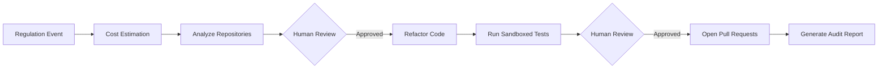

<p align="center">
  <h1 align="center">regulatory-agent-kit</h1>
  <p align="center">
    <strong>Multi-agent AI framework for automated regulatory compliance</strong>
  </p>
  <p align="center">
    <a href="#quickstart">Quickstart</a> &middot;
    <a href="#how-it-works">How It Works</a> &middot;
    <a href="#writing-plugins">Writing Plugins</a> &middot;
    <a href="docs/architecture.md">Architecture</a> &middot;
    <a href="CONTRIBUTING.md">Contributing</a>
  </p>
</p>

---

**regulatory-agent-kit (RAK)** turns regulatory requirements into code. Define rules as YAML, point RAK at your repositories, and let AI agents detect violations, generate fixes, write tests, and open pull requests — with humans approving every step.

```
Regulation (YAML)  +  Your Repos  -->  AI Agents  -->  Human Review  -->  Compliant PRs
```

### Why RAK?

| Problem | RAK's Approach |
|---------|---------------|
| Regulations change faster than teams can audit codebases | AI agents scan thousands of files in minutes |
| Compliance logic is buried in code, understood by few | Declarative YAML plugins readable by compliance officers |
| No audit trail for compliance decisions | Every LLM call, code change, and human decision is cryptographically signed |
| AI-generated code shipped without review | Non-bypassable human checkpoints — agents suggest, humans decide |

---

## Key Features

**Regulation-as-Configuration** -- All regulatory knowledge lives in YAML plugins, not code. Supporting a new regulation requires zero framework changes.

**Four Specialized Agents** -- Analyzer (detects violations), Refactor (applies fixes), TestGenerator (validates changes in a sandbox), Reporter (opens PRs and generates audit trails).

**Durable Orchestration** -- Temporal workflows survive crashes, retries, and week-long human approval cycles. Fan-out across hundreds of repositories.

**Lite Mode** -- Run everything locally with `rak run --lite` — no Docker, no databases, no infrastructure. SQLite + terminal prompts for quick evaluation.

**Immutable Audit Trail** -- Append-only, Ed25519-signed entries for every action. Monthly partitioning and object storage export for long-term retention.

**Cross-Regulation Conflict Detection** -- When multiple regulations target the same code, RAK detects overlaps and escalates based on declared precedence rules.

---

## Quickstart

### Prerequisites

- Python 3.12+
- [uv](https://docs.astral.sh/uv/) (package manager)
- Docker & Docker Compose (for full mode; optional for Lite Mode)

### Install

```bash
git clone https://github.com/your-org/regulatory-agent-kit.git
cd regulatory-agent-kit
uv sync --all-extras
```

### Run in Lite Mode (no infrastructure required)

```bash
# Set your LLM API key
export ANTHROPIC_API_KEY=sk-ant-...

# Run against a local repo with the example plugin
rak run --lite \
  --regulation regulations/examples/example.yaml \
  --repos /path/to/your/repo \
  --checkpoint-mode terminal
```

RAK will analyze the repo, show an impact map for your approval, apply fixes, run sandboxed tests, and ask for merge approval — all in your terminal.

### Run with Full Stack

```bash
# Copy and edit configuration
cp .env.example .env
cp rak-config.yaml.example rak-config.yaml

# Start all services
docker compose up -d

# Run the pipeline
rak run --config rak-config.yaml
```

---

## How It Works



### Pipeline Stages

| Stage | Agent | What Happens |
|-------|-------|-------------|
| **Cost Estimation** | -- | Estimate LLM cost before committing resources |
| **Analysis** | Analyzer | Clone repos, parse ASTs, match plugin rules, produce impact map |
| **Impact Review** | Human | Approve, reject, or request modifications to the impact map |
| **Refactoring** | Refactor | Apply remediation templates, create branches, commit changes |
| **Testing** | TestGenerator | Generate and run compliance tests in Docker sandbox (`--network=none`) |
| **Merge Review** | Human | Approve or reject the generated changes and tests |
| **Reporting** | Reporter | Open PRs, generate audit trail, create rollback manifests |

Both human checkpoints are **non-bypassable** — no code path can skip them.

---

## Writing Plugins

Regulation plugins are declarative YAML files that compliance officers and engineers can co-author:

```yaml
id: example-regulation-2025
name: "Example Regulation"
version: "1.0.0"
effective_date: "2025-01-01"
jurisdiction: "EXAMPLE"
authority: "Example Regulatory Authority"
source_url: "https://example.com/regulations/audit-logging"
disclaimer: "Compliance tool output — not legal advice."

rules:
  - id: RULE-001
    description: "All services must implement structured audit logging"
    severity: critical
    affects:
      - pattern: "**/*.java"
        condition: "class implements Service AND NOT has_annotation(@AuditLog)"
    remediation:
      strategy: add_annotation
      template: templates/audit_log.j2
      test_template: templates/audit_log_test.j2
      confidence_threshold: 0.85

cross_references:
  - regulation_id: "other-regulation"
    relationship: does_not_override
    conflict_handling: escalate_to_human
```

Regulation-specific plugins (DORA, PSD2, PCI-DSS, HIPAA, Open Finance, etc.) are distributed as separate GitHub repositories and installed via the CLI:

```bash
rak plugin install <plugin-id>
```

### Condition DSL

The `condition` field uses a purpose-built DSL with 7 static predicates:

```
class implements <Interface>       # Java interface implementation
class inherits <Class>             # Class hierarchy
has_annotation(@Name)              # Java annotations
has_decorator(@Name)               # Python decorators
has_method(name)                   # Method existence
has_key(path.to.key)               # Config key lookup
class_name matches "regex"         # Name pattern matching
```

Combine with `AND`, `OR`, `NOT`, and parentheses. Operator precedence: `NOT` > `AND` > `OR`.

### Scaffold a New Plugin

```bash
rak plugin init --name my-regulation
rak plugin validate regulations/my-regulation/my-regulation.yaml
```

See the [Plugin Template Guide](docs/plugin-template-guide.md) for the full schema reference.

---

## Architecture

```
src/regulatory_agent_kit/
├── models/           # Pydantic v2 domain models (20 classes)
├── config.py         # pydantic-settings with YAML overlay
├── exceptions.py     # Exception hierarchy (15 classes)
├── plugins/          # YAML loader, schema, Condition DSL parser, conflict engine
├── agents/           # PydanticAI agent definitions + tool bindings
├── orchestration/    # Temporal workflows + Lite Mode executor
├── tools/            # Git, AST (tree-sitter), test runner, Elasticsearch, notifications
├── templates/        # Jinja2 sandboxed code generation
├── database/         # Psycopg 3 pool + 6 repository classes + Lite Mode SQLite
├── event_sources/    # File, Webhook, Kafka, SQS + WorkflowStarter
├── observability/    # MLflow tracing, audit logger, WAL, object storage
├── api/              # FastAPI routes + auth middleware
└── cli.py            # Typer CLI (rak command)
```

### Tech Stack

| Layer | Technology |
|-------|-----------|
| Language | Python 3.12+ |
| Agent Framework | PydanticAI |
| Orchestration | Temporal |
| Data Validation | Pydantic v2 |
| HTTP API | FastAPI |
| Database | PostgreSQL 16 (Psycopg 3, no ORM) |
| Search | Elasticsearch 8.x |
| LLM Gateway | LiteLLM (model-agnostic) |
| Observability | MLflow + OpenTelemetry + Prometheus + Grafana |
| AST Parsing | tree-sitter |
| Cryptography | Ed25519 (cryptography library) |
| CLI | Typer + Rich |

### Key Design Decisions

- **[ADR-002](docs/adr/002-langgraph-vs-temporal-pydanticai.md)** -- Temporal + PydanticAI over LangGraph
- **[ADR-003](docs/adr/003-database-selection.md)** -- PostgreSQL-only (single DB, three schemas)
- **[ADR-005](docs/adr/005-llm-observability-platform.md)** -- MLflow + OpenTelemetry over Langfuse
- **[ADR-006](docs/adr/006-elasticsearch-selection.md)** -- Elasticsearch 8.x over pgvector

---

## CLI Reference

```bash
rak run          # Start a compliance pipeline
rak status       # Query pipeline status
rak cancel       # Cancel a running pipeline
rak retry-failures  # Re-dispatch failed repositories
rak rollback     # Revert changes from a completed run
rak resume       # Resume an interrupted Lite Mode run
rak plugin validate  # Validate a regulation plugin
rak plugin init  # Scaffold a new plugin
rak db clean-cache       # Remove expired analysis cache
rak db create-partitions # Create audit table partitions
```

See [CLI Reference](docs/cli-reference.md) for full documentation.

---

## Development

```bash
# Install all dependencies (including dev)
uv sync --all-extras

# Run unit tests
pytest tests/unit/ -v

# Run integration tests (requires Docker)
pytest tests/integration/ -v -m integration

# Lint and format
ruff check src/ tests/
ruff format src/ tests/

# Type check (strict mode)
mypy src/

# All quality checks
make check

# Start the full Docker stack
docker compose up -d
```

### Test Coverage

470 tests across unit and integration suites, with 80%+ line coverage enforced.

---

## Documentation

| Document | Description |
|----------|-------------|
| [Architecture](docs/architecture.md) | System design, principles, plugin system |
| [High-Level Design](docs/hld.md) | Deployment topology, integrations |
| [Low-Level Design](docs/lld.md) | Class diagrams, state machines, algorithms |
| [Data Model](docs/data-model.md) | PostgreSQL schemas, Elasticsearch mappings |
| [CLI Reference](docs/cli-reference.md) | All commands with examples |
| [Plugin Guide](docs/plugin-template-guide.md) | Plugin authoring reference |
| [Glossary](docs/glossary.md) | Domain term definitions |
| ADRs ([001](docs/adr/001-agent-orchestration-framework.md)--[006](docs/adr/006-elasticsearch-selection.md)) | Architecture decision records |

---

## Project Status

**Alpha (v0.1.0)** -- Foundation complete. The framework scaffold, all domain models, plugin system, agent definitions, orchestration layer, API, CLI, and infrastructure are implemented. Regulation-specific plugins are distributed as separate repositories and installed via `rak plugin install`.

---

## License

MIT
