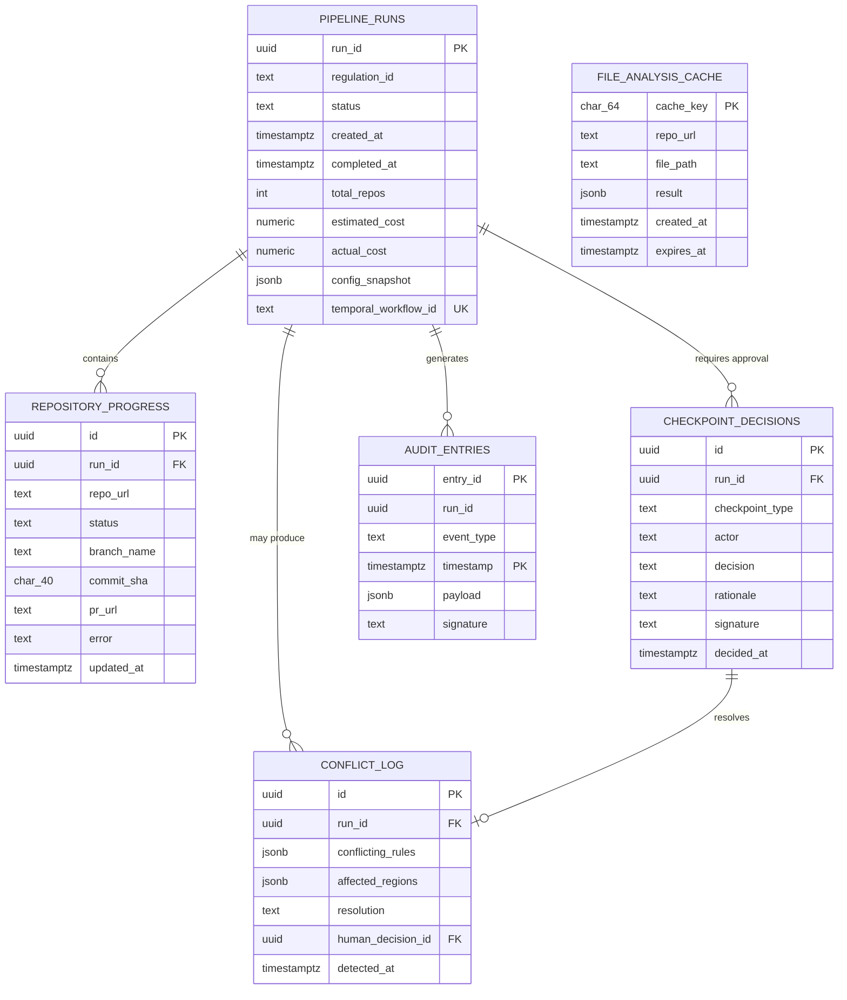
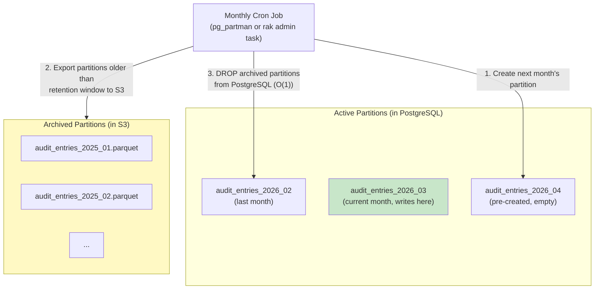

# regulatory-agent-kit — Data Model and Database Schema Design

> **Version:** 1.0
> **Date:** 2026-03-27
> **Status:** Active Development
> **Audience:** Engineers working on data access, schema changes, migrations, and storage operations.

---

## Table of Contents

1. [Overview](#1-overview)
2. [Entity-Relationship Diagrams](#2-entity-relationship-diagrams)
3. [Data Dictionary](#3-data-dictionary)
4. [Indexing Strategy](#4-indexing-strategy)
5. [JSONB Payload Schemas](#5-jsonb-payload-schemas)
6. [Elasticsearch Data Model](#6-elasticsearch-data-model)
7. [Object Storage Data Model](#7-object-storage-data-model)
8. [Partitioning and Retention](#8-partitioning-and-retention)
9. [Data Migration Plan](#9-data-migration-plan)
10. [Data Integrity and Constraints](#10-data-integrity-and-constraints)

---

## 1. Overview

### 1.1 Storage Systems

| Store | Technology | Data Managed | Schema Owner |
|---|---|---|---|
| **PostgreSQL 16+** (single instance) | Relational | Workflow state (Temporal), application data (rak), LLM trace metadata (MLflow) | 3 schemas, 3 owners |
| **Elasticsearch 8.x** | Document search | Regulatory knowledge base (indexed regulation text, rule descriptions) | Application-managed mappings |
| **S3 / GCS / Azure Blob** | Object storage | Immutable audit archives, MLflow artifacts, compliance reports | Application-managed prefixes |

### 1.2 Schema Ownership

```
PostgreSQL 16+
|
+-- Schema: temporal       Owner: Temporal server (DO NOT MODIFY)
|     Managed by: temporal-sql-tool (auto-setup)
|     Tables: executions, history_node, history_tree,
|             visibility, tasks, task_queues, cluster_metadata, ...
|
+-- Schema: rak            Owner: Application (Alembic migrations)
|     Managed by: alembic upgrade head
|     Tables: pipeline_runs, repository_progress, audit_entries,
|             checkpoint_decisions, conflict_log, file_analysis_cache
|
+-- Schema: mlflow         Owner: MLflow server (DO NOT MODIFY)
      Managed by: mlflow db upgrade
      Tables: experiments, runs, metrics, latest_metrics,
              params, tags, registered_models, model_versions, ...
```

### 1.3 Design Principles

| Principle | Application |
|---|---|
| **Single source of truth** | Each data entity lives in exactly one table. No cross-schema duplication. |
| **Append-only audit** | `audit_entries` accepts INSERT and SELECT only. No UPDATE or DELETE. Enforced by PostgreSQL role grants. |
| **JSONB for semi-structured data** | Variable-shape payloads (audit events, plugin config snapshots, conflict details) use JSONB with GIN indexes. |
| **Partitioning for growth** | The only high-growth table (`audit_entries`) is partitioned by month. All others fit in a single partition indefinitely. |
| **Foreign keys for referential integrity** | All relationships are enforced by FK constraints with ON DELETE CASCADE where appropriate. |

---

## 2. Entity-Relationship Diagrams

### 2.1 Full ERD (rak Schema)



### 2.2 Cardinality Summary

| Relationship | Cardinality | Description |
|---|---|---|
| pipeline_runs -> repository_progress | 1:N | One run processes many repositories (typically 5-500) |
| pipeline_runs -> checkpoint_decisions | 1:N (max ~4) | Two checkpoint types, possible re-reviews |
| pipeline_runs -> conflict_log | 1:N (0-5 typical) | Conflicts are rare; only when multiple regulations overlap |
| pipeline_runs -> audit_entries | 1:N (500-2000) | Every LLM call, tool use, and state transition is logged |
| checkpoint_decisions -> conflict_log | 1:0..1 | A conflict resolution references the human decision that resolved it |

---

## 3. Data Dictionary

### 3.1 Table: `rak.pipeline_runs`

Tracks the lifecycle of a single compliance pipeline execution.

| Column | Type | Nullable | Default | Description |
|---|---|---|---|---|
| `run_id` | `UUID` | NO | `gen_random_uuid()` | Primary key. Globally unique pipeline run identifier. |
| `regulation_id` | `TEXT` | NO | — | ID of the regulation plugin that triggered this run (e.g., `dora-ict-risk-2025`). Must match a loaded plugin ID. |
| `status` | `TEXT` | NO | `'pending'` | Coarse lifecycle state. Constrained to: `pending`, `running`, `cost_rejected`, `completed`, `failed`, `rejected`, `cancelled`. This tracks the **lifecycle**, not the granular workflow phase — Temporal manages intermediate phases (e.g., `ANALYZING`, `AWAITING_IMPACT_REVIEW`) via its event-sourced history. `running` covers all active intermediate phases. See [`lld.md` Section 4.1.1](lld.md) for the full mapping. |
| `created_at` | `TIMESTAMPTZ` | NO | `now()` | Timestamp when the pipeline run was created. |
| `completed_at` | `TIMESTAMPTZ` | YES | `NULL` | Timestamp when the run reached a terminal state. NOT NULL when status is terminal; NULL when running. Enforced by CHECK constraint. |
| `total_repos` | `INTEGER` | NO | — | Number of repositories in this run. Must be > 0. |
| `estimated_cost` | `NUMERIC(10,4)` | YES | `NULL` | Pre-run estimated LLM cost in USD. Set by the cost estimation activity. |
| `actual_cost` | `NUMERIC(10,4)` | YES | `0` | Running total of actual LLM cost in USD. Updated as activities complete. |
| `config_snapshot` | `JSONB` | NO | — | Frozen copy of the pipeline configuration at run time: plugin version, model versions, confidence thresholds, retry limits. Ensures reproducibility. |
| `temporal_workflow_id` | `TEXT` | YES | `NULL` | Temporal workflow ID for cross-referencing with the Temporal UI and API. UNIQUE constraint prevents duplicate workflow registrations. |

**Constraints:**

| Constraint | Type | Expression |
|---|---|---|
| `pipeline_runs_pkey` | PRIMARY KEY | `(run_id)` |
| `pipeline_runs_temporal_workflow_id_key` | UNIQUE | `(temporal_workflow_id)` |
| `pipeline_runs_status_check` | CHECK | `status IN ('pending','running','cost_rejected','completed','failed','rejected','cancelled')` |
| `pipeline_runs_total_repos_check` | CHECK | `total_repos > 0` |
| `valid_completion` | CHECK | Terminal statuses must have `completed_at`; non-terminal must not. |

---

### 3.2 Table: `rak.repository_progress`

Tracks the processing status of each repository within a pipeline run.

| Column | Type | Nullable | Default | Description |
|---|---|---|---|---|
| `id` | `UUID` | NO | `gen_random_uuid()` | Primary key. |
| `run_id` | `UUID` | NO | — | Foreign key to `pipeline_runs.run_id`. ON DELETE CASCADE. |
| `repo_url` | `TEXT` | NO | — | Full repository URL (e.g., `https://github.com/org/service-a`). |
| `status` | `TEXT` | NO | `'pending'` | Processing status: `pending`, `in_progress`, `completed`, `failed`, `skipped`. |
| `branch_name` | `TEXT` | YES | `NULL` | The `rak/{regulation}/{rule}` branch created for this repo. Set when refactoring begins. |
| `commit_sha` | `CHAR(40)` | YES | `NULL` | Git commit SHA of the remediation commit. Always 40 hex characters (SHA-1). |
| `pr_url` | `TEXT` | YES | `NULL` | Full URL of the merge request created for this repo. Set by the Reporter. |
| `error` | `TEXT` | YES | `NULL` | Error message if the repository processing failed. |
| `updated_at` | `TIMESTAMPTZ` | NO | `now()` | Last modification timestamp. Auto-updated by trigger `trg_progress_updated`. |

**Constraints:**

| Constraint | Type | Expression |
|---|---|---|
| `repository_progress_pkey` | PRIMARY KEY | `(id)` |
| `repository_progress_run_id_repo_url_key` | UNIQUE | `(run_id, repo_url)` — prevents duplicate processing |
| `repository_progress_run_id_fkey` | FOREIGN KEY | `run_id REFERENCES pipeline_runs(run_id) ON DELETE CASCADE` |
| `repository_progress_status_check` | CHECK | `status IN ('pending','in_progress','completed','failed','skipped')` |

**Triggers:**

| Trigger | Event | Function | Purpose |
|---|---|---|---|
| `trg_progress_updated` | BEFORE UPDATE | `rak.update_timestamp()` | Auto-sets `updated_at = now()` on every update |

---

### 3.3 Table: `rak.audit_entries`

Immutable, append-only, cryptographically signed audit trail. Partitioned by month.

| Column | Type | Nullable | Default | Description |
|---|---|---|---|---|
| `entry_id` | `UUID` | NO | `gen_random_uuid()` | Unique entry identifier within the partition. |
| `run_id` | `UUID` | NO | — | Pipeline run this entry belongs to. **Not a FK** (partitioned tables cannot have cross-table FKs in PostgreSQL). Referential integrity enforced at application level. |
| `event_type` | `TEXT` | NO | — | Category of the audited event. Constrained to: `llm_call`, `tool_invocation`, `state_transition`, `human_decision`, `conflict_detected`, `cost_estimation`, `test_execution`, `merge_request`, `error`. |
| `timestamp` | `TIMESTAMPTZ` | NO | `now()` | When the event occurred. Part of the composite primary key. Used for partition routing. |
| `payload` | `JSONB` | NO | — | Event-specific data in JSON-LD format. Schema varies by `event_type` (see [Section 5](#5-jsonb-payload-schemas)). |
| `signature` | `TEXT` | NO | — | Base64-encoded Ed25519 signature over the canonicalized `payload`. Used for tamper detection. |

**Constraints:**

| Constraint | Type | Expression |
|---|---|---|
| `audit_entries_pkey` | PRIMARY KEY | `(timestamp, entry_id)` — composite PK for partitioning |
| `audit_entries_event_type_check` | CHECK | `event_type IN (...)` — see above |

**Access control:**
- Role `rak_app`: `INSERT`, `SELECT` only. **No UPDATE. No DELETE.** This is the primary immutability enforcement.
- Role `rak_admin`: Full access (for partition management and exports).

**Design notes:**
- No FK to `pipeline_runs` because PostgreSQL does not support FK constraints on partitioned tables referencing non-partitioned tables. Application code validates `run_id` existence before insert.
- The `(timestamp, entry_id)` composite PK is required for partition routing. PostgreSQL requires the partition key in the primary key.

---

### 3.4 Table: `rak.checkpoint_decisions`

Records human approval/rejection decisions at the two mandatory pipeline checkpoints.

| Column | Type | Nullable | Default | Description |
|---|---|---|---|---|
| `id` | `UUID` | NO | `gen_random_uuid()` | Primary key. |
| `run_id` | `UUID` | NO | — | Foreign key to `pipeline_runs.run_id`. ON DELETE CASCADE. |
| `checkpoint_type` | `TEXT` | NO | — | Which checkpoint: `impact_review` (post-analysis) or `merge_review` (pre-merge). |
| `actor` | `TEXT` | NO | — | Identity of the human who made the decision (e.g., email address, SSO ID). |
| `decision` | `TEXT` | NO | — | The decision: `approved`, `rejected`, or `modifications_requested`. |
| `rationale` | `TEXT` | YES | `NULL` | Free-text explanation of why the decision was made. Optional but strongly encouraged for audit purposes. |
| `signature` | `TEXT` | NO | — | Base64-encoded Ed25519 signature over `{run_id, checkpoint_type, actor, decision, rationale, decided_at}`. Proves authenticity. |
| `decided_at` | `TIMESTAMPTZ` | NO | `now()` | When the decision was made. |

**Constraints:**

| Constraint | Type | Expression |
|---|---|---|
| `checkpoint_decisions_pkey` | PRIMARY KEY | `(id)` |
| `checkpoint_decisions_run_id_fkey` | FOREIGN KEY | `run_id REFERENCES pipeline_runs(run_id) ON DELETE CASCADE` |
| `checkpoint_decisions_type_check` | CHECK | `checkpoint_type IN ('impact_review','merge_review')` |
| `checkpoint_decisions_decision_check` | CHECK | `decision IN ('approved','rejected','modifications_requested')` |
| `checkpoint_decisions_unique` | UNIQUE | `(run_id, checkpoint_type, decided_at)` — allows re-reviews (latest wins) |

---

### 3.5 Table: `rak.conflict_log`

Records cross-regulation conflicts detected during analysis.

| Column | Type | Nullable | Default | Description |
|---|---|---|---|---|
| `id` | `UUID` | NO | `gen_random_uuid()` | Primary key. |
| `run_id` | `UUID` | NO | — | Foreign key to `pipeline_runs.run_id`. ON DELETE CASCADE. |
| `conflicting_rules` | `JSONB` | NO | — | Array of objects: `[{regulation_id, rule_id}, ...]`. Identifies the two (or more) rules in conflict. |
| `affected_regions` | `JSONB` | NO | — | Array of objects: `[{file_path, start_line, end_line, start_col, end_col}, ...]`. Code regions where the conflict manifests. |
| `resolution` | `TEXT` | YES | `NULL` | Description of how the conflict was resolved. NULL while unresolved. |
| `human_decision_id` | `UUID` | YES | `NULL` | Foreign key to `checkpoint_decisions.id`. References the checkpoint decision that resolved this conflict. NULL while unresolved. |
| `detected_at` | `TIMESTAMPTZ` | NO | `now()` | When the conflict was detected. |

**Constraints:**

| Constraint | Type | Expression |
|---|---|---|
| `conflict_log_pkey` | PRIMARY KEY | `(id)` |
| `conflict_log_run_id_fkey` | FOREIGN KEY | `run_id REFERENCES pipeline_runs(run_id) ON DELETE CASCADE` |
| `conflict_log_decision_fkey` | FOREIGN KEY | `human_decision_id REFERENCES checkpoint_decisions(id)` |
| `resolution_needs_decision` | CHECK | If `resolution` is NOT NULL, then `human_decision_id` must also be NOT NULL. |

---

### 3.6 Table: `rak.file_analysis_cache`

Caches file-level analysis results to avoid redundant LLM calls on re-runs.

| Column | Type | Nullable | Default | Description |
|---|---|---|---|---|
| `cache_key` | `CHAR(64)` | NO | — | SHA-256 hash of `file_content + plugin_version + agent_version`. Deterministic cache key. |
| `repo_url` | `TEXT` | NO | — | Repository URL (for cache management/debugging). |
| `file_path` | `TEXT` | NO | — | Relative file path within the repository. |
| `result` | `JSONB` | NO | — | Cached `FileImpact` serialized as JSON. Contains matched rules, affected regions, confidence scores. |
| `created_at` | `TIMESTAMPTZ` | NO | `now()` | When this cache entry was created. |
| `expires_at` | `TIMESTAMPTZ` | NO | `now() + INTERVAL '7 days'` | When this cache entry expires. Expired entries are periodically deleted. |

**Constraints:**

| Constraint | Type | Expression |
|---|---|---|
| `file_analysis_cache_pkey` | PRIMARY KEY | `(cache_key)` |

**Access control:** `rak_app` has `INSERT`, `SELECT`, `DELETE` (for cache eviction). No UPDATE (entries are replaced, not modified).

---

## 4. Indexing Strategy

### 4.1 Index Inventory

| Table | Index Name | Type | Column(s) | Purpose | Estimated Cardinality |
|---|---|---|---|---|---|
| `pipeline_runs` | `idx_runs_status` | B-tree | `(status)` | Filter running/failed runs for dashboards and `rak status` | ~7 distinct values |
| `pipeline_runs` | `idx_runs_regulation` | B-tree | `(regulation_id)` | Filter runs by regulation for reporting | ~10-50 distinct values |
| `pipeline_runs` | `idx_runs_created` | B-tree | `(created_at DESC)` | Recent runs listing, time-range queries | High (continuous) |
| `repository_progress` | `idx_progress_run` | B-tree | `(run_id)` | All repos for a given run (most common query) | ~50 rows per run_id |
| `repository_progress` | `idx_progress_status` | B-tree | `(status)` | Find failed/pending repos across all runs | ~5 distinct values |
| `audit_entries` | `idx_audit_run` | B-tree | `(run_id)` | All audit entries for a run (audit report generation) | ~1000 rows per run_id |
| `audit_entries` | `idx_audit_type` | B-tree | `(event_type)` | Filter by event type (e.g., all `llm_call` entries) | ~9 distinct values |
| `audit_entries` | `idx_audit_payload` | GIN | `(payload)` | Full JSON path queries on payload (e.g., `payload->>'model'`) | High cardinality |
| `audit_entries` | `idx_audit_model` | B-tree (expression) | `((payload->>'model'))` WHERE `event_type = 'llm_call'` | Fast lookup of LLM calls by model name | ~5-10 distinct values |
| `checkpoint_decisions` | `idx_checkpoint_run` | B-tree | `(run_id)` | Approvals for a specific run | ~2-4 per run |
| `conflict_log` | `idx_conflict_run` | B-tree | `(run_id)` | Conflicts for a specific run | ~0-5 per run |
| `file_analysis_cache` | `idx_cache_expires` | B-tree | `(expires_at)` | Batch deletion of expired cache entries | Continuous |

### 4.2 Index Design Rationale

**Why B-tree for status columns (low cardinality)?**
Status columns have few distinct values (5-7), which normally makes B-tree indexes ineffective. However, the access pattern is always `WHERE status = 'failed'` or `WHERE status = 'running'` — filtering for a small minority of rows. Since most rows are in terminal states (`completed`), the index efficiently locates the small number of active/failed rows.

**Why GIN on `audit_entries.payload`?**
GIN (Generalized Inverted Index) supports containment queries (`@>`) and key-existence queries (`?`, `?|`, `?&`) on JSONB. Audit queries often filter by arbitrary payload fields: "all LLM calls to model X", "all tool invocations for file Y", "all state transitions triggered by Z". The GIN index makes these queries index-scannable without knowing the query shape at schema design time.

**Why an expression index on `payload->>'model'`?**
The `idx_audit_model` expression index is a targeted optimization for the most common audit query: "show all LLM calls for a specific model". The partial index (`WHERE event_type = 'llm_call'`) ensures it only indexes relevant rows, keeping the index small. This is faster than the general GIN index for this specific access pattern.

**Why no index on `audit_entries.run_id` as a FK?**
`audit_entries` is a partitioned table. Each partition has its own local indexes. The `idx_audit_run` index is defined on the parent table and automatically created on each partition. PostgreSQL's partition pruning ensures queries with a `timestamp` filter scan only the relevant partition.

### 4.3 Indexes NOT Created (and Why)

| Candidate Index | Why Omitted |
|---|---|
| `repository_progress(repo_url)` | Queries always filter by `run_id` first. The `(run_id, repo_url)` UNIQUE constraint provides the needed index. |
| `audit_entries(signature)` | Signatures are never queried. They are verified application-side when reading entries. |
| `checkpoint_decisions(actor)` | Very low volume table (~2-4 rows per run). Sequential scan is faster than index lookup. |
| `conflict_log(conflicting_rules)` using GIN | Very low volume. Sequential scan sufficient. |
| `pipeline_runs(actual_cost)` | Cost queries use `ORDER BY created_at` with status filters, not cost filters. |

---

## 5. JSONB Payload Schemas

Each `audit_entries.event_type` has a defined payload schema. These schemas are validated by Pydantic models at the application level before insertion.

### 5.1 `event_type: "llm_call"`

```json
{
  "@context": "https://schema.org",
  "@type": "LLMCall",
  "model": "anthropic/claude-sonnet-4-6",
  "model_version": "claude-sonnet-4-6-20260327",
  "prompt_hash": "sha256:a1b2c3...",
  "prompt_tokens": 4200,
  "completion_tokens": 1800,
  "total_tokens": 6000,
  "latency_ms": 3400,
  "cost_usd": 0.042,
  "temperature": 0.0,
  "agent": "analyzer",
  "purpose": "evaluate_condition",
  "rule_id": "DORA-ICT-001",
  "file_path": "src/main/java/com/example/UserService.java",
  "confidence": 0.92
}
```

| Field | Type | Required | Description |
|---|---|---|---|
| `model` | string | YES | LiteLLM model identifier |
| `model_version` | string | YES | Exact model version (pinned) |
| `prompt_hash` | string | YES | SHA-256 of the sanitized prompt (prompt text itself is not stored for privacy) |
| `prompt_tokens` | integer | YES | Input token count |
| `completion_tokens` | integer | YES | Output token count |
| `total_tokens` | integer | YES | Sum of input + output tokens |
| `latency_ms` | integer | YES | Round-trip latency in milliseconds |
| `cost_usd` | number | YES | Estimated cost in USD |
| `temperature` | number | YES | Sampling temperature used |
| `agent` | string | YES | Which agent made the call (`analyzer`, `refactor`, `testgen`, `reporter`) |
| `purpose` | string | YES | Why the call was made (`evaluate_condition`, `generate_remediation`, `generate_tests`, `generate_report`) |
| `rule_id` | string | NO | Rule being evaluated (if applicable) |
| `file_path` | string | NO | File being analyzed (if applicable) |
| `confidence` | number | NO | LLM-reported confidence score (0.0-1.0) |

### 5.2 `event_type: "tool_invocation"`

```json
{
  "@context": "https://schema.org",
  "@type": "ToolInvocation",
  "tool": "git_clone",
  "agent": "analyzer",
  "input": {
    "url": "https://github.com/org/service-a",
    "depth": 1
  },
  "output": {
    "path": "/tmp/rak/repos/service-a",
    "files_count": 342
  },
  "duration_ms": 8500,
  "success": true,
  "error": null
}
```

| Field | Type | Required | Description |
|---|---|---|---|
| `tool` | string | YES | Tool name (`git_clone`, `ast_parse`, `ast_search`, `es_search`, `jinja_render`, `test_run`, `git_commit`, `git_pr_create`, `notification_send`) |
| `agent` | string | YES | Agent that invoked the tool |
| `input` | object | YES | Tool input parameters (sanitized: no secrets) |
| `output` | object | YES | Tool output (truncated if large) |
| `duration_ms` | integer | YES | Execution time in milliseconds |
| `success` | boolean | YES | Whether the invocation succeeded |
| `error` | string | NO | Error message if `success=false` |

### 5.3 `event_type: "state_transition"`

```json
{
  "@context": "https://schema.org",
  "@type": "StateTransition",
  "from_state": "ANALYZING",
  "to_state": "AWAITING_IMPACT_REVIEW",
  "trigger": "analysis_complete",
  "repos_analyzed": 42,
  "files_impacted": 156,
  "rules_matched": 23,
  "conflicts_detected": 2,
  "elapsed_ms": 345000
}
```

### 5.4 `event_type: "human_decision"`

```json
{
  "@context": "https://schema.org",
  "@type": "HumanDecision",
  "checkpoint_type": "impact_review",
  "actor": "jane@corp.com",
  "decision": "approved",
  "rationale": "Impact assessment looks correct. Proceed with remediation.",
  "repos_affected": 42,
  "rules_matched": ["DORA-ICT-001", "DORA-ICT-002"],
  "decision_id": "550e8400-e29b-41d4-a716-446655440000",
  "wait_duration_ms": 7200000
}
```

### 5.5 `event_type: "conflict_detected"`

```json
{
  "@context": "https://schema.org",
  "@type": "ConflictDetected",
  "conflicting_rules": [
    {"regulation_id": "dora-ict-risk-2025", "rule_id": "DORA-ICT-001"},
    {"regulation_id": "gdpr-privacy-2025", "rule_id": "GDPR-MIN-003"}
  ],
  "file_path": "src/main/java/com/example/AuditService.java",
  "region": {"start_line": 45, "end_line": 78},
  "conflict_description": "DORA-ICT-001 requires adding detailed audit logging; GDPR-MIN-003 requires minimizing personal data in logs.",
  "relationship": "does_not_override"
}
```

### 5.6 `event_type: "cost_estimation"`

```json
{
  "@context": "https://schema.org",
  "@type": "CostEstimation",
  "estimated_total_cost_usd": 45.20,
  "estimated_total_tokens": 2400000,
  "repo_count": 50,
  "per_repo_avg_cost_usd": 0.904,
  "model_used": "anthropic/claude-sonnet-4-6",
  "cost_threshold_usd": 100.00,
  "exceeds_threshold": false,
  "auto_approved": true
}
```

### 5.7 `event_type: "test_execution"`

```json
{
  "@context": "https://schema.org",
  "@type": "TestExecution",
  "repo_url": "https://github.com/org/service-a",
  "pass_rate": 0.95,
  "total_tests": 20,
  "passed": 19,
  "failed": 1,
  "failures": [
    {
      "test_name": "test_audit_log_annotation_present",
      "error": "AssertionError: Expected @AuditLog annotation on PaymentGateway"
    }
  ],
  "sandbox_config": {
    "network": "none",
    "read_only": true,
    "memory_limit": "512m",
    "cpu_limit": 1,
    "timeout_seconds": 300
  },
  "duration_ms": 12500
}
```

### 5.8 `event_type: "merge_request"`

```json
{
  "@context": "https://schema.org",
  "@type": "MergeRequest",
  "repo_url": "https://github.com/org/service-a",
  "pr_url": "https://github.com/org/service-a/pull/42",
  "pr_number": 42,
  "branch": "rak/dora-ict-risk-2025/DORA-ICT-001",
  "title": "rak: DORA-ICT-001 — Add audit logging to ICT services",
  "rules_addressed": ["DORA-ICT-001"],
  "files_changed": 3,
  "insertions": 45,
  "deletions": 2
}
```

---

## 6. Elasticsearch Data Model

### 6.1 Index: `rak-regulations`

Stores indexed regulatory knowledge for semantic search by the Analyzer Agent.

```json
{
  "mappings": {
    "properties": {
      "regulation_id":   { "type": "keyword" },
      "regulation_name": { "type": "text", "analyzer": "standard" },
      "rule_id":         { "type": "keyword" },
      "rule_description": {
        "type": "text",
        "analyzer": "english",
        "fields": {
          "exact": { "type": "keyword" }
        }
      },
      "severity":        { "type": "keyword" },
      "jurisdiction":    { "type": "keyword" },
      "authority":       { "type": "keyword" },
      "effective_date":  { "type": "date" },
      "pillar":          { "type": "keyword" },
      "rts_reference":   { "type": "keyword" },
      "condition":       { "type": "text" },
      "remediation_strategy": { "type": "keyword" },
      "source_url":      { "type": "keyword" },
      "content_chunk": {
        "type": "text",
        "analyzer": "english",
        "term_vector": "with_positions_offsets"
      },
      "chunk_index":     { "type": "integer" },
      "indexed_at":      { "type": "date" }
    }
  },
  "settings": {
    "number_of_shards": 1,
    "number_of_replicas": 1,
    "analysis": {
      "analyzer": {
        "regulation_analyzer": {
          "type": "custom",
          "tokenizer": "standard",
          "filter": ["lowercase", "stop", "snowball"]
        }
      }
    }
  }
}
```

### 6.2 Index: `rak-regulation-context`

Stores chunked regulatory document text for RAG-style context retrieval.

```json
{
  "mappings": {
    "properties": {
      "regulation_id":   { "type": "keyword" },
      "document_title":  { "type": "text" },
      "section":         { "type": "keyword" },
      "article":         { "type": "keyword" },
      "paragraph":       { "type": "keyword" },
      "content": {
        "type": "text",
        "analyzer": "english"
      },
      "embedding": {
        "type": "dense_vector",
        "dims": 1536,
        "index": true,
        "similarity": "cosine"
      },
      "source_url":      { "type": "keyword" },
      "chunk_index":     { "type": "integer" },
      "total_chunks":    { "type": "integer" }
    }
  },
  "settings": {
    "number_of_shards": 1,
    "number_of_replicas": 1
  }
}
```

---

## 7. Object Storage Data Model

### 7.1 Bucket Structure

```
s3://rak-{environment}-data/
|
+-- audit-archives/
|   +-- {year}/
|       +-- {month}/
|           +-- audit_entries_{year}_{month}.parquet
|           +-- audit_entries_{year}_{month}.json.gz
|           +-- manifest.json              # {row_count, sha256, exported_at}
|
+-- compliance-reports/
|   +-- {run_id}/
|       +-- report.pdf
|       +-- report.html
|       +-- audit-log.jsonld
|       +-- audit-log.jsonld.sig           # Detached Ed25519 signature
|       +-- rollback-manifest.json
|
+-- mlflow-artifacts/
|   +-- {experiment_id}/
|       +-- {run_id}/
|           +-- artifacts/                 # MLflow-managed
|
+-- plugin-registry/                       # (v1.5+)
    +-- index.json                         # Plugin catalog
    +-- {plugin_id}/
        +-- {version}/
            +-- plugin.yaml
            +-- templates/
```

### 7.2 Bucket Policies

| Bucket Path | Write Access | Read Access | Versioning | Lifecycle |
|---|---|---|---|---|
| `audit-archives/` | `rak-worker` (export job) | `rak-admin`, auditors | **Enabled** (immutability) | No expiration (regulatory requirement) |
| `compliance-reports/` | `rak-worker` (Reporter activity) | Engineers, compliance officers, auditors | Enabled | 5 years default |
| `mlflow-artifacts/` | MLflow server | MLflow server, engineers | Disabled | 90 days default |
| `plugin-registry/` | CI/CD pipeline | Public (read-only) | Enabled | No expiration |

---

## 8. Partitioning and Retention

### 8.1 Partition Management for `audit_entries`



**Monthly partition management procedure:**

```sql
-- Step 1: Create next month's partition (run on 1st of each month)
CREATE TABLE rak.audit_entries_2026_05 PARTITION OF rak.audit_entries
    FOR VALUES FROM ('2026-05-01') TO ('2026-06-01');

-- Step 2: Export old partition to S3 (via COPY or pg_dump)
-- Application code handles this:
--   AuditRepository.export_partition(2025, 1, Path("s3://..."))

-- Step 3: Drop archived partition (only after confirming S3 upload)
-- Only if retention policy allows:
DROP TABLE rak.audit_entries_2025_01;
```

### 8.2 Retention Policies

| Data | Default Retention (PostgreSQL) | Archive Retention (S3) | Configurable? |
|---|---|---|---|
| `pipeline_runs` | Permanent | N/A | No |
| `repository_progress` | Permanent | N/A | No |
| `audit_entries` | 12 months in PostgreSQL | **Permanent** in S3 (regulatory) | PG retention: Yes. S3: No (regulatory mandate). |
| `checkpoint_decisions` | Permanent | N/A | No |
| `conflict_log` | Permanent | N/A | No |
| `file_analysis_cache` | 7 days (TTL per entry) | N/A | Yes (`RAK_CACHE_TTL_DAYS`) |
| Temporal workflow history | Configurable (Temporal retention policy) | N/A | Yes (default: 30 days) |
| MLflow traces | 90 days | Artifacts in S3: 90 days | Yes (`MLFLOW_ARTIFACT_RETENTION_DAYS`) |

### 8.3 Cache Eviction

```sql
-- Periodic cleanup of expired cache entries
-- Run daily via cron or application startup
DELETE FROM rak.file_analysis_cache
WHERE expires_at < now();
```

---

## 9. Data Migration Plan

### 9.1 Migration Strategy

All schema changes to the `rak` schema are managed by **Alembic** (Python database migration tool). Migrations are version-controlled alongside application code.

**Golden rules:**

1. **Every schema change is a migration.** No ad-hoc DDL in production.
2. **Migrations are forward-only.** Downgrade scripts are provided but not routinely tested. Rollback strategy is restore-from-backup.
3. **Migrations must be backward-compatible.** The new schema must work with both the current and previous application version during rolling deployments.
4. **Data migrations run in batches.** Large data transformations use `UPDATE ... WHERE id IN (SELECT id FROM ... LIMIT 1000)` with COMMIT between batches to avoid long-running transactions.

### 9.2 Alembic Configuration

```
migrations/
+-- alembic.ini                # Alembic config (DB URL from env var)
+-- env.py                     # Alembic environment (targets rak schema only)
+-- versions/
    +-- 001_initial_schema.py  # Creates all tables, indexes, constraints
    +-- 002_add_cache_table.py # Adds file_analysis_cache
    +-- ...
```

```python
# migrations/env.py (key configuration)
target_metadata = None  # No SQLAlchemy metadata (raw SQL migrations)

def run_migrations_online():
    connectable = create_engine(config.get_main_option("sqlalchemy.url"))
    with connectable.connect() as connection:
        context.configure(
            connection=connection,
            version_table="alembic_version",
            version_table_schema="rak",  # Track migrations in rak schema
        )
        with context.begin_transaction():
            context.run_migrations()
```

### 9.3 Initial Migration: `001_initial_schema.py`

```python
"""Initial schema creation.

Revision ID: 001
Create Date: 2026-03-27
"""

revision = "001"
down_revision = None

def upgrade():
    op.execute("CREATE SCHEMA IF NOT EXISTS rak")
    op.execute("""
        CREATE TABLE rak.pipeline_runs (
            run_id UUID PRIMARY KEY DEFAULT gen_random_uuid(),
            regulation_id TEXT NOT NULL,
            status TEXT NOT NULL DEFAULT 'pending'
                CHECK (status IN ('pending','running','cost_rejected',
                    'completed','failed','rejected','cancelled')),
            created_at TIMESTAMPTZ NOT NULL DEFAULT now(),
            completed_at TIMESTAMPTZ,
            total_repos INTEGER NOT NULL CHECK (total_repos > 0),
            estimated_cost NUMERIC(10,4),
            actual_cost NUMERIC(10,4) DEFAULT 0,
            config_snapshot JSONB NOT NULL,
            temporal_workflow_id TEXT UNIQUE
        )
    """)
    # ... (remaining tables, indexes, triggers, roles)
    # Full DDL as documented in Section 3

def downgrade():
    op.execute("DROP SCHEMA rak CASCADE")
```

### 9.4 Migration Patterns

**Adding a column (backward-compatible):**

```python
# 003_add_priority_to_runs.py
def upgrade():
    op.execute("""
        ALTER TABLE rak.pipeline_runs
        ADD COLUMN priority TEXT DEFAULT 'normal'
        CHECK (priority IN ('low','normal','high','critical'))
    """)
    # DEFAULT ensures existing rows get a value.
    # Application v2 writes priority; application v1 ignores it (uses default).

def downgrade():
    op.execute("ALTER TABLE rak.pipeline_runs DROP COLUMN priority")
```

**Adding a new audit event type:**

```python
# 004_add_cache_hit_event_type.py
def upgrade():
    # Drop and recreate the CHECK constraint with the new value
    op.execute("""
        ALTER TABLE rak.audit_entries
        DROP CONSTRAINT audit_entries_event_type_check
    """)
    op.execute("""
        ALTER TABLE rak.audit_entries
        ADD CONSTRAINT audit_entries_event_type_check
        CHECK (event_type IN (
            'llm_call','tool_invocation','state_transition',
            'human_decision','conflict_detected','cost_estimation',
            'test_execution','merge_request','error',
            'cache_hit'
        ))
    """)
```

**Renaming a column (requires two-phase deployment):**

```python
# Phase 1: Add new column, keep old column (deploy app v2 that writes both)
# 005_add_new_column.py
def upgrade():
    op.execute("""
        ALTER TABLE rak.repository_progress
        ADD COLUMN repository_url TEXT
    """)
    op.execute("""
        UPDATE rak.repository_progress
        SET repository_url = repo_url
    """)

# Phase 2: After all app instances are v2, drop old column
# 006_drop_old_column.py
def upgrade():
    op.execute("""
        ALTER TABLE rak.repository_progress
        DROP COLUMN repo_url
    """)
```

### 9.5 Migration Execution

```bash
# Development
just migrate                        # Runs: alembic upgrade head

# CI
alembic upgrade head                # Applied against ephemeral testcontainers DB

# Production (Kubernetes)
# Init container runs migrations before worker/api start:
#   initContainers:
#     - name: migrate
#       image: rak:latest
#       command: ["alembic", "upgrade", "head"]
#       env:
#         - name: RAK_DATABASE_URL
#           valueFrom:
#             secretKeyRef: ...
```

### 9.6 Schema Version Tracking

Alembic tracks the current schema version in `rak.alembic_version`:

```sql
SELECT * FROM rak.alembic_version;
-- version_num
-- -----------
-- 002
```

Application startup validates that the database schema is at the expected version:

```python
async def check_schema_version(pool: AsyncConnectionPool, expected: str):
    async with pool.connection() as conn:
        row = await conn.execute(
            "SELECT version_num FROM rak.alembic_version"
        )
        actual = (await row.fetchone())[0]
        if actual != expected:
            raise RuntimeError(
                f"Schema version mismatch: expected {expected}, got {actual}. "
                f"Run 'alembic upgrade head' to apply pending migrations."
            )
```

---

## 10. Data Integrity and Constraints

### 10.1 Constraint Summary Matrix

| Table | Constraint | Type | Purpose |
|---|---|---|---|
| `pipeline_runs` | `run_id` PK | PRIMARY KEY | Row identity |
| `pipeline_runs` | `temporal_workflow_id` UNIQUE | UNIQUE | Prevent duplicate workflow registrations |
| `pipeline_runs` | `status` CHECK | CHECK | Valid state values only |
| `pipeline_runs` | `total_repos > 0` | CHECK | No empty runs |
| `pipeline_runs` | `valid_completion` | CHECK | Terminal states must have `completed_at` |
| `repository_progress` | `(run_id, repo_url)` UNIQUE | UNIQUE | No duplicate repos per run |
| `repository_progress` | `run_id` FK | FOREIGN KEY (CASCADE) | Referential integrity to runs |
| `audit_entries` | `(timestamp, entry_id)` PK | PRIMARY KEY | Composite PK for partitioning |
| `audit_entries` | `event_type` CHECK | CHECK | Valid event types only |
| `audit_entries` | **Role grants** (no UPDATE/DELETE) | ACCESS CONTROL | Append-only immutability |
| `checkpoint_decisions` | `(run_id, type, decided_at)` UNIQUE | UNIQUE | Ordered re-reviews |
| `checkpoint_decisions` | `run_id` FK | FOREIGN KEY (CASCADE) | Referential integrity to runs |
| `conflict_log` | `resolution_needs_decision` | CHECK | Resolution requires a linked decision |
| `conflict_log` | `run_id` FK, `human_decision_id` FK | FOREIGN KEY | Referential integrity to runs and decisions |
| `file_analysis_cache` | `cache_key` PK (CHAR(64)) | PRIMARY KEY | SHA-256 deterministic key |

### 10.2 Application-Level Integrity

Constraints that cannot be expressed in SQL but are enforced in application code:

| Constraint | Enforcement | Layer |
|---|---|---|
| `audit_entries.run_id` references a valid `pipeline_runs.run_id` | Application validates before INSERT | `AuditRepository.insert()` |
| `audit_entries.signature` is a valid Ed25519 signature of `payload` | Signature generated by `AuditSigner.sign()` at insert time; verified by `AuditSigner.verify()` at read time | `AuditLogger._create_entry()` |
| `audit_entries.payload` conforms to the schema for its `event_type` | Pydantic model validation before JSON serialization | `AuditLogger.log_*()` methods |
| `pipeline_runs.config_snapshot` is frozen at run creation | Config is serialized once at run creation; never updated | `PipelineRunRepository.create()` |
| `checkpoint_decisions.signature` covers the decision payload | Signature includes `{run_id, checkpoint_type, actor, decision, rationale, decided_at}` | FastAPI approval endpoint |

### 10.3 Temporal Data Integrity

The `temporal` schema is fully managed by the Temporal server. Application code must **never** read from or write to Temporal's internal tables. The only interaction is through the Temporal SDK (gRPC API).

Temporal guarantees:
- Workflow state is event-sourced and immutable
- Workflow ID uniqueness is enforced server-side
- Activity deduplication prevents duplicate side effects on retry
- Signal delivery is exactly-once within a workflow execution

### 10.4 Cross-Schema Consistency

The three schemas (`temporal`, `rak`, `mlflow`) are logically independent. There are no cross-schema foreign keys. Consistency between them is maintained by:

| Relationship | Consistency Mechanism |
|---|---|
| `pipeline_runs.temporal_workflow_id` <-> Temporal workflow | Application writes `temporal_workflow_id` after starting the workflow. If the workflow start fails, the run row is rolled back (same transaction). |
| `audit_entries.run_id` <-> `pipeline_runs.run_id` | Application validates existence before insert. Race condition is acceptable: a dangling audit entry for a cancelled run is harmless. |
| MLflow trace <-> `pipeline_runs.run_id` | MLflow traces are tagged with `run_id` via the LiteLLM callback. If the tag is missing, the trace is still useful for debugging but not linked to a pipeline run. |

---

*This document describes the data model. For schema DDL with full SQL, see [`lld.md` Section 5](lld.md#5-database-schema-details). For the database design overview and topology, see [`hld.md` Section 4](hld.md#4-database-design-overview). For the PostgreSQL selection rationale, see [ADR-003](adr/003-database-selection.md). For partition maintenance and operational procedures, see [`operations/runbook.md`](operations/runbook.md).*
