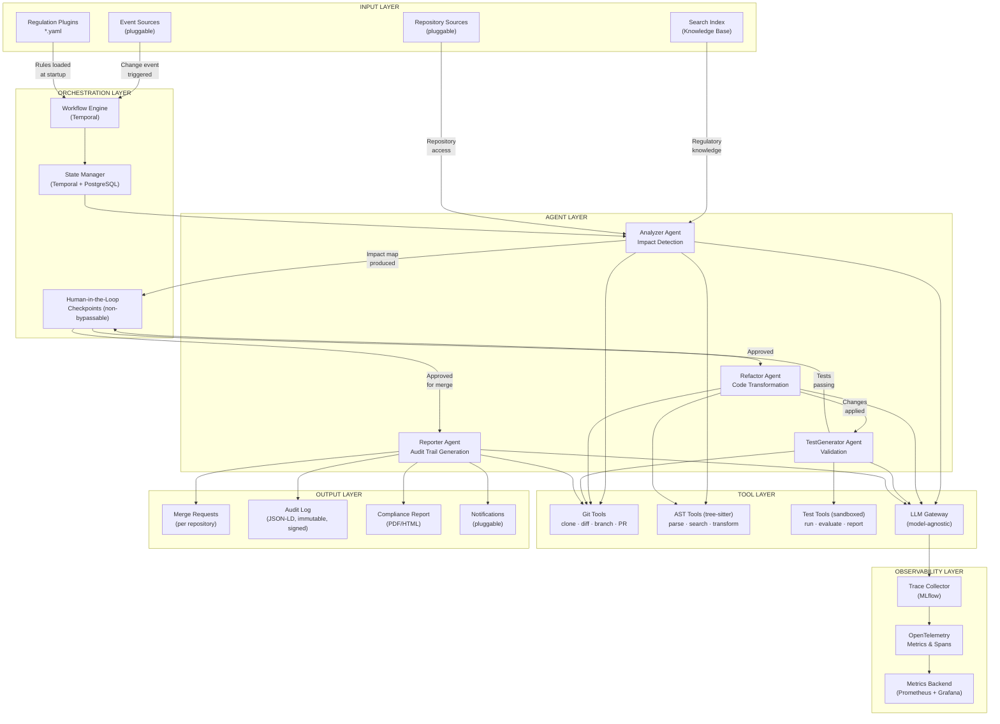
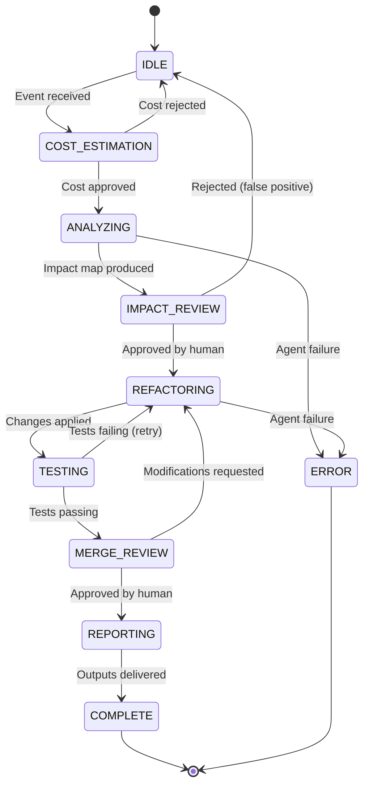

# regulatory-agent-kit — Framework Architecture

### Pure Infrastructure Specification — Regulation-Agnostic

> **Version:** 2.0
> **Status:** Active Development
> **Scope:** This document describes the framework's architecture, contracts, and infrastructure. It contains **no regulation-specific business rules, country-specific references, or jurisdiction-dependent logic**. All regulatory knowledge is externalized into YAML plugins (see [Plugin Authoring Guide](plugin-authoring-guide.md)).
> **Glossary:** See [`glossary.md`](glossary.md) for term definitions.

---

## Table of Contents

1. [Architectural Principles](#1-architectural-principles)
2. [System Architecture](#2-system-architecture)
3. [Plugin System](#3-plugin-system)
4. [Agent Orchestration](#4-agent-orchestration)
5. [Event Architecture](#5-event-architecture)
6. [LLM Gateway](#6-llm-gateway)
7. [Observability](#7-observability)
8. [Cross-Regulation Dependency Engine](#8-cross-regulation-dependency-engine)
9. [Security Architecture](#9-security-architecture)
10. [Technical Risks & Mitigations](#10-technical-risks-mitigations)
11. [Deployment Options](#11-deployment-options)
12. [Plugin Schema Reference](#12-plugin-schema-reference)

---

## 1. Architectural Principles

The framework is built on four non-negotiable architectural principles:

1. **Regulation-as-Configuration.** All regulatory knowledge — rules, conditions, remediation strategies, cross-references — is expressed as declarative YAML plugins. The framework core contains zero regulation-specific logic. Adding support for a new regulation requires zero code changes.

2. **Human-in-the-Loop by Design.** Every AI-generated output passes through non-bypassable human checkpoints before affecting any external system. The framework creates suggestions (branches, diffs, merge requests); humans make decisions.

3. **Audit-First Observability.** Every agent decision, LLM call, tool invocation, and human approval is traced, signed, and stored. The audit trail is a first-class output, not a side effect.

4. **Infrastructure Agnosticism.** Event sources, LLM providers, Git providers, storage backends, and notification channels are all pluggable via well-defined interfaces. No single vendor dependency is mandatory.

---

## 2. System Architecture



**Layer summary in plain English:**

- **Input Layer**: Receives regulatory change events (from Kafka, webhooks, SQS, or files) and loads the YAML regulation plugins that define compliance rules.
- **Orchestration Layer**: The Temporal workflow engine manages pipeline state, crash recovery, retries, and parallel processing. Human checkpoints pause the pipeline for approval.
- **Agent Layer**: Four PydanticAI agents — Analyzer (detects issues), Refactor (applies fixes), TestGenerator (validates changes), Reporter (produces audit trail and merge requests) — each with isolated tool sets.
- **Tool Layer**: Shared utilities — Git operations, AST parsing via tree-sitter, sandboxed test execution, Elasticsearch search, and the LLM gateway (LiteLLM).
- **Observability Layer**: MLflow traces every LLM call; OpenTelemetry + Prometheus track operational metrics; Grafana provides dashboards.
- **Output Layer**: Merge requests per repository, a cryptographically signed audit log (JSON-LD), compliance reports (PDF/HTML), and pluggable notifications.

### Layer Responsibilities

| Layer | Responsibility | Regulation-Aware? |
|---|---|---|
| **Input** | Receives events, loads plugins, connects to repositories | No — consumes generic event schema |
| **Orchestration** | Manages workflow state, transitions, checkpoints | No — drives generic state machine |
| **Agents** | Executes analysis, refactoring, testing, reporting | No — agents are generic; regulation logic comes from plugins |
| **Tools** | Provides AST parsing, Git operations, test execution, LLM access | No — pure infrastructure |
| **Observability** | Traces all operations, produces audit artifacts | No — captures generic events |
| **Output** | Delivers merge requests, audit logs, reports, notifications | No — generic output formats |

**All regulation-specific behavior is injected at runtime through YAML plugins.** No layer contains hardcoded regulatory logic.

---

## 3. Plugin System

### 3.1 Design Philosophy

The plugin system is the framework's primary extension point. It implements a **total decoupling of regulatory knowledge from infrastructure code**:

- **Plugins are declarative YAML** — readable by non-engineers (compliance officers, legal teams), testable by engineers.
- **The plugin schema is open** — plugins may include arbitrary domain-specific fields in addition to the required fields. The framework processes only the fields it knows; additional fields are passed through to templates and reports.
- **Plugins are versioned** — each plugin declares its version and may reference a predecessor it supersedes.
- **Plugins carry mandatory disclaimers** — every plugin must include a `disclaimer` field acknowledging that it represents an interpretation, not legal advice.

### 3.2 Plugin Structure (Generic Example)

```yaml
# regulations/example/example_regulation.yaml

# === REQUIRED FIELDS (framework-processed) ===
id: "example-regulation-2025"
name: "Example Regulation Requirements"
version: "1.0.0"
effective_date: "2025-01-01"
jurisdiction: "GLOBAL"           # ISO 3166-1 alpha-2, or "GLOBAL"
authority: "Example Authority"
source_url: "https://example.com/regulation"

# === OPTIONAL: Regulatory hierarchy ===
regulatory_technical_standards:   # Lower-level standards referenced by this regulation
  - id: "EX-RTS-001"
    name: "Technical Standard on Data Handling"
    url: "https://example.com/rts-001"

# === OPTIONAL: Cross-regulation dependencies ===
cross_references:
  - regulation_id: "other-regulation"
    relationship: "does_not_override"   # See Section 8 for relationship types
    articles: ["2(3)"]
    conflict_handling: "escalate_to_human"

# === RULES ===
rules:
  - id: "EX-001"
    description: "All services must implement structured logging for audit purposes"
    severity: "critical"           # critical | high | medium | low
    affects:
      - pattern: "**/*.java"      # Glob pattern for file matching
        condition: "class implements AuditableService AND NOT has_annotation(@AuditLog)"
      - pattern: "**/*.py"
        condition: "class inherits AuditableService AND NOT has_decorator(@audit_log)"
    remediation:
      strategy: "add_annotation"   # See Section 3.4 for strategies
      template: "templates/audit_log.j2"
      test_template: "templates/audit_log_test.j2"
      confidence_threshold: 0.85   # Below this, require additional human review

  - id: "EX-002"
    description: "Recovery objectives must be documented in service manifests"
    severity: "high"
    affects:
      - pattern: "**/service-manifest.yaml"
        condition: "NOT has_key(resilience.rto) OR NOT has_key(resilience.rpo)"
    remediation:
      strategy: "add_configuration"
      template: "templates/resilience_manifest.j2"

# === VERSIONING ===
supersedes: null                   # ID of prior version, or null
changelog: "Initial release"

# === REQUIRED: Legal disclaimer ===
disclaimer: >
  This plugin represents one interpretation of the referenced regulation.
  It does not constitute legal advice. Organizations must validate compliance
  with their own legal and compliance teams.

# === OPTIONAL: Event trigger configuration ===
event_trigger:
  topic: "regulatory-changes"
  schema:
    regulation_id: "example-regulation-2025"
    change_type: "new_requirement"

# === OPTIONAL: Domain-specific extensions ===
# Plugins may include arbitrary additional fields.
# The framework ignores fields it does not recognize but passes them
# through to Jinja2 templates and the Reporter Agent output.
# Example: a plugin might add "regulation_pillar: risk_management"
# Example: a plugin might add "requirement_id: 6.4.3"
```

### 3.3 Condition DSL

The `condition` field in rules uses a predicate expression language for matching code patterns:

| Operator | Meaning | Example |
|---|---|---|
| `AND` | Logical conjunction | `class implements Foo AND has_method(bar)` |
| `OR` | Logical disjunction | `has_annotation(@A) OR has_annotation(@B)` |
| `NOT` | Logical negation | `NOT has_annotation(@AuditLog)` |
| `implements` / `inherits` | Class hierarchy check | `class implements ServiceInterface` |
| `has_annotation` / `has_decorator` | Annotation/decorator presence | `has_annotation(@Deprecated)` |
| `has_method` | Method presence | `has_method(handlePayment)` |
| `has_key` | Configuration key presence (YAML/JSON) | `has_key(resilience.rto)` |
| `matches` | Regex pattern match | `class_name matches ".*Controller"` |

The DSL is evaluated by the Analyzer Agent using tree-sitter AST queries. Conditions that cannot be evaluated via AST (e.g., semantic meaning) are delegated to the LLM with the condition as a prompt constraint.

### 3.4 Remediation Strategies

| Strategy | Description | Input | Output |
|---|---|---|---|
| `add_annotation` | Adds class/method annotations or decorators | Jinja2 template | Modified source file |
| `add_configuration` | Injects configuration keys into manifests | Jinja2 template | Modified YAML/JSON/properties file |
| `replace_pattern` | Replaces deprecated patterns with compliant ones | Jinja2 template with old/new | Modified source file |
| `add_dependency` | Adds required library dependencies to build files | Jinja2 template | Modified pom.xml/build.gradle/package.json |
| `generate_file` | Creates new required files per repository | Jinja2 template | New file |
| `custom_agent` | Delegates to a user-defined Python class implementing `CustomAgentProtocol` | Fully-qualified class path in `template` field | Agent-defined `changes` list |

#### 3.4.1 Writing a Custom Agent

Use `custom_agent` when the five built-in strategies cannot express your remediation — for example, when you need to call an external API, apply semantic analysis, or make changes across multiple files.

**Step 1 — Implement the protocol:**

```python
# mypackage/agents/my_remediator.py
from regulatory_agent_kit.plugins.custom_agent import CustomAgentProtocol
from typing import Any


class MyRemediator(CustomAgentProtocol):
    async def remediate(
        self, file_path: str, rule_id: str, context: dict[str, Any]
    ) -> dict[str, Any]:
        with open(file_path) as f:
            content = f.read()

        modified = content.replace("old_pattern", "new_pattern")

        with open(file_path, "w") as f:
            f.write(modified)

        return {
            "status": "success",
            "changes": [
                {
                    "file_path": file_path,
                    "original": content,
                    "modified": modified,
                }
            ],
        }
```

**Step 2 — Reference in YAML (`template` holds the class path):**

```yaml
remediation:
  strategy: custom_agent
  template: mypackage.agents.MyRemediator
  confidence_threshold: 0.85
```

**Step 3 — Make the class importable at runtime:**

The framework imports the class using `importlib.import_module`. Your package must be installed in the same Python environment as `rak` (e.g., `uv pip install -e ./mypackage`).

**Return value contract:**

| Key | Type | Required | Description |
|---|---|---|---|
| `status` | `"success"` \| `"skipped"` \| `"error"` | Yes | Outcome of the remediation |
| `changes` | `list[dict]` | When `status == "success"` | Each entry needs `file_path`, `original`, `modified` |
| `message` | `str` | No | Human-readable explanation shown in the audit trail |

Return `{"status": "skipped", "message": "..."}` when the rule matches but your agent decides no change is needed. Return `{"status": "error", "message": "..."}` (or raise an exception) to flag the file for human review.

### 3.5 Plugin Lifecycle

```
rak plugin init --name <name>       # Scaffold new plugin
rak plugin validate <path>          # Validate schema, templates, test fixtures
rak plugin test <path> --repo <dir> # Run plugin against a test repository
rak plugin search <query>           # Search the plugin registry
```

### 3.6 Plugin Certification Tiers

| Tier | Meaning | How Achieved |
|---|---|---|
| **Technically Valid** | Schema correct, templates render, tests pass | Automated CI validation |
| **Community Reviewed** | Reviewed by 2+ domain experts | Pull request review process |
| **Official** | Maintained by core team, versioned with regulation | Core team ownership |

No "certified" tier. Certification implies legal liability that cannot be assumed by a software tool.

---

## 4. Agent Orchestration

### 4.1 Workflow Engine

The workflow engine is built on **Temporal** (self-hosted, Go binary) with **PydanticAI** as the agent framework. Each agent phase is a Temporal Activity, and transitions are governed by explicit workflow logic. Pipeline state is durably persisted to PostgreSQL via Temporal's event-sourced history (see [ADR-002](adr/002-langgraph-vs-temporal-pydanticai.md)).



> **Implementation mapping:** The conceptual state names above (IDLE, COMPLETE, ERROR) map to implementation-level states (PENDING, COMPLETED, FAILED, REJECTED, COST_REJECTED, CANCELLED) in the Temporal workflow and PostgreSQL `pipeline_runs.status` column. For the full mapping table, see [`implementation-design.md` Section 4.1.1 — Pipeline Status vs Temporal Phase](implementation-design.md#41-pipeline-run-lifecycle).

### 4.2 Orchestration Features

- **Cost estimation gate** — estimated LLM cost displayed before analysis begins
- **Non-bypassable human checkpoints** — Temporal Signals with cryptographically signed approvals at two gates (post-analysis, pre-merge)
- **Per-repository progress tracking** — `{repo_url, status: pending|in_progress|complete|failed, branch_name, commit_sha}` persisted to PostgreSQL
- **Idempotent operations** — deterministic branch naming (`rak/{regulation_id}/{rule_id}`) and deterministic Temporal workflow IDs prevent duplicate work on retry
- **Repository-level locking** — Temporal workflow ID uniqueness prevents concurrent pipeline runs from conflicting
- **Dead letter queue** — failed repositories are isolated; `rak retry-failures --run-id <id>` retries them without re-processing successes
- **Rollback manifests** — every pipeline run records all branches, PRs, and commits; `rak rollback --run-id <id>` reverses everything

### 4.3 Agent Contracts

Each agent implements a common interface and is unaware of specific regulations. Regulatory knowledge is injected via the plugin YAML and Jinja2 templates.

| Agent | Input Contract | Output Contract | Regulation-Aware? |
|---|---|---|---|
| **Analyzer** | Repository list + loaded plugin YAML | Impact map (JSON): `{repo → files → rules → approach → conflicts}` | No — reads rules from plugin |
| **Refactor** | Impact map + Jinja2 templates from plugin | Modified code on branches; diffs; confidence scores | No — applies templates from plugin |
| **TestGenerator** | Refactored code + test templates from plugin | Test files; execution report; pass/fail per repo | No — generates from templates |
| **Reporter** | All previous outputs + plugin metadata | Merge requests; signed JSON-LD audit log; report; rollback manifest | No — assembles generic artifacts |

### 4.4 Horizontal Scaling

Each agent phase supports fan-out/fan-in:

1. Analyzer produces a list of N repository analyses
2. N Refactor Agent workers pull from a work queue, each processing one repo
3. A coordinator waits for all workers, then proceeds to TestGenerator
4. Same fan-out pattern for TestGenerator and Reporter

Temporal distributes activities across N worker replicas automatically, providing native fan-out/fan-in parallelism.

---

## 5. Event Architecture

### 5.1 Pluggable Event Sources

The framework treats regulatory changes as **domain events** from pluggable sources, implementing a common `EventSource` interface:

| Source | Implementation | Dependencies | Use Case |
|---|---|---|---|
| `KafkaEventSource` | Kafka consumer group | Kafka cluster | Enterprise environments with existing Kafka |
| `WebhookEventSource` | Built-in HTTP endpoint (FastAPI) | None | Lightweight deployments; CI/CD triggers; manual |
| `SQSEventSource` | AWS SQS long-polling | AWS SQS | AWS-native organizations |
| `FileEventSource` | Watches a directory for JSON files | None | Development, testing, evaluation ("lite mode") |

### 5.2 Event Schema

All event sources produce the same normalized event:

```json
{
  "event_id": "uuid",
  "timestamp": "ISO-8601",
  "regulation_id": "string — matches a loaded plugin ID",
  "change_type": "new_requirement | amendment | withdrawal",
  "source": "string — originating system identifier",
  "payload": {}
}
```

The framework routes the event to the matching plugin by `regulation_id`. If no plugin matches, the event is logged and discarded.

### 5.3 Shift-Left Integration (CI/CD Mode)

Beyond reacting to regulatory change events, the framework supports **code change events**:

- **CI/CD pipeline gate** — GitHub Action / GitLab CI step that blocks merges on compliance violations
- **PR review bot** — agent comments on pull requests with compliance impact analysis
- **Pre-commit hook** — lightweight Analyzer flags violations before code is pushed

In shift-left mode, the event is generated by a code change (push, PR), not a regulatory change.

---

## 6. LLM Gateway

All LLM calls are routed through **LiteLLM**, providing:

| Capability | Description |
|---|---|
| **Model-agnostic agents** | Agent logic is decoupled from any specific LLM provider |
| **Data residency routing** | Route calls to region-specific models based on data classification. **Mandatory** for data subject to privacy regulations. |
| **Cost optimization** | Larger models for complex analysis; smaller models for templated tasks |
| **Model version pinning** | Pin exact model versions in production for deterministic behavior |
| **Audit of model selection** | Every model + version used for every decision is logged in the trace |
| **Vendor independence** | Switching providers requires only a configuration change |
| **Rate limit management** | Token bucket rate limiter for 500+ repository processing |
| **Fallback routing** | Automatic failover to secondary models on provider outage |

### Supported Providers

| Provider | Protocol | Authentication | Use Case |
|---|---|---|---|
| Anthropic Claude | REST (HTTPS) | API Key | Complex reasoning (default) |
| OpenAI GPT-4o / GPT-4o-mini | REST (HTTPS) | API Key | Fallback; cost optimization |
| AWS Bedrock | AWS SigV4 | IAM Roles | Data residency |
| Azure OpenAI | Azure AD | Service Principal | Enterprise; data residency |
| Self-hosted (vLLM, Ollama) | REST (HTTPS) | Bearer Token | Air-gapped environments |

LiteLLM is deployed behind a load balancer with 2+ replicas to avoid single point of failure.

---

## 7. Observability

Every agent decision is a potential audit artifact. The framework captures:

| Observable Event | Captured Data | Retention |
|---|---|---|
| LLM call initiated | Model + version, prompt (sanitized), temperature, max_tokens | Configurable (default: 90 days) |
| LLM response received | Full output, token count, latency, cost, confidence score | Configurable |
| Tool invocation | Tool name, input parameters, output | Configurable |
| Agent state transition | From state, to state, trigger condition, timestamp | **Permanent** |
| Human checkpoint decision | Actor, decision (approve/reject), rationale, timestamp, **cryptographic signature** | **Permanent** |
| Test execution result | Pass/fail per test, stack traces on failure, sandbox metadata | 30 days |
| Merge request created | Repository, branch, PR URL, rule IDs addressed | **Permanent** |
| Audit log generated | SHA-256 hash of log, storage location, **digital signature** | **Permanent** |
| Cross-regulation conflict detected | Conflicting rule IDs, affected code regions, resolution | **Permanent** |
| Cost tracking | Per-call cost, cumulative pipeline cost, budget threshold | **Permanent** |

### Durability Guarantees

- **MLflow** (self-hosted, PostgreSQL + S3 backend) is the primary trace collector (see [ADR-005](adr/005-llm-observability-platform.md))
- A **local write-ahead log (WAL)** buffers audit-critical traces, preventing data loss during MLflow outages
- **OpenTelemetry** exports operational metrics to Prometheus for pipeline health dashboards
- All permanent traces are replicated to object storage (S3/GCS/Azure Blob)

---

## 8. Cross-Regulation Dependency Engine

A single code change may be subject to multiple regulations simultaneously. The dependency engine evaluates all loaded plugins against each change and detects conflicts.

### 8.1 Relationship Types

The `cross_references.relationship` field in plugins uses these generic relationship types:

| Relationship | Meaning | Example |
|---|---|---|
| `does_not_override` | This regulation does not supersede the referenced regulation; both apply | Privacy law still applies alongside sector-specific law |
| `takes_precedence` | This regulation prevails over the referenced regulation for entities in scope | Sector-specific law overrides general cybersecurity law for sector entities |
| `complementary` | Both regulations apply and reinforce each other | Payment regulation + card security standard |
| `supersedes` | This regulation replaces the referenced regulation entirely | New version of a regulation replaces old version |
| `references` | This regulation references the other without a precedence relationship | One regulation cites another for definitions or scope |

### 8.2 Conflict Detection

When two regulations loaded in the same pipeline run produce contradictory remediation actions for the same code region (overlapping AST node ranges), the engine:

1. **Detects** the conflict via AST range overlap analysis
2. **Flags** both rules and their conflicting actions
3. **Resolves or escalates** based on the plugin's `conflict_handling` setting — `escalate_to_human` (default) routes to the human checkpoint; `apply_both` applies both remediations; `defer_to_referenced` defers to the referenced regulation. The default behavior is escalation, as conflict resolution is ultimately a legal decision
4. **Logs** the conflict in the audit trail with both rule IDs, affected code, and the human's resolution

### 8.3 Conflict Resolution Workflow

When `escalate_to_human` is triggered, the conflict is surfaced at the **Impact Review** checkpoint (Checkpoint #1):

1. The Analyzer Agent includes the conflict in the `ImpactMap.conflicts` field with both rule IDs, affected file paths, and conflicting remediation descriptions
2. The pipeline pauses at `AWAITING_IMPACT_REVIEW`, and the conflict is highlighted in the review notification (Slack/email/webhook)
3. The human reviewer sees the conflicting rules side-by-side and selects a resolution: apply Rule A, apply Rule B, apply both, or skip the conflicted region
4. The decision is recorded in `conflict_log` with a reference to the `checkpoint_decisions` entry and signed with Ed25519
5. The Refactor Agent receives the resolution as part of its input and applies only the approved remediation

If multiple conflicts exist in a single run, they are all presented at the same checkpoint. The reviewer resolves each independently.

### 8.4 Duplicate Prevention

When a `takes_precedence` relationship exists between two regulations, the engine suppresses the lower-priority regulation's rules for entities in scope, preventing duplicate remediations.

---

## 9. Security Architecture

```
SECURITY BOUNDARIES

1. Regulatory docs → LLM           (read-only tools only)
2. LLM output → Pydantic validation (typed JSON schemas)
3. Generated tests → Sandboxed container
   (no network, no secrets, no filesystem escape)
4. All code changes → Human review  (non-bypassable, signed)
5. Git credentials → Secrets manager (short-lived tokens)
6. Data classification → Region-specific model routing (enforced)
7. Audit logs → Cryptographically signed + local WAL
8. Supply chain → Pinned deps with hash verification
   (pip --require-hashes, SBOM via Syft/CycloneDX)
```

### 9.1 Threat Mitigations

| Threat | Mitigation |
|---|---|
| **LLM prompt injection via regulatory documents** | Input sanitization; Pydantic output validation; tool-level isolation (Analyzer = read-only tools); human checkpoints as primary defense |
| **Test execution as RCE vector** | Sandboxed containers (`--network=none --read-only`); static AST analysis before execution; CPU/memory/time limits |
| **Credential exposure** | Mandatory secrets manager (Vault, AWS SM, GCP SM); short-lived Git tokens (GitHub App tokens expire in 1h); rotation without restart |
| **Data classification leakage** | LiteLLM routing enforces region-based model selection; content with privacy-sensitive patterns is redacted before LLM calls |
| **Supply chain compromise** | Exact version pinning with hash verification; `pip-audit` in CI; SBOM generation; signed container images (Sigstore/cosign) |
| **Mid-pipeline crash** | Temporal event-sourced state; automatic replay; per-repo progress tracking; idempotent operations; `rak resume` command |
| **Concurrent pipeline conflicts** | Temporal workflow ID uniqueness; deterministic child workflow IDs; queuing for locked repos |

### 9.2 Credential Management

| Credential Type | Required Approach |
|---|---|
| LLM API keys | Secrets manager; LiteLLM Vault integration |
| Git provider tokens | Short-lived: GitHub App installation tokens (1h), GitLab tokens with expiry, Bitbucket OAuth2 with refresh |
| Kafka credentials | SASL/SCRAM or mTLS; rotatable without restart |
| Elasticsearch credentials | API Key with expiry; OAuth2 |
| Notification tokens | Secrets manager |

**Environment variables are acceptable for development only.** Production deployments must use a secrets manager.

### 9.3 API Authentication

The RAK API (FastAPI) endpoints (`POST /events`, `POST /approvals/{run_id}`, `GET /runs/{run_id}`) must be protected by an authentication layer appropriate to the deployment context:

| Deployment | Recommended Authentication |
|---|---|
| Lite Mode (local) | None (localhost only, bind to `127.0.0.1`) |
| Docker Compose (dev) | Bearer token via environment variable |
| Kubernetes (production) | OAuth2 / OIDC via API gateway (e.g., Istio, Kong, AWS ALB with Cognito) or FastAPI middleware with JWT validation |

API authentication is the responsibility of the deployer. The framework provides a `RakAuthMiddleware` extension point for custom authentication backends. Production deployments must not expose the API without authentication.

---

## 10. Technical Risks & Mitigations

| Risk | Severity | Likelihood | Mitigation |
|---|---|---|---|
| Mid-pipeline crash losing state | CRITICAL | HIGH | Temporal event-sourced state; automatic replay; per-repo progress; `rak resume --run-id` |
| Test execution as RCE vector | CRITICAL | MEDIUM | Sandboxed containers; static analysis; resource limits |
| No rollback mechanism | CRITICAL | HIGH | Rollback manifests; `rak rollback --run-id` |
| LLM prompt injection | HIGH | MEDIUM | Input sanitization; Pydantic validation; tool isolation; human checkpoints |
| Concurrent regulation conflicts | HIGH | MEDIUM | Temporal workflow ID uniqueness; deterministic child workflow IDs; conflict detection at PR creation |
| Credential exposure | HIGH | HIGH | Mandatory secrets manager; short-lived tokens |
| Temporal SDK version instability | HIGH | MEDIUM | Version pinning; integration tests; `WorkflowEngine` abstraction for potential migration |
| LLM non-determinism across versions | HIGH | MEDIUM | Model version pinning; version in audit trace; validation test suite |
| No incremental analysis | MEDIUM | HIGH | File-level caching via `SHA256(content + plugin_version + agent_version)` |

---

## 11. Deployment Options

| Option | Description | Dependencies | Best For |
|---|---|---|---|
| **Lite Mode** (`rak run --lite`) | File-based events, SQLite, MLflow optional | Python 3.12+, LLM API key | Evaluation in < 5 minutes |
| **Docker Compose** | Full stack: Kafka, Elasticsearch, Temporal, MLflow, PostgreSQL | Docker | Development, POC |
| **Kubernetes (Helm)** | Production-grade, horizontal scaling | Kubernetes 1.28+ | Enterprise production |
| **AWS ECS + MSK** | Managed containers + managed Kafka | AWS account | AWS-native organizations |
| **Serverless** | Lambda + EventBridge | AWS account | Low-frequency events |

For detailed deployment configurations, hardware sizing, container images, Helm chart values, cloud-specific guides (AWS, GCP, Azure), CI/CD pipelines, and monitoring setup, see [`infrastructure.md`](infrastructure.md).

### Integration Reference

The following table summarizes all external system integrations. For the detailed integration specification including rate limits, retry strategies, timeouts, and data residency routing, see [`system-design.md` Section 6.2 — Integration Specification Table](system-design.md#62-integration-specification-table).

| Category | Integration | Protocol | Authentication |
|---|---|---|---|
| **Event Streaming** | Apache Kafka | Kafka 2.x+ | SASL/SCRAM, mTLS |
| **Event — Lightweight** | Webhook (HTTP POST) | REST (HTTPS) | Bearer Token, HMAC |
| **Event — AWS** | Amazon SQS | AWS SDK | IAM Roles |
| **Search & Knowledge** | Elasticsearch 8.x | REST (HTTPS) | API Key, OAuth2 |
| **State & Checkpoints** | PostgreSQL 16+ | libpq | Username/Password, SSL |
| **Observability** | MLflow (self-hosted) | REST (HTTPS) | Bearer Token |
| **Metrics** | OpenTelemetry → Prometheus → Grafana | OTLP (gRPC/HTTP) | N/A |
| **Git** | GitHub, GitLab, Bitbucket | REST/GraphQL | App tokens, OAuth2 |
| **Notifications** | Slack, Email, Generic Webhook | Webhooks/SMTP/HTTP | Bot Token, SMTP, Bearer |
| **Storage** | S3 / GCS / Azure Blob | SDK | IAM / Service Account |
| **CI/CD** | GitHub Actions, GitLab CI, Jenkins | Webhook/REST | Token |
| **Secrets** | Vault, AWS SM, GCP SM | SDK | IAM / AppRole |

### Analysis Scope

| Asset Type | Examples | Phase |
|---|---|---|
| Application code | Java, Kotlin, Python | v1.0 |
| Build files | pom.xml, build.gradle, package.json | v1.0 |
| API specifications | OpenAPI 3.x, AsyncAPI | v1.5 |
| Infrastructure-as-Code | Terraform, Pulumi | v1.5 |
| Kubernetes manifests | Deployments, NetworkPolicies | v1.5 |
| CI/CD pipelines | GitHub Actions, GitLab CI | v2.0 |
| Go, TypeScript | .go, .ts/.tsx | v2.0 |

---

## 12. Plugin Schema Reference

```yaml
# === REQUIRED FIELDS ===
id: string                        # Unique identifier (kebab-case)
name: string                      # Human-readable name
version: semver                   # Plugin version (e.g., "1.0.0")
effective_date: date              # When regulation takes effect (YYYY-MM-DD)
jurisdiction: string              # ISO 3166-1 alpha-2 or "GLOBAL"
authority: string                 # Regulatory body name
source_url: url                   # Official regulation URL
disclaimer: string                # REQUIRED — legal disclaimer text

# === OPTIONAL: Regulatory hierarchy ===
regulatory_technical_standards:
  - id: string                    # Standard identifier
    name: string                  # Human-readable name
    url: url                      # Official URL

# === OPTIONAL: Cross-regulation dependencies ===
cross_references:
  - regulation_id: string         # ID of referenced regulation plugin
    relationship: enum            # does_not_override | takes_precedence |
                                  # complementary | supersedes | references
    articles: [string]            # Relevant articles/sections
    conflict_handling: enum       # escalate_to_human | apply_both | defer_to_referenced

# === VERSIONING ===
supersedes: string | null         # ID of prior plugin version this replaces
changelog: string                 # What changed from prior version

# === RULES ===
rules:
  - id: string                   # Rule identifier (e.g., "REG-001")
    description: string           # Plain-language rule description
    severity: enum                # critical | high | medium | low
    affects:
      - pattern: glob            # File patterns to scan
        condition: string         # Predicate expression (DSL — see Section 3.3)
    remediation:
      strategy: enum             # add_annotation | add_configuration | replace_pattern |
                                 # add_dependency | generate_file | custom_agent
      template: path             # Jinja2 template for code generation
      test_template: path        # Jinja2 template for test generation
      confidence_threshold: float # 0.0–1.0; below this, require extra human review

# === OPTIONAL: Event trigger ===
event_trigger:
  topic: string                  # Event topic/channel name
  schema:
    regulation_id: string        # Must match plugin id
    change_type: string          # Event type filter

# === OPEN SCHEMA ===
# Plugins may include arbitrary additional fields beyond those listed above.
# The framework ignores unrecognized fields but passes them through to
# Jinja2 templates and the Reporter Agent output.
# This allows regulation-specific metadata without polluting the core schema.
```

The subsections below provide a complete field-by-field reference derived from
`src/regulatory_agent_kit/plugins/schema.py`. Use these tables when authoring or
reviewing a regulation plugin YAML.

### 12.1 Top-Level Fields (`RegulationPlugin`)

| Field | Type | Required | Default | Description |
|---|---|---|---|---|
| `id` | `str` | Yes | — | Unique plugin identifier. Use kebab-case (e.g. `gdpr-audit-2025`). |
| `name` | `str` | Yes | — | Human-readable regulation name. |
| `version` | `str` | Yes | — | Plugin version in semver format (e.g. `1.0.0`). |
| `effective_date` | `date` (YYYY-MM-DD) | Yes | — | When the regulation takes effect. |
| `jurisdiction` | `str` | Yes | — | ISO 3166-1 alpha-2 country code or `"GLOBAL"`. |
| `authority` | `str` | Yes | — | The issuing regulatory authority. |
| `source_url` | `HttpUrl` | Yes | — | URL to the official regulation text. |
| `disclaimer` | `str` | Yes | — | Legal disclaimer (must be non-empty). |
| `rules` | `list[Rule]` | Yes | — | At least one rule required. See §12.2. |
| `regulatory_technical_standards` | `list[RTS]` | No | `null` | Referenced technical standards. See §12.5. |
| `cross_references` | `list[CrossReference]` | No | `null` | Dependencies on other plugins. See §12.4. |
| `supersedes` | `str` | No | `null` | Plugin ID that this version replaces. |
| `changelog` | `str` | No | `""` | What changed in this version. |
| `event_trigger` | `EventTrigger` | No | `null` | Event topic that triggers this regulation's pipeline. See §12.6. |
| `certification` | `Certification` | No | `technically_valid` | Certification status. See §12.7. |

> **Extension fields:** Any additional fields beyond the above are preserved in `model_extra` and available in Jinja2 templates via `plugin.model_extra.<field>`.

### 12.2 Rule Fields (`Rule`)

| Field | Type | Required | Default | Description |
|---|---|---|---|---|
| `id` | `str` | Yes | — | Unique rule identifier within this plugin (e.g. `GDPR-001`). |
| `description` | `str` | Yes | — | Plain-language description of what the rule enforces. |
| `severity` | `"critical"` \| `"high"` \| `"medium"` \| `"low"` | Yes | — | Determines urgency and escalation path. |
| `affects` | `list[AffectsClause]` | Yes | — | One or more file pattern + condition pairs. See §12.3. |
| `remediation` | `Remediation` | Yes | — | How to fix violations. See §12.3. |

> Rules also accept extension fields (e.g. `rts_reference`, `article`) that are passed through to templates via `rule.model_extra`.

### 12.3 AffectsClause and Remediation Fields

**`AffectsClause`:**

| Field | Type | Required | Description |
|---|---|---|---|
| `pattern` | `str` | Yes | Glob pattern for matching files (e.g. `**/*.java`, `**/service-manifest.yaml`). |
| `condition` | `str` | Yes | Condition DSL expression (see §3.3). |

**`Remediation`:**

| Field | Type | Required | Default | Description |
|---|---|---|---|---|
| `strategy` | `str` | Yes | — | One of: `add_annotation`, `add_configuration`, `replace_pattern`, `add_dependency`, `generate_file`, `custom_agent`. |
| `template` | `str` | Yes | — | For built-in strategies: path to the Jinja2 template file relative to the plugin YAML. For `custom_agent`: fully-qualified Python class path (e.g. `mypackage.agents.MyAgent`). |
| `test_template` | `str` | No | `null` | Path to a Jinja2 template that generates validation tests. |
| `confidence_threshold` | `float` (0.0–1.0) | No | `0.85` | Minimum Analyzer confidence to auto-apply the remediation. Below this, requires human review. |

### 12.4 CrossReference Fields

| Field | Type | Required | Default | Description |
|---|---|---|---|---|
| `regulation_id` | `str` | Yes | — | ID of the referenced plugin. |
| `relationship` | `str` | Yes | — | `does_not_override` \| `takes_precedence` \| `complementary` \| `supersedes` \| `references` |
| `articles` | `list[str]` | No | `[]` | Referenced article numbers (e.g. `["6(1)", "17"]`). |
| `conflict_handling` | `str` | No | `null` | `escalate_to_human` \| `apply_both` \| `defer_to_referenced` |

### 12.5 RTS (Regulatory Technical Standard) Fields

| Field | Type | Required | Description |
|---|---|---|---|
| `id` | `str` | Yes | RTS identifier. |
| `name` | `str` | Yes | RTS human-readable name. |
| `url` | `HttpUrl` | Yes | URL to the RTS document. |

### 12.6 EventTrigger Fields

| Field | Type | Required | Description |
|---|---|---|---|
| `topic` | `str` | Yes | The message topic / event type that activates this pipeline (e.g. `regulatory-changes`). |
| `schema` | `dict[str, str]` | No | Expected payload fields and their types, for documentation and validation. |

### 12.7 Certification Fields

| Field | Type | Required | Default | Description |
|---|---|---|---|---|
| `tier` | `str` | No | `technically_valid` | `technically_valid` \| `community_reviewed` \| `official` |
| `certified_at` | `datetime` | No | `null` | When certification was granted. |
| `certified_by` | `str` | No | `""` | Required for `official` tier. |
| `reviews` | `list[ReviewRecord]` | No | `[]` | `community_reviewed` requires ≥ 2 entries. |
| `ci_validated` | `bool` | No | `false` | Set to `true` by CI after passing `rak plugin validate`. |

---

## Appendix A — Quick Start

```bash
# Install
pip install regulatory-agent-kit

# Minimal evaluation (lite mode — no infrastructure required)
export ANTHROPIC_API_KEY=your_key
rak run --lite \
  --regulation regulations/examples/example.yaml \
  --repos ./my-local-repo \
  --checkpoint-mode terminal

# Full deployment (Temporal, MLflow, PostgreSQL, Elasticsearch)
docker compose up -d
rak run \
  --regulation regulations/my-regulation.yaml \
  --repos https://github.com/org/service-a \
           https://github.com/org/service-b \
  --checkpoint-mode slack \
  --slack-channel "#compliance-approvals"

# Plugin development
rak plugin init --name my-regulation
rak plugin validate regulations/my-regulation.yaml
rak plugin test regulations/my-regulation.yaml --repo ./test-repo

# Pipeline management
rak status --run-id <id>
rak retry-failures --run-id <id>
rak rollback --run-id <id>
rak resume --run-id <id>
```

---

## Next Steps

| Your role | Read next |
|---|---|
| Implementing agents or workflows | [`implementation-design.md`](implementation-design.md) — class diagrams, algorithms, state machines |
| Deploying the system | [`infrastructure.md`](infrastructure.md) — Docker, Kubernetes, cloud guides |
| Writing regulation plugins | [`plugin-template-guide.md`](plugin-template-guide.md) — Jinja2 template authoring |
| Understanding data storage | [`data-model.md`](data-model.md) — tables, indexes, partitioning |

*This document describes the framework infrastructure only. For regulation-specific plugin documentation, see [Plugin Authoring Guide](plugin-authoring-guide.md). For the full product requirements including market context and business strategy, see [`docs/prd.md`](prd.md).*
