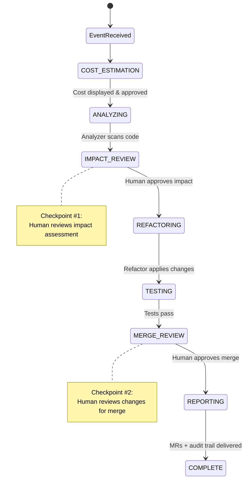

# Getting Started with regulatory-agent-kit

> **Time to first run:** ~5 minutes
> **Prerequisites:** Python 3.12+, an LLM API key (Anthropic, OpenAI, or any LiteLLM-supported provider)

---

## What is regulatory-agent-kit?

`regulatory-agent-kit` is an open-source Python framework that automates regulatory compliance across software codebases. It uses four specialized AI agents — Analyzer, Refactor, TestGenerator, and Reporter — to detect compliance issues, apply fixes, generate tests, and produce audit trails. All regulatory knowledge is defined in declarative YAML plugins, not hardcoded logic.

For the full product vision, see [`prd.md`](prd.md). For the technical architecture, see [`framework-spec.md`](framework-spec.md).

---

## 1. Install

```bash
# Clone the repository
git clone https://github.com/regulatory-agent-kit/regulatory-agent-kit.git
cd regulatory-agent-kit

# Install with uv (recommended) or pip
uv sync          # installs all dependencies from uv.lock
# OR
pip install -e .
```

## 2. Set your LLM API key

```bash
# Pick your provider (only one is required)
export ANTHROPIC_API_KEY="sk-ant-..."
# OR
export OPENAI_API_KEY="sk-..."
```

## 3. Run your first pipeline

```bash
rak run --lite \
  --regulation regulations/dora/dora-ict-risk-2025.yaml \
  --repo https://github.com/your-org/example-service
```

The `--lite` flag runs in **Lite Mode** — no Temporal, no Elasticsearch, no Kafka. Just Python, SQLite, and your LLM. This is the fastest way to evaluate the framework.

## 4. What just happened?

The pipeline executes these stages:



At each **checkpoint** (Impact Review, Merge Review), the pipeline pauses for your approval. No code change reaches a merge request without explicit human sign-off.

**Expected output:** After completion, you should see merge request URLs, a cost summary, and the path to a signed audit trail printed to your terminal.

## 5. Check pipeline status

```bash
rak status --run-id <uuid>
```

Example output:

```
Run:    a1b2c3d4-...
Status: running
Phase:  AWAITING_IMPACT_REVIEW (waiting for human approval)
Repos:  3 total (1 completed, 1 in_progress, 1 pending)
Cost:   $0.42 estimated / $0.18 actual so far
```

## 6. Explore further

| Your goal | Start here |
|---|---|
| Run full stack locally (Docker) | [`local-development.md`](local-development.md) — all services, parallel processing, Elasticsearch, MLflow |
| Understand the architecture | [`framework-spec.md`](framework-spec.md) — framework contracts, plugin system, agent orchestration |
| Write a regulation plugin | [`framework-spec.md` Section 12](framework-spec.md#12-plugin-schema-reference) then [`plugin-template-guide.md`](plugin-template-guide.md) |
| Deploy to production | [`system-design.md`](system-design.md) then [`infrastructure.md`](infrastructure.md) — Docker Compose, Kubernetes, AWS/GCP/Azure |
| Understand the data model | [`data-model.md`](data-model.md) — tables, indexes, partitioning, retention |
| Operate and troubleshoot | [`operations/runbook.md`](operations/runbook.md) — failure recovery, maintenance |
| Read technology decisions | [`adr/`](adr/) — why Temporal, PostgreSQL, MLflow, Elasticsearch |
| Look up CLI commands | [`cli-reference.md`](cli-reference.md) — all `rak` commands, flags, and environment variables |
| Look up a term | [`glossary.md`](glossary.md) — definitions for technical and regulatory terms |

---

*For the full documentation reading order, see [`README.md`](README.md).*
