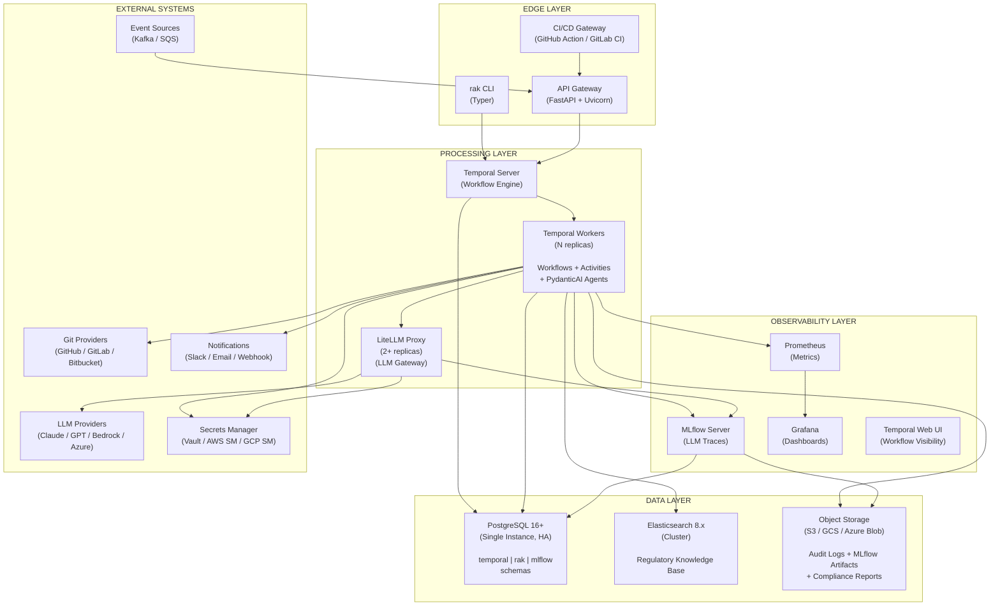
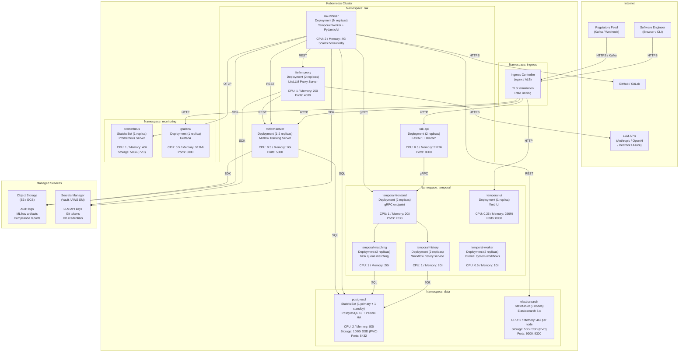
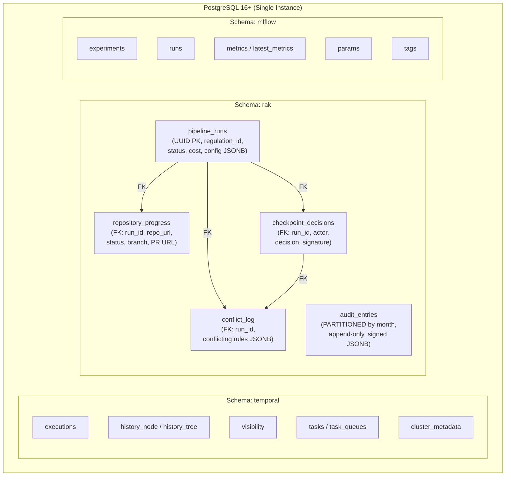
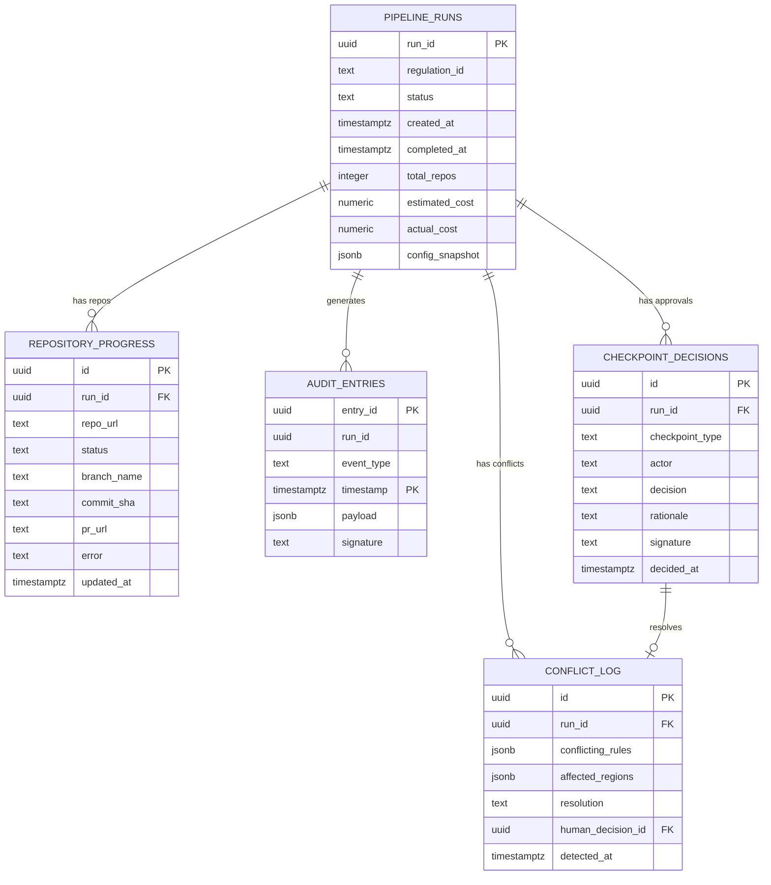
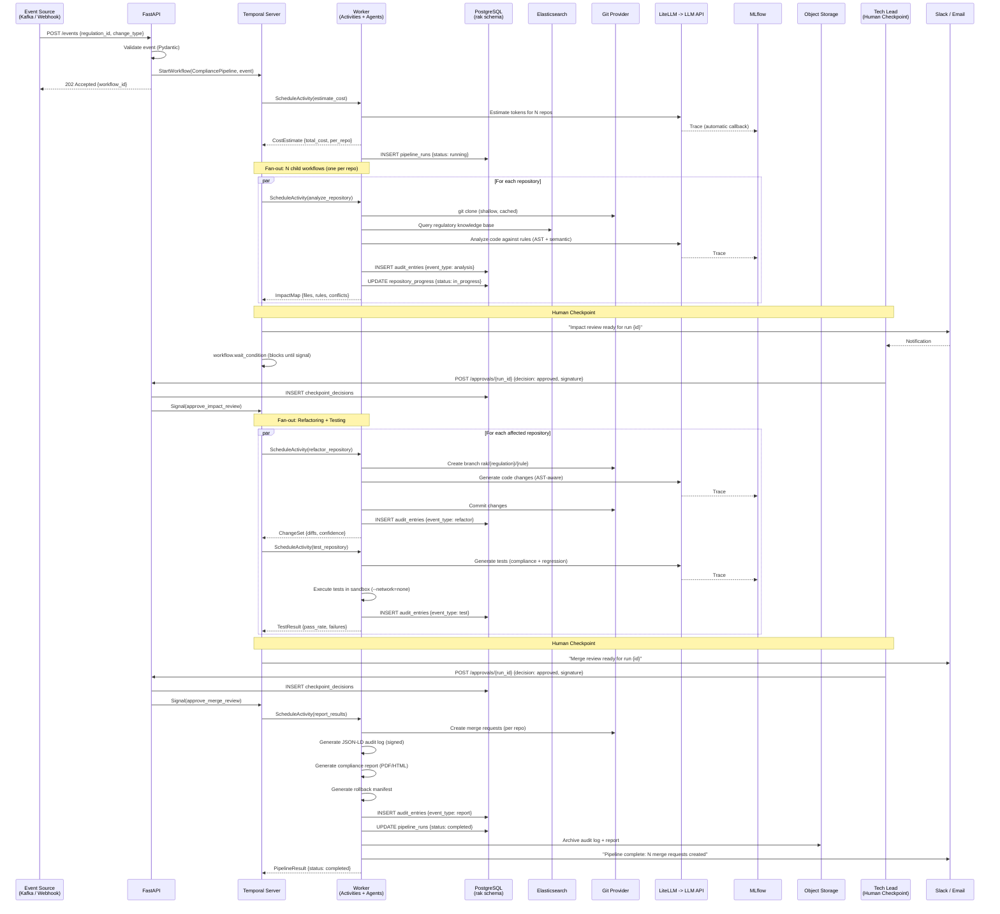
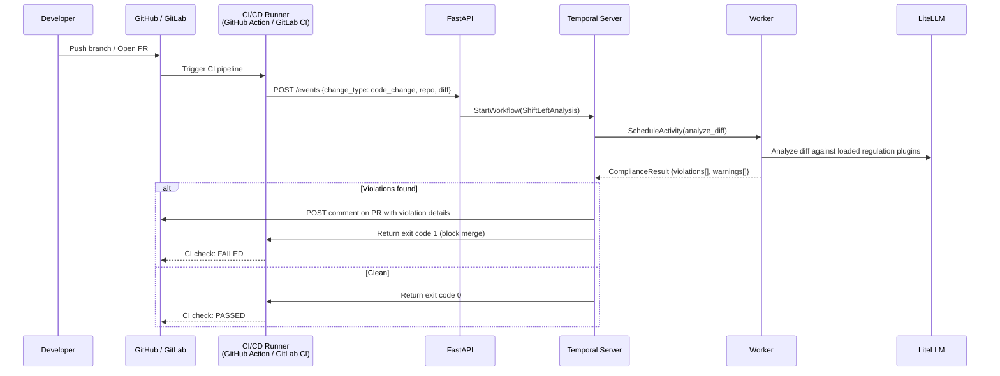
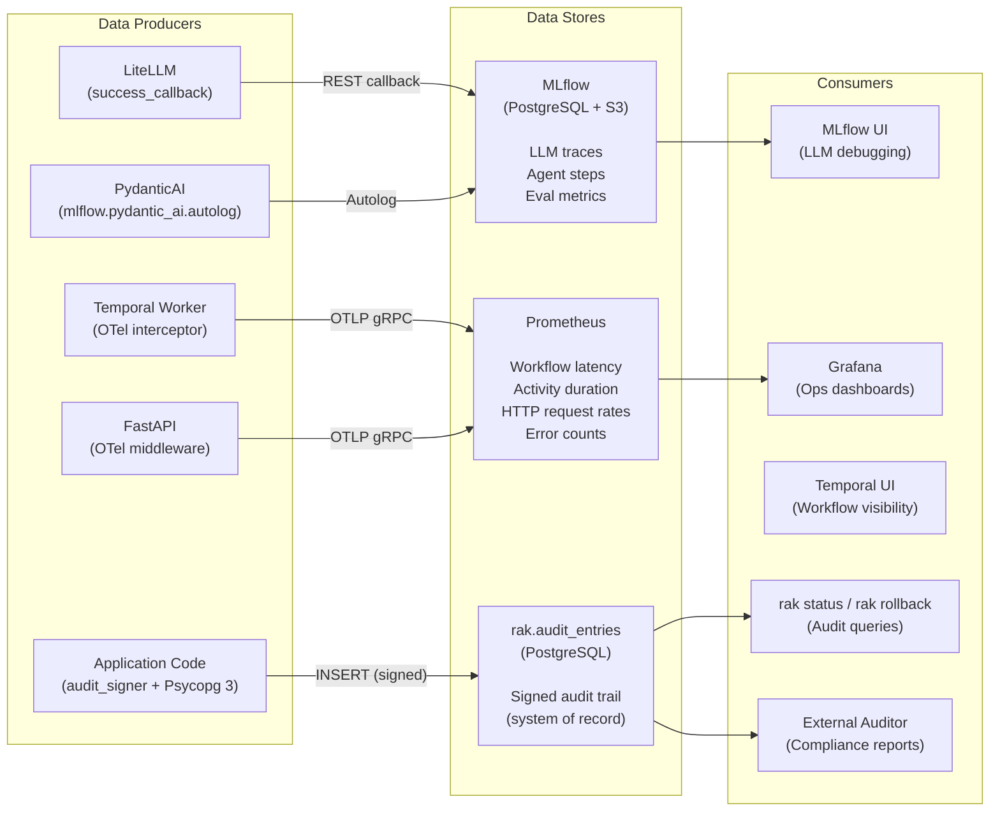
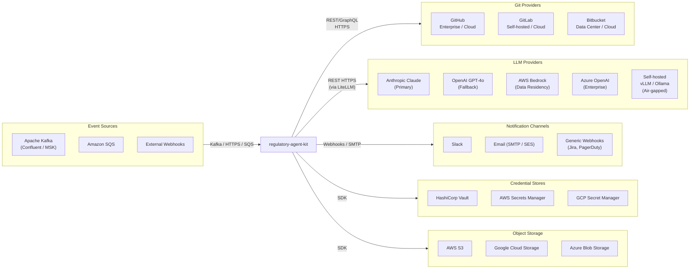
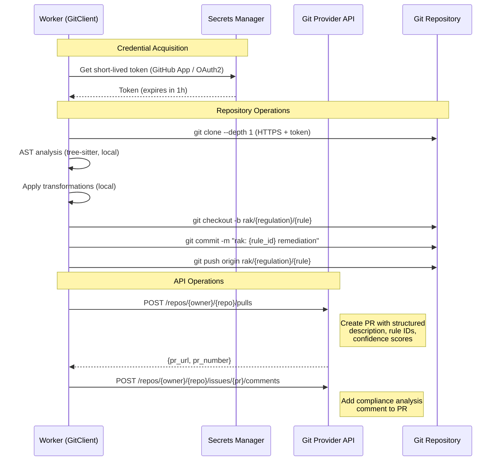
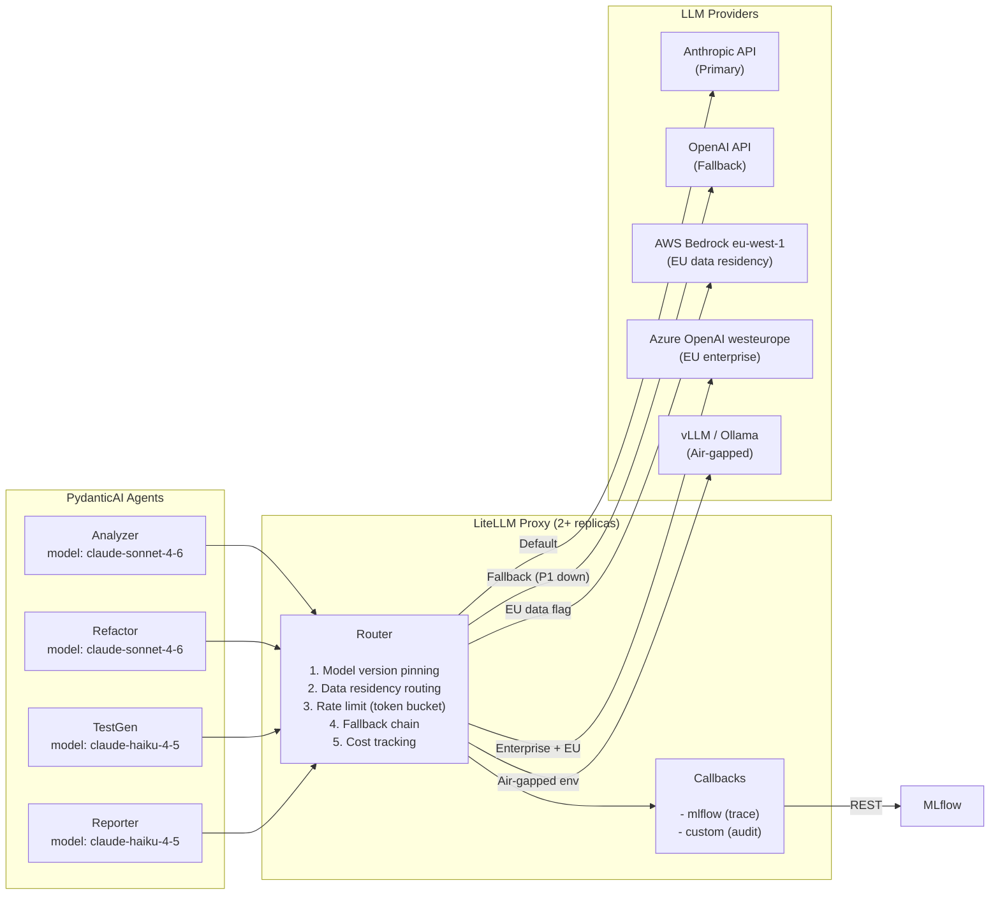

# regulatory-agent-kit — High-Level Design / System Design Document

> **Version:** 1.0
> **Date:** 2026-03-27
> **Status:** Active Development
> **Audience:** Platform engineers, DevOps, infrastructure teams, and technical decision-makers responsible for deploying, operating, and integrating the system.

---

## Table of Contents

1. [Document Purpose and Scope](#1-document-purpose-and-scope)
2. [System Architecture Diagrams](#2-system-architecture-diagrams)
3. [Hardware and Software Environments](#3-hardware-and-software-environments)
4. [Database Design Overview](#4-database-design-overview)
5. [Data Flow Diagrams](#5-data-flow-diagrams)
6. [External System Integrations](#6-external-system-integrations)
7. [Network and Communication Architecture](#7-network-and-communication-architecture)
8. [Capacity Planning and Sizing](#8-capacity-planning-and-sizing)
9. [High Availability and Disaster Recovery](#9-high-availability-and-disaster-recovery)
10. [Environment Strategy](#10-environment-strategy)

---

## 1. Document Purpose and Scope

### 1.1 Purpose

This High-Level Design (HLD) document describes the physical and logical system design of `regulatory-agent-kit` — how the system is deployed, what hardware and software it runs on, how data flows between components, how external systems are integrated, and how the infrastructure is sized, secured, and made resilient.

### 1.2 Relationship to Other Documents

| Document | Focus | This HLD Adds |
|---|---|---|
| [`architecture.md`](architecture.md) | Abstract framework specification (regulation-agnostic contracts, plugin schema) | N/A — this HLD implements the abstract spec |
| [`sad.md`](sad.md) | Software architecture (C4 model, component design, code-level abstractions, ADR decisions) | Physical deployment, hardware sizing, network topology, HA/DR strategy |
| [`adr/*.md`](adr/) | Individual technology decisions with rationale | Concrete deployment configurations for each chosen technology |
| [`regulatory-agent-kit.md`](regulatory-agent-kit.md) | Product requirements, market context, roadmap | Infrastructure required to deliver each roadmap phase |

### 1.3 Technology Decisions (Summary)

All technology choices are documented in ADRs. This HLD designs the physical system around them:

| Concern | Decision | ADR |
|---|---|---|
| Orchestration | Temporal (self-hosted) + PydanticAI | [ADR-002](adr/002-langgraph-vs-temporal-pydanticai.md) |
| Database | PostgreSQL 16+ (single instance) | [ADR-003](adr/003-database-selection.md) |
| Python stack | Python 3.12+, uv, FastAPI, Psycopg 3, tree-sitter, Typer | [ADR-004](adr/004-python-stack.md) |
| LLM observability | MLflow (self-hosted, PostgreSQL + S3) | [ADR-005](adr/005-llm-observability-platform.md) |
| LLM gateway | LiteLLM (proxy mode, 2+ replicas) | `architecture.md` SS6 |
| Search/knowledge base | Elasticsearch 8.x | `architecture.md` SS5 |

---

## 2. System Architecture Diagrams

### 2.1 Logical Architecture

Shows the logical grouping of system components by responsibility.



### 2.2 Physical Deployment Architecture (Production — Kubernetes)



### 2.3 Physical Deployment Architecture (Development — Docker Compose)

```
docker-compose.yml
+-------------------------------------------------------------------+
|                                                                    |
|  +------------------+    +------------------+                      |
|  | postgres:5432    |    | elasticsearch:   |                      |
|  | PostgreSQL 16    |    | 9200             |                      |
|  | (temporal + rak  |    | Elasticsearch 8  |                      |
|  |  + mlflow)       |    | (single node)    |                      |
|  +------------------+    +------------------+                      |
|                                                                    |
|  +------------------+    +------------------+                      |
|  | temporal:7233    |    | temporal-ui:8080 |                      |
|  | Temporal Server  |    | Temporal Web UI  |                      |
|  | (auto-setup)     |    |                  |                      |
|  +------------------+    +------------------+                      |
|                                                                    |
|  +------------------+    +------------------+                      |
|  | worker           |    | api:8000         |                      |
|  | Temporal Worker   |    | FastAPI          |                      |
|  | (single replica) |    | (webhook + API)  |                      |
|  +------------------+    +------------------+                      |
|                                                                    |
|  +------------------+    +------------------+                      |
|  | litellm:4000     |    | mlflow:5000      |                      |
|  | LiteLLM Proxy    |    | MLflow Server    |                      |
|  | (single replica) |    | (single replica) |                      |
|  +------------------+    +------------------+                      |
|                                                                    |
|  +------------------+    +------------------+                      |
|  | prometheus:9090  |    | grafana:3000     |                      |
|  | Prometheus       |    | Grafana          |                      |
|  | (single)         |    | (single)         |                      |
|  +------------------+    +------------------+                      |
|                                                                    |
|  Volumes: pgdata, esdata, prometheusdata                          |
|  Network: rak-network (bridge)                                     |
+-------------------------------------------------------------------+
```

---

## 3. Hardware and Software Environments

### 3.1 Software Environment Matrix

| Component | Software | Version | License | Container Image |
|---|---|---|---|---|
| **Application Runtime** | Python | 3.12+ | PSF | `python:3.12-slim` |
| **Temporal Server** | Temporal | Latest stable | MIT | `temporalio/auto-setup` (dev) / `temporalio/server` (prod) |
| **Temporal UI** | Temporal UI | Latest stable | MIT | `temporalio/ui` |
| **PostgreSQL** | PostgreSQL | 16+ | PostgreSQL License | `postgres:16-alpine` |
| **Elasticsearch** | Elasticsearch | 8.13+ | SSPL / Elastic License | `elasticsearch:8.13.0` |
| **MLflow** | MLflow | 2.18+ | Apache 2.0 | Custom: `python:3.12-slim` + `pip install mlflow` |
| **LiteLLM** | LiteLLM Proxy | 1.40+ | MIT | `ghcr.io/berriai/litellm:main` |
| **Prometheus** | Prometheus | 2.50+ | Apache 2.0 | `prom/prometheus` |
| **Grafana** | Grafana | 10+ | AGPL-3.0 | `grafana/grafana` |
| **Object Storage** | S3 / GCS / Azure Blob | Managed | N/A | N/A (managed service) |
| **Secrets Manager** | Vault / AWS SM / GCP SM | Managed | MPL-2.0 / Managed | N/A (managed service) |

### 3.2 Hardware Sizing — Development Environment

Minimum requirements for a single developer running the full Docker Compose stack locally:

| Resource | Minimum | Recommended |
|---|---|---|
| **CPU** | 4 cores | 8 cores |
| **RAM** | 12 GB | 16 GB |
| **Disk** | 20 GB free | 40 GB SSD |
| **Network** | Internet access for LLM API calls | Same |
| **OS** | Linux (x86_64/arm64), macOS (Apple Silicon), Windows (WSL2) | Linux or macOS |
| **Docker** | Docker Engine 24+ with Compose V2 | Same |

### 3.3 Hardware Sizing — Lite Mode

Minimal evaluation mode (`rak run --lite`) with no infrastructure:

| Resource | Minimum |
|---|---|
| **CPU** | 2 cores |
| **RAM** | 4 GB |
| **Disk** | 2 GB free |
| **Dependencies** | Python 3.12+, `git` CLI, LLM API key |
| **Infrastructure** | None (file-based events, SQLite, MLflow optional) |

### 3.4 Hardware Sizing — Production (Kubernetes)

Recommended per-node sizing for a production cluster processing up to 500 repositories per pipeline run:

| Node Role | Nodes | CPU per Node | RAM per Node | Disk per Node |
|---|---|---|---|---|
| **Application nodes** (workers, API, LiteLLM, MLflow) | 3-5 | 8 cores | 16 GB | 50 GB SSD |
| **Data nodes** (PostgreSQL, Elasticsearch) | 2-3 | 8 cores | 32 GB | 200 GB SSD (NVMe preferred) |
| **Monitoring nodes** (Prometheus, Grafana) | 1-2 | 4 cores | 8 GB | 100 GB SSD |

**Per-pod resource requests (Kubernetes):**

| Pod | Replicas | CPU Request | CPU Limit | Memory Request | Memory Limit | Storage |
|---|---|---|---|---|---|---|
| `rak-worker` | 2-10 (HPA) | 1 | 4 | 2 Gi | 8 Gi | — |
| `rak-api` | 2 | 0.25 | 1 | 256 Mi | 1 Gi | — |
| `litellm-proxy` | 2 | 0.5 | 2 | 512 Mi | 2 Gi | — |
| `mlflow-server` | 1-2 | 0.25 | 1 | 512 Mi | 2 Gi | — |
| `temporal-frontend` | 2 | 0.5 | 2 | 1 Gi | 4 Gi | — |
| `temporal-history` | 2 | 0.5 | 2 | 1 Gi | 4 Gi | — |
| `temporal-matching` | 2 | 0.5 | 1 | 512 Mi | 2 Gi | — |
| `temporal-worker` | 2 | 0.25 | 1 | 256 Mi | 1 Gi | — |
| `temporal-ui` | 1 | 0.1 | 0.5 | 128 Mi | 256 Mi | — |
| `postgresql` | 1+1 standby | 2 | 4 | 4 Gi | 8 Gi | 100 Gi PVC |
| `elasticsearch` | 3 | 1 | 4 | 2 Gi | 8 Gi | 50 Gi PVC |
| `prometheus` | 1 | 0.5 | 2 | 2 Gi | 4 Gi | 50 Gi PVC |
| `grafana` | 1 | 0.25 | 1 | 256 Mi | 512 Mi | — |

### 3.5 Scaling Lever

The **primary scaling lever** is `rak-worker` replica count. Each worker independently pulls Temporal tasks and processes repository activities. Adding workers provides linear throughput scaling.

```
Throughput = (N workers) x (repos per worker per hour)

At default concurrency (10 activities per worker):
  2 workers  -> ~20 repos/hour
  5 workers  -> ~50 repos/hour
  10 workers -> ~100 repos/hour

Bottleneck shifts to:
  - LLM API rate limits (managed by LiteLLM token bucket)
  - PostgreSQL write throughput (managed by connection pooling)
  - Git provider API limits (managed by per-provider rate limiter)
```

### 3.6 Operating System and Runtime Requirements

| Requirement | Production | Development |
|---|---|---|
| **Container Runtime** | containerd (via Kubernetes) | Docker Engine 24+ |
| **Kubernetes** | 1.28+ (with PVC support, Ingress controller) | Not required (Docker Compose) |
| **Python** | 3.12+ (in container images) | 3.12+ (local) |
| **Git** | 2.40+ (in worker container image) | 2.40+ (local) |
| **TLS** | Required for all external traffic | Self-signed or omitted in dev |
| **DNS** | Internal cluster DNS (CoreDNS) | Docker DNS (bridge network) |

---

## 4. Database Design Overview

### 4.1 Database Topology

A single PostgreSQL 16+ instance hosts three logically isolated schemas:



### 4.2 Entity Relationship Diagram (rak Schema)



### 4.3 Table Sizing Estimates

| Table | Rows per Pipeline Run | Growth Rate | Partition Strategy | Estimated Size (1 year, 100 runs/month) |
|---|---|---|---|---|
| `pipeline_runs` | 1 | Low | None | ~100 KB |
| `repository_progress` | 1 per repo (avg 50) | Moderate | None | ~5 MB |
| `audit_entries` | ~500-2000 per run | **High** | Monthly partitions | ~2-10 GB |
| `checkpoint_decisions` | 2 per run | Low | None | ~50 KB |
| `conflict_log` | 0-5 per run | Low | None | ~50 KB |

### 4.4 Indexing Strategy

| Table | Index | Type | Purpose |
|---|---|---|---|
| `pipeline_runs` | `idx_runs_status` | B-tree | Filter by status (`running`, `failed`) |
| `pipeline_runs` | `idx_runs_regulation` | B-tree | Filter by regulation_id |
| `pipeline_runs` | `idx_runs_created` | B-tree | Date range queries |
| `repository_progress` | `idx_progress_run` | B-tree | All repos for a given run |
| `repository_progress` | `idx_progress_status` | B-tree | Find failed/pending repos |
| `audit_entries` | `idx_audit_run` | B-tree | All entries for a run |
| `audit_entries` | `idx_audit_type` | B-tree | Filter by event type |
| `audit_entries` | `idx_audit_payload` | GIN | Full JSON path queries on payload |
| `checkpoint_decisions` | `idx_checkpoint_run` | B-tree | Approvals for a run |

### 4.5 Partitioning and Retention

`audit_entries` is the only high-growth table. It is partitioned by month:

```
audit_entries (parent, partitioned)
  +-- audit_entries_2026_01  (January 2026)
  +-- audit_entries_2026_02  (February 2026)
  +-- audit_entries_2026_03  (March 2026, current)
  +-- audit_entries_2026_04  (April 2026, pre-created)
  ...
```

- **Partition creation:** Automated via `pg_partman` or application-level `CREATE TABLE ... PARTITION OF`.
- **Retention:** Configurable. Default: permanent for regulatory data. Partitions older than the retention window are exported to S3 (Parquet or JSON-LD format) before being dropped.
- **Partition drop:** `DROP TABLE audit_entries_2024_01` is O(1) — no row-by-row deletion.

### 4.6 Connection Pool Design

```
+-------------------------------------------+
| PostgreSQL 16+                            |
|   max_connections = 200                   |
+-------------------------------------------+
       ^           ^            ^
       |           |            |
+-----------+ +-----------+ +-----------+
| Temporal  | | rak-worker| | MLflow    |
| Server    | | Psycopg 3 | | Server    |
| Pool: 50  | | Pool: 30  | | Pool: 20  |
| (internal)| | (per pod) | | (internal)|
+-----------+ +-----------+ +-----------+

Allocation:
  Temporal server:     50 connections (fixed)
  rak-worker (x5):     30 x 5 = 150 connections (max)
  MLflow server:       20 connections (fixed)
  Headroom:            30 connections (monitoring, migrations, ad-hoc)
  TOTAL:               250 (headroom above max_connections triggers PgBouncer)
```

When scaling beyond 5 workers, deploy **PgBouncer** in front of PostgreSQL:

```
Workers (N) --> PgBouncer (pool: 100) --> PostgreSQL (max_connections: 200)
```

---

## 5. Data Flow Diagrams

### 5.1 Primary Data Flow — Regulatory Change Pipeline



### 5.2 Data Flow — Shift-Left (CI/CD Mode)



### 5.3 Data Flow — Observability



---

## 6. External System Integrations

### 6.1 Integration Map



### 6.2 Integration Specification Table

| Integration | Protocol | Authentication | Rate Limiting | Retry Strategy | Timeout | Data Residency |
|---|---|---|---|---|---|---|
| **GitHub** | REST (HTTPS) + GraphQL | GitHub App (installation tokens, 1h expiry) | 5000 req/h (REST), 5000 points/h (GraphQL) | Exponential backoff, 3 attempts | 30s per request | N/A (code metadata only) |
| **GitLab** | REST (HTTPS) | Access Token (with expiry) | 2000 req/min (user), 300 req/min (unauthenticated) | Exponential backoff, 3 attempts | 30s per request | N/A |
| **Bitbucket** | REST (HTTPS) | OAuth2 with refresh token | 1000 req/h | Exponential backoff, 3 attempts | 30s per request | N/A |
| **Anthropic Claude** | REST (HTTPS) via LiteLLM | API Key (secrets manager) | 4000 req/min (varies by tier) | LiteLLM fallback routing to secondary model | 120s (analysis), 60s (templated) | EU: Bedrock EU region |
| **OpenAI GPT-4o** | REST (HTTPS) via LiteLLM | API Key (secrets manager) | 10000 TPM (varies by tier) | LiteLLM automatic retry | 120s | EU: Azure OpenAI EU |
| **AWS Bedrock** | AWS SigV4 via LiteLLM | IAM Roles | Service quotas | LiteLLM automatic retry | 120s | Region-specific (eu-west-1, us-east-1) |
| **Azure OpenAI** | Azure AD via LiteLLM | Service Principal | Deployment-specific TPM | LiteLLM automatic retry | 120s | Region-specific (westeurope, eastus) |
| **Apache Kafka** | Kafka Protocol 2.x+ | SASL/SCRAM or mTLS | N/A (consumer pull) | Consumer group rebalance | Poll timeout: 5s | N/A |
| **Amazon SQS** | AWS SDK | IAM Roles | N/A (consumer pull) | Built-in SQS retry + DLQ | Long poll: 20s | Region-specific |
| **Elasticsearch** | REST (HTTPS) | API Key with expiry | Bulk indexing: batch 500 docs | Exponential backoff | 30s | Co-located with cluster |
| **Slack** | Webhooks / Bolt API | Bot Token | 1 msg/s per channel | Retry with backoff | 10s | N/A |
| **Email** | SMTP / SES API | SMTP credentials / IAM | SES: 14 msg/s (default) | Retry with backoff | 10s | N/A |
| **Vault** | REST (HTTPS) | AppRole / Kubernetes Auth | N/A | Retry with backoff | 5s | Co-located |
| **AWS SM** | AWS SDK | IAM Roles | 10000 req/s | SDK built-in retry | 5s | Region-specific |
| **S3 / GCS** | SDK | IAM / Service Account | 5500 PUT/s per prefix (S3) | SDK built-in retry | 30s | Region-specific |

### 6.3 Git Provider Integration Detail



### 6.4 LLM Provider Integration via LiteLLM



**Routing rules:**

| Condition | Route To | Rationale |
|---|---|---|
| Default | Anthropic Claude (primary) | Best reasoning quality for compliance analysis |
| Primary unavailable | OpenAI GPT-4o (fallback) | Automatic failover |
| Data classified as EU-personal | AWS Bedrock eu-west-1 or Azure OpenAI westeurope | GDPR data residency requirement (RC-1) |
| Air-gapped deployment | Self-hosted vLLM/Ollama | No external API calls permitted |
| Templated/deterministic task (test generation, report formatting) | Claude Haiku / GPT-4o-mini | Cost optimization (smaller model sufficient) |

---

## 7. Network and Communication Architecture

### 7.1 Protocol Matrix

| From | To | Protocol | Port | Encrypted | Auth |
|---|---|---|---|---|---|
| User browser | Ingress | HTTPS | 443 | TLS 1.3 | Bearer token / SSO |
| Ingress | rak-api | HTTP | 8000 | No (cluster-internal) | N/A |
| Ingress | temporal-ui | HTTP | 8080 | No (cluster-internal) | N/A |
| Ingress | mlflow | HTTP | 5000 | No (cluster-internal) | N/A |
| Ingress | grafana | HTTP | 3000 | No (cluster-internal) | N/A |
| rak-api | temporal-frontend | gRPC | 7233 | mTLS (prod) | mTLS certificates |
| rak-worker | temporal-frontend | gRPC | 7233 | mTLS (prod) | mTLS certificates |
| rak-worker | postgresql | TCP | 5432 | SSL | Username/password |
| rak-worker | elasticsearch | HTTPS | 9200 | TLS | API Key |
| rak-worker | litellm-proxy | HTTP | 4000 | No (cluster-internal) | Bearer token |
| rak-worker | mlflow | HTTP | 5000 | No (cluster-internal) | N/A |
| rak-worker | Git providers | HTTPS | 443 | TLS 1.3 | App tokens |
| rak-worker | prometheus | HTTP (OTLP) | 4318 | No (cluster-internal) | N/A |
| litellm-proxy | LLM APIs | HTTPS | 443 | TLS 1.3 | API Key |
| temporal-* | postgresql | TCP | 5432 | SSL | Username/password |
| mlflow | postgresql | TCP | 5432 | SSL | Username/password |
| mlflow | S3/GCS | HTTPS | 443 | TLS 1.3 | IAM / Service Account |

### 7.2 Network Segmentation (Kubernetes)

```
+-------------------------------------------------------------------+
|  Kubernetes Cluster                                                |
|                                                                    |
|  NetworkPolicy Rules:                                             |
|                                                                    |
|  Namespace: rak                                                   |
|    - rak-api: ingress from Ingress only                           |
|    - rak-worker: egress to temporal, postgresql, elasticsearch,   |
|                  litellm, mlflow, external Git/LLM APIs, S3       |
|    - litellm: ingress from rak-worker; egress to LLM APIs        |
|    - mlflow: ingress from rak-worker, litellm; egress to PG, S3  |
|                                                                    |
|  Namespace: temporal                                              |
|    - temporal-frontend: ingress from rak namespace only           |
|    - temporal-*: egress to postgresql only                        |
|                                                                    |
|  Namespace: data                                                  |
|    - postgresql: ingress from temporal, rak, mlflow namespaces    |
|    - elasticsearch: ingress from rak namespace only               |
|                                                                    |
|  Namespace: monitoring                                            |
|    - prometheus: ingress from all namespaces (scraping)           |
|    - grafana: ingress from Ingress only                           |
|                                                                    |
|  Sandbox containers (test execution):                             |
|    - --network=none (no network access at all)                    |
|    - --read-only filesystem                                       |
|    - CPU/memory/time limits                                       |
+-------------------------------------------------------------------+
```

---

## 8. Capacity Planning and Sizing

### 8.1 Throughput Model

| Metric | Small Deployment | Medium Deployment | Large Deployment |
|---|---|---|---|
| Pipeline runs / month | 5-10 | 20-50 | 100+ |
| Repos per run | 5-20 | 20-100 | 100-500 |
| LLM calls per repo (avg) | ~10 | ~10 | ~10 |
| Total LLM calls / month | 250-2,000 | 2,000-50,000 | 10,000-500,000 |
| Audit entries / month | 2,500-20,000 | 20,000-500,000 | 100,000-5,000,000 |
| Workers needed | 1-2 | 2-5 | 5-20 |
| PostgreSQL storage / year | < 1 GB | 1-10 GB | 10-100 GB |
| S3 storage / year | < 1 GB | 1-5 GB | 5-50 GB |

### 8.2 LLM Cost Estimation

| Agent | Model (default) | Avg tokens/call | Calls per repo | Cost per repo (est.) |
|---|---|---|---|---|
| Analyzer | Claude Sonnet 4.6 | 8,000 in + 2,000 out | 3-5 | $0.05-0.10 |
| Refactor | Claude Sonnet 4.6 | 4,000 in + 4,000 out | 2-4 | $0.04-0.08 |
| TestGenerator | Claude Haiku 4.5 | 3,000 in + 3,000 out | 2-3 | $0.005-0.01 |
| Reporter | Claude Haiku 4.5 | 2,000 in + 2,000 out | 1-2 | $0.003-0.005 |
| **Total per repo** | | | **8-14 calls** | **$0.10-0.20** |
| **100-repo run** | | | **800-1,400 calls** | **$10-20** |
| **500-repo run** | | | **4,000-7,000 calls** | **$50-100** |

The cost estimation gate (`estimate_cost` activity) calculates these estimates before pipeline execution and displays them for operator approval.

---

## 9. High Availability and Disaster Recovery

### 9.1 Failure Modes and Recovery

| Component | Failure Mode | Impact | Recovery | RTO | RPO |
|---|---|---|---|---|---|
| **rak-worker** | Pod crash | In-flight activities fail | Temporal re-dispatches activities to surviving workers. No data loss. | < 30s | 0 (event-sourced) |
| **rak-api** | Pod crash | Webhook events dropped | Kubernetes restarts pod. Events from Kafka/SQS are redelivered (at-least-once). Webhook events from HTTP callers must be retried by the caller. | < 30s | 0 (stateless) |
| **Temporal Server** | Pod crash | Workflow execution pauses | Kubernetes restarts. Temporal recovers from PostgreSQL event history. Running workflows resume automatically. | < 60s | 0 (event-sourced) |
| **PostgreSQL** | Primary crash | All writes fail | Patroni promotes standby to primary. Applications reconnect automatically (via PgBouncer or DNS). | < 30s (with Patroni) | 0 (synchronous replication) |
| **PostgreSQL** | Data corruption | Data loss | Point-in-time recovery (PITR) from WAL archives in S3. | < 30 min | Configurable (WAL archive interval) |
| **Elasticsearch** | Node crash | Search degraded | ES cluster self-heals (replica shards promoted). No data loss with replication factor >= 1. | < 60s | 0 (replicated) |
| **MLflow** | Pod crash | LLM traces buffered | LiteLLM callbacks are fire-and-forget; traces may be lost during downtime. Audit trail (in PostgreSQL) is unaffected. | < 30s | Possible trace loss (non-critical) |
| **LiteLLM** | Pod crash | LLM calls fail | Kubernetes restarts. In-flight LLM calls fail; Temporal retries the activity. | < 30s | 0 (stateless proxy) |
| **S3 / GCS** | Service outage | Audit archive fails | Retry with exponential backoff. Audit entries remain in PostgreSQL. Archive on service recovery. | N/A | 0 (data in PG) |
| **Entire cluster** | Full outage | System down | Restore from backups. PostgreSQL PITR + Elasticsearch snapshot + Temporal auto-recovery. | < 2 hours | RPO depends on backup frequency |

### 9.2 Backup Strategy

| Data Store | Backup Method | Frequency | Retention | Storage |
|---|---|---|---|---|
| **PostgreSQL** | `pg_basebackup` (full) + WAL archiving (continuous) | Full: daily. WAL: continuous. | 30 days (full), 7 days (WAL) | S3 / GCS |
| **Elasticsearch** | Snapshot API to S3 | Daily | 14 days | S3 / GCS |
| **Audit entries** | Monthly partition export (Parquet/JSON-LD) | Monthly | Permanent (regulatory requirement) | S3 / GCS (versioned bucket) |
| **MLflow artifacts** | Already in S3/GCS (native storage) | N/A (always in object storage) | 90 days (configurable) | S3 / GCS |
| **Temporal** | PostgreSQL backup covers Temporal's event history | Via PostgreSQL backup | Same as PostgreSQL | Same as PostgreSQL |

### 9.3 PostgreSQL HA Architecture

```
                +-------------------+
                |   PgBouncer       |
                |   (connection     |
                |    pooling)       |
                +--------+----------+
                         |
              +----------+----------+
              |                     |
    +---------v---------+  +-------v-----------+
    | PostgreSQL Primary|  | PostgreSQL Standby|
    | (read-write)      |  | (read-only)       |
    |                   |  |                   |
    | Patroni agent     |  | Patroni agent     |
    +--------+----------+  +--------+----------+
             |                      |
             +----------+-----------+
                        |
              +---------v---------+
              |   WAL Archive     |
              |   (S3 / GCS)      |
              +-------------------+

    Patroni manages:
    - Automatic failover (standby promoted if primary fails)
    - Fencing (prevents split-brain)
    - Health checks and leader election (via etcd/consul/ZK)
```

---

## 10. Environment Strategy

### 10.1 Environment Matrix

| Environment | Purpose | Infrastructure | Data | Access |
|---|---|---|---|---|
| **Local (Lite)** | Developer evaluation | Python + SQLite + file events | Synthetic test repos | Developer machine |
| **Local (Full)** | Development + testing | Docker Compose (full stack) | Synthetic test repos | Developer machine |
| **CI** | Automated testing | GitHub Actions / GitLab CI + testcontainers | Ephemeral (created/destroyed per run) | CI runners |
| **Staging** | Pre-production validation | Kubernetes (reduced replicas) | Anonymized copy of production repos | Engineering team |
| **Production** | Live pipeline execution | Kubernetes (full HA) | Real repositories + real regulations | Operations team + tech leads |

### 10.2 Configuration Management

Configuration is managed via `pydantic-settings` with the following precedence (highest to lowest):

```
1. Environment variables          (K8s ConfigMaps / Secrets)
2. .env file                      (development only)
3. Application defaults            (in code)
```

| Setting | Env Var | Default | Environment Override |
|---|---|---|---|
| PostgreSQL DSN | `RAK_DATABASE_URL` | `postgresql://localhost:5432/rak` | K8s Secret |
| Temporal host | `RAK_TEMPORAL_HOST` | `localhost:7233` | K8s ConfigMap |
| Elasticsearch URL | `RAK_ELASTICSEARCH_URL` | `http://localhost:9200` | K8s ConfigMap |
| LiteLLM proxy URL | `RAK_LITELLM_URL` | `http://localhost:4000` | K8s ConfigMap |
| MLflow tracking URI | `MLFLOW_TRACKING_URI` | `http://localhost:5000` | K8s ConfigMap |
| Default LLM model | `RAK_DEFAULT_MODEL` | `anthropic/claude-sonnet-4-6` | K8s ConfigMap |
| LLM API keys | `ANTHROPIC_API_KEY`, `OPENAI_API_KEY` | None (required) | K8s Secret (from Vault) |
| Checkpoint mode | `RAK_CHECKPOINT_MODE` | `terminal` | `slack` or `api` in prod |
| Log level | `RAK_LOG_LEVEL` | `INFO` | `DEBUG` in dev, `WARNING` in prod |
| Plugin directory | `RAK_PLUGIN_DIR` | `./regulations` | Volume mount |

### 10.3 Container Image Strategy

```dockerfile
# Multi-stage build
FROM python:3.12-slim AS builder
# Install uv, copy pyproject.toml + uv.lock
# RUN uv sync --frozen --no-dev

FROM python:3.12-slim AS runtime
# Copy installed packages from builder
# Install git CLI (required for GitClient)
# Non-root user (uid 1000)
# ENTRYPOINT configurable: worker, api, or cli mode

# Image variants:
#   rak:latest          - Worker + API + CLI (default)
#   rak:worker          - Worker only (production)
#   rak:api             - API only (production)
#   rak:cli             - CLI only (operator tooling)
```

**Image security:**
- Base image: `python:3.12-slim` (minimal Debian, no unnecessary packages)
- Non-root user (UID 1000)
- Read-only filesystem where possible
- No secrets baked into images
- Signed with Sigstore/cosign
- Scanned with Trivy in CI

---

*This document describes the high-level system design. For software architecture (C4 model, component design, code abstractions), see [`sad.md`](sad.md). For the abstract framework specification, see [`architecture.md`](architecture.md). For technology decision rationale, see [`adr/`](adr/).*
