# regulatory-agent-kit — Low-Level Design / Detailed Design Document

> **Version:** 1.0
> **Date:** 2026-03-27
> **Status:** Active Development
> **Audience:** Software engineers implementing, extending, or reviewing the codebase.

---

## Table of Contents

1. [Document Purpose](#1-document-purpose)
2. [Class Diagrams](#2-class-diagrams)
3. [Detailed Sequence Diagrams](#3-detailed-sequence-diagrams)
4. [State Machine Diagrams](#4-state-machine-diagrams)
5. [Database Schema Details](#5-database-schema-details)
6. [Algorithms and Business Logic](#6-algorithms-and-business-logic)
7. [Error Handling and Retry Logic](#7-error-handling-and-retry-logic)

---

## 1. Document Purpose

This Low-Level Design (LLD) document describes the internal structure and behavior of `regulatory-agent-kit` at the class, method, and algorithm level. It is the most granular design document, intended for engineers writing or reviewing code.

| Document | Abstraction Level | This LLD Adds |
|---|---|---|
| [`framework-spec.md`](framework-spec.md) | Conceptual — what the system does | N/A |
| [`software-architecture.md`](software-architecture.md) | Structural — C4 model, components, data architecture | N/A |
| [`system-design.md`](system-design.md) | Physical — deployment, hardware, integrations, data flows | N/A |
| **This document** | **Behavioral** — class hierarchies, method signatures, algorithms, state machines, error paths | Class diagrams, detailed sequence diagrams, algorithm pseudocode, state machines per component |

---

## 2. Class Diagrams

> **Pydantic v2 primer:** [Pydantic](https://docs.pydantic.dev/) is a Python data validation library. All data shapes in this project are `BaseModel` subclasses — Python classes with type-annotated fields that are automatically validated on construction. `model_validate()` parses raw data (dicts, JSON) into a typed model, raising errors if the data doesn't match. `Literal["a", "b"]` restricts a field to specific values. This pattern replaces manual validation, DTO classes, and schema definitions with a single source of truth. See also: [`glossary.md`](glossary.md).

### 2.1 Domain Models (`models/`)

All data shapes are Pydantic v2 `BaseModel` subclasses. These models are the single source of truth for serialization, validation, API schemas, and database DTOs.

```mermaid
classDiagram
    class RegulatoryEvent {
        +UUID event_id
        +datetime timestamp
        +str regulation_id
        +Literal~new_requirement,amendment,withdrawal~ change_type
        +str source
        +dict~str,Any~ payload
    }

    class PipelineInput {
        +str regulation_id
        +list~str~ repo_urls
        +RegulationPlugin plugin
        +PipelineConfig config
    }

    class PipelineConfig {
        +str default_model
        +float cost_threshold
        +bool auto_approve_cost
        +str checkpoint_mode
        +int max_retries
    }

    class PipelineResult {
        +UUID run_id
        +Literal~completed,rejected,failed,cost_rejected~ status
        +Optional~ReportBundle~ report
        +float actual_cost
    }

    class RepoInput {
        +str repo_url
        +RegulationPlugin plugin
        +Literal~analyze,refactor_and_test~ phase
        +Optional~ImpactMap~ impact_map
    }

    class RepoResult {
        +str repo_url
        +Literal~completed,failed,skipped~ status
        +Optional~str~ branch_name
        +Optional~str~ pr_url
        +Optional~str~ error
    }

    class ImpactMap {
        +list~FileImpact~ files
        +list~ConflictRecord~ conflicts
        +float analysis_confidence
    }

    class FileImpact {
        +str file_path
        +list~RuleMatch~ matched_rules
        +str suggested_approach
        +list~ASTRegion~ affected_regions
    }

    class RuleMatch {
        +str rule_id
        +str description
        +Literal~critical,high,medium,low~ severity
        +float confidence
        +str condition_evaluated
    }

    class ASTRegion {
        +int start_line
        +int end_line
        +int start_col
        +int end_col
        +str node_type
    }

    class ChangeSet {
        +str branch_name
        +list~FileDiff~ diffs
        +list~float~ confidence_scores
        +str commit_sha
    }

    class FileDiff {
        +str file_path
        +str rule_id
        +str diff_content
        +float confidence
        +str strategy_used
    }

    class TestResult {
        +float pass_rate
        +int total_tests
        +int passed
        +int failed
        +list~TestFailure~ failures
        +list~str~ test_files_created
    }

    class TestFailure {
        +str test_name
        +str file_path
        +str error_message
        +str stack_trace
    }

    class ReportBundle {
        +list~str~ pr_urls
        +str audit_log_path
        +str report_path
        +str rollback_manifest_path
    }

    class CheckpointDecision {
        +str actor
        +Literal~approved,rejected,modifications_requested~ decision
        +Optional~str~ rationale
        +str signature
        +datetime decided_at
    }

    class ConflictRecord {
        +list~str~ conflicting_rule_ids
        +list~ASTRegion~ affected_regions
        +str description
        +Optional~str~ resolution
    }

    PipelineInput --> PipelineConfig
    PipelineInput --> RegulationPlugin
    PipelineResult --> ReportBundle
    ImpactMap --> FileImpact
    ImpactMap --> ConflictRecord
    FileImpact --> RuleMatch
    FileImpact --> ASTRegion
    ChangeSet --> FileDiff
    TestResult --> TestFailure
    ConflictRecord --> ASTRegion
```

### 2.2 Plugin System (`plugins/`)

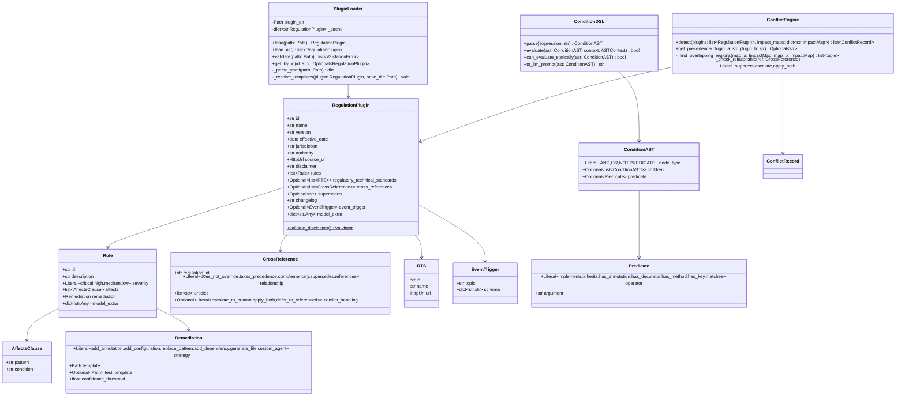

### 2.3 Workflow and Activity Layer (`workflows/`, `activities/`)

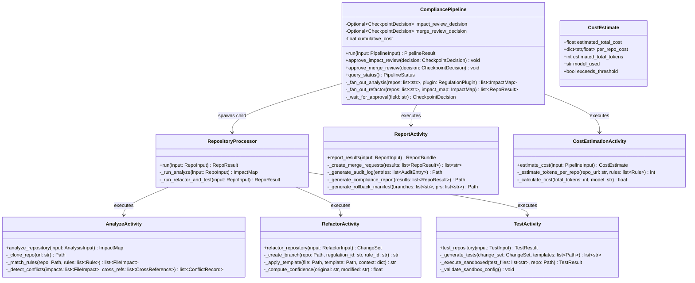

### 2.4 Agent and Tool Layer (`agents/`, `tools/`)

```mermaid
classDiagram
    class GitClient {
        -Optional~str~ _token
        -Path _work_dir
        +clone(url: str, path: Path, depth: int) void
        +create_branch(repo: Path, name: str) void
        +checkout(repo: Path, branch: str) void
        +add(repo: Path, files: list~str~) void
        +commit(repo: Path, message: str) str
        +push(repo: Path, remote: str, branch: str) void
        +diff(repo: Path, staged: bool) str
        +log(repo: Path, n: int) list~CommitInfo~
        -_run(args: list~str~, cwd: Path) CompletedProcess
        -_acquire_token(url: str) str
    }

    class GitProviderClient {
        <<abstract>>
        +create_pull_request(repo: str, branch: str, title: str, body: str) str
        +add_comment(repo: str, pr_number: int, body: str) void
        +get_pr_status(repo: str, pr_number: int) PRStatus
    }

    class GitHubClient {
        -httpx.AsyncClient _client
        -str _app_id
        +create_pull_request(...) str
        +add_comment(...) void
        +get_pr_status(...) PRStatus
        -_get_installation_token() str
    }

    class GitLabClient {
        -httpx.AsyncClient _client
        +create_pull_request(...) str
        +add_comment(...) void
    }

    class ASTEngine {
        -dict~str,Language~ _languages
        -dict~str,Parser~ _parsers
        +parse(source: str, language: str) Tree
        +query(tree: Tree, query_str: str) list~Match~
        +find_classes(tree: Tree) list~ClassNode~
        +find_annotations(tree: Tree, class_node: ClassNode) list~str~
        +find_methods(tree: Tree, class_node: ClassNode) list~str~
        +get_node_range(node: Node) ASTRegion
        +check_implements(tree: Tree, class_node: ClassNode, interface: str) bool
        -_get_parser(language: str) Parser
        -_detect_language(file_path: str) str
    }

    class TemplateEngine {
        -SandboxedEnvironment _env
        +render(template_path: Path, context: dict) str
        +render_string(template_str: str, context: dict) str
        +validate_template(template_path: Path) list~str~
        -_create_sandboxed_env() SandboxedEnvironment
    }

    class TestRunner {
        +execute(test_files: list~Path~, repo: Path, timeout: int) TestResult
        -_build_sandbox_command(test_files: list~Path~) list~str~
        -_parse_test_output(stdout: str, stderr: str) TestResult
        -_validate_no_network() void
        -_apply_resource_limits() dict
    }

    class SearchClient {
        -AsyncElasticsearch _client
        +index_regulation(plugin: RegulationPlugin) void
        +search_rules(query: str, regulation_id: Optional~str~) list~RuleSearchResult~
        +search_context(query: str) list~DocumentChunk~
        -_build_query(query: str, filters: dict) dict
    }

    GitProviderClient <|-- GitHubClient
    GitProviderClient <|-- GitLabClient
```

### 2.5 Repository Layer (`repositories/`)

```mermaid
classDiagram
    class BaseRepository {
        #AsyncConnectionPool _pool
        +__init__(pool: AsyncConnectionPool)
        #_fetch_one(query: str, params: tuple) Optional~Row~
        #_fetch_all(query: str, params: tuple) list~Row~
        #_execute(query: str, params: tuple) void
    }

    class PipelineRunRepository {
        +create(regulation_id: str, total_repos: int, config: dict) UUID
        +update_status(run_id: UUID, status: str) void
        +update_cost(run_id: UUID, actual_cost: float) void
        +complete(run_id: UUID, status: str) void
        +get(run_id: UUID) Optional~PipelineRun~
        +list_by_status(status: str) list~PipelineRun~
        +list_by_regulation(regulation_id: str) list~PipelineRun~
    }

    class RepositoryProgressRepository {
        +create(run_id: UUID, repo_url: str) UUID
        +update_status(id: UUID, status: str, branch: Optional~str~, sha: Optional~str~) void
        +set_pr_url(id: UUID, pr_url: str) void
        +set_error(id: UUID, error: str) void
        +get_by_run(run_id: UUID) list~RepositoryProgress~
        +get_failed(run_id: UUID) list~RepositoryProgress~
        +count_by_status(run_id: UUID) dict~str,int~
    }

    class AuditRepository {
        +insert(entry: AuditEntry) void
        +bulk_insert(entries: list~AuditEntry~) void
        +get_by_run(run_id: UUID) list~AuditEntry~
        +get_by_type(run_id: UUID, event_type: str) list~AuditEntry~
        +get_by_date_range(start: datetime, end: datetime) list~AuditEntry~
        +export_partition(year: int, month: int, output: Path) void
    }

    class CheckpointDecisionRepository {
        +create(run_id: UUID, decision: CheckpointDecision) UUID
        +get_by_run(run_id: UUID) list~CheckpointDecision~
        +get_latest(run_id: UUID, checkpoint_type: str) Optional~CheckpointDecision~
    }

    class ConflictLogRepository {
        +create(run_id: UUID, conflict: ConflictRecord) UUID
        +resolve(id: UUID, resolution: str, decision_id: UUID) void
        +get_by_run(run_id: UUID) list~ConflictLogEntry~
        +get_unresolved(run_id: UUID) list~ConflictLogEntry~
    }

    BaseRepository <|-- PipelineRunRepository
    BaseRepository <|-- RepositoryProgressRepository
    BaseRepository <|-- AuditRepository
    BaseRepository <|-- CheckpointDecisionRepository
    BaseRepository <|-- ConflictLogRepository
```

### 2.6 Event System (`events/`)

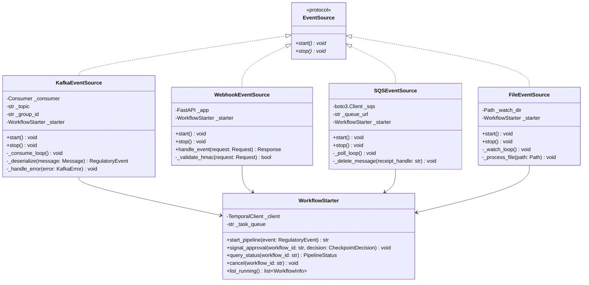

### 2.7 Observability (`observability/`)

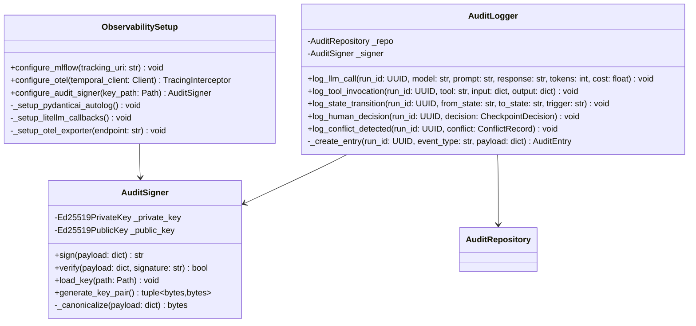

---

## 3. Detailed Sequence Diagrams

### 3.1 Plugin Loading and Validation

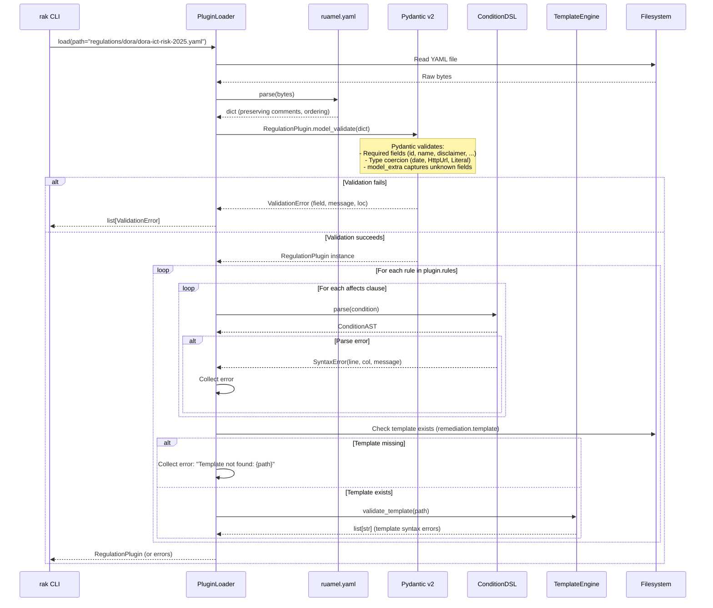

### 3.2 Analyzer Agent — Rule Matching for a Single File

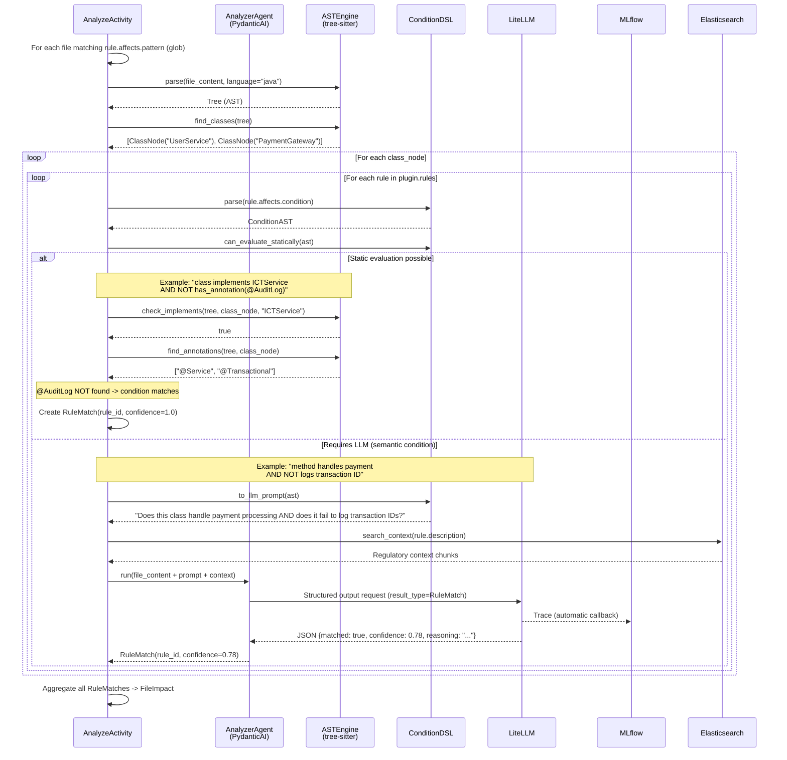

### 3.3 Refactor Agent — Applying a Remediation Template

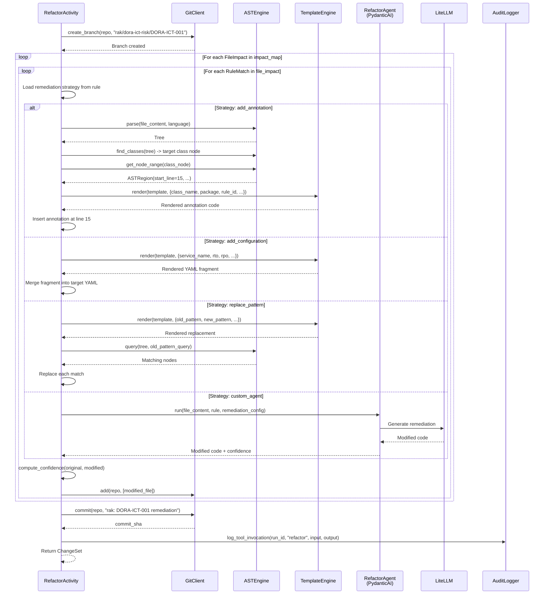

### 3.4 Human Checkpoint — Approval Flow

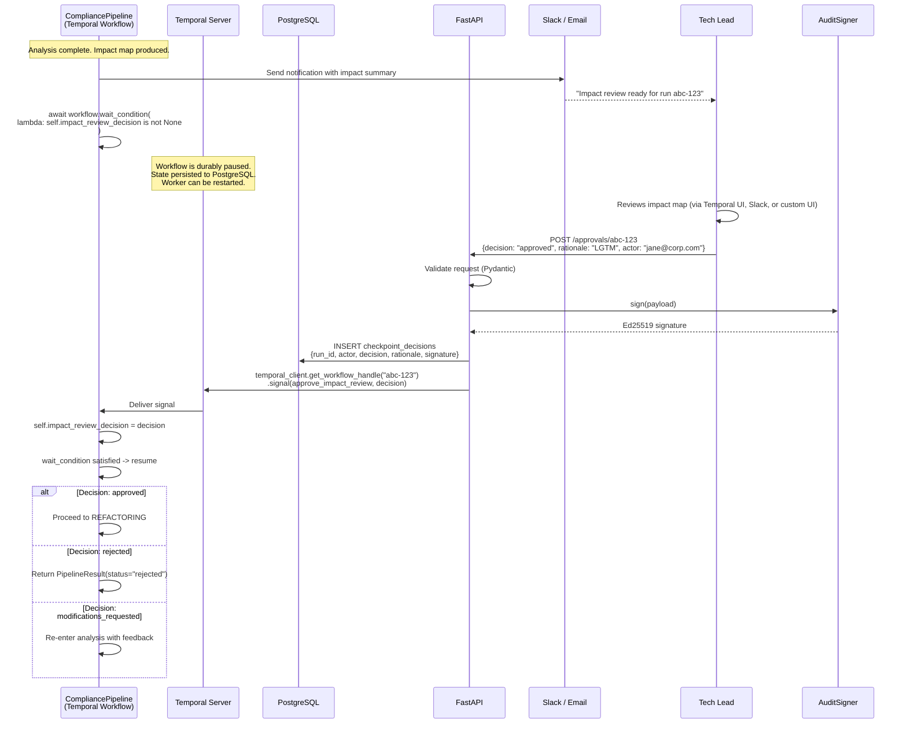

### 3.5 Test Execution — Sandboxed

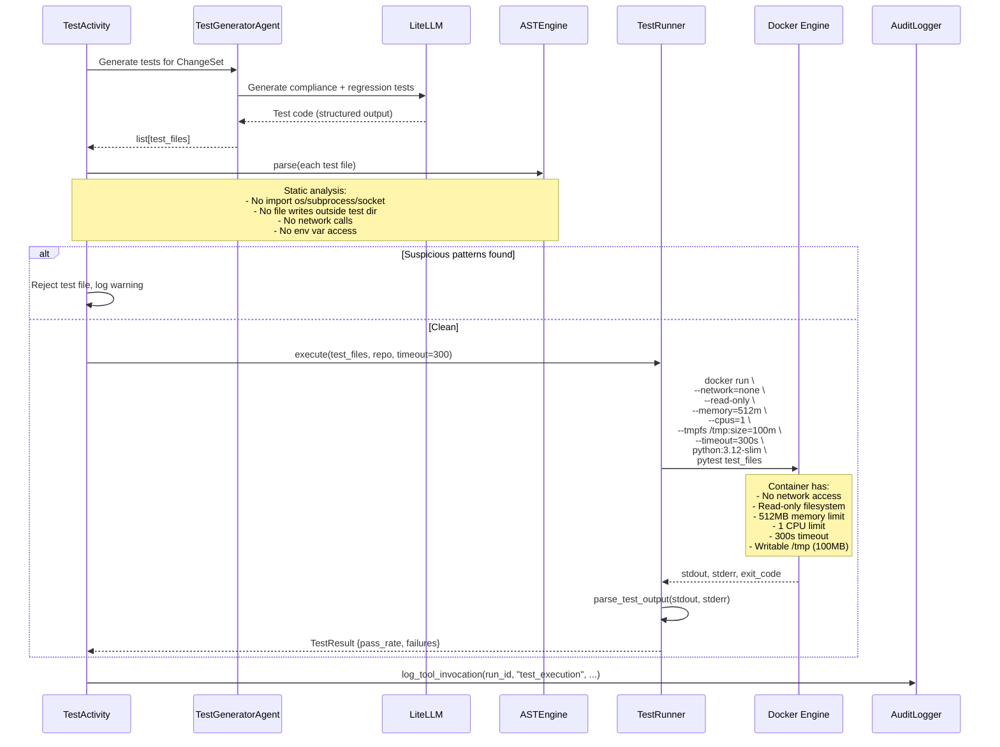

---

## 4. State Machine Diagrams

### 4.1 Pipeline Run Lifecycle

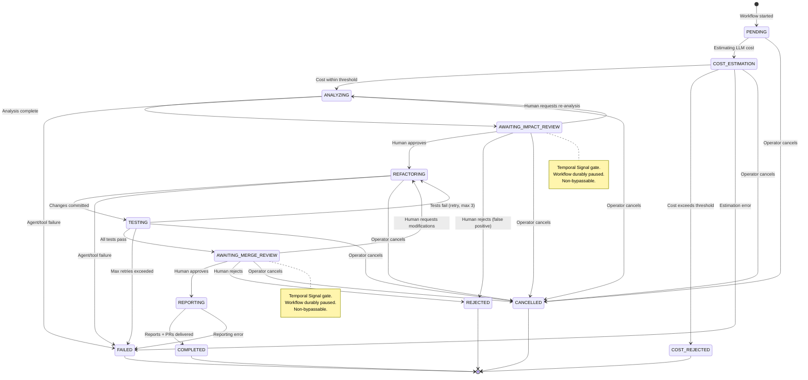

#### 4.1.1 Workflow Phase vs. Database Status

The state machine above represents the **Temporal workflow phase** — the granular orchestration state managed by Temporal's event-sourced history. The `pipeline_runs.status` column in PostgreSQL tracks a **coarse lifecycle status** for dashboard queries and reporting. These are two distinct state representations by design: Temporal is the authority for which phase is active, PostgreSQL is the authority for lifecycle queries.

**Mapping: DB `status` → Temporal workflow phases**

| DB `pipeline_runs.status` | Temporal Workflow Phases Covered | Semantics |
|---|---|---|
| `pending` | `PENDING` | Workflow created, not yet started |
| `running` | `COST_ESTIMATION`, `ANALYZING`, `AWAITING_IMPACT_REVIEW`, `REFACTORING`, `TESTING`, `AWAITING_MERGE_REVIEW`, `REPORTING` | Pipeline is actively executing (any intermediate phase) |
| `cost_rejected` | `COST_REJECTED` | Cost estimate exceeded threshold; operator rejected |
| `completed` | `COMPLETED` | All outputs delivered successfully |
| `failed` | `FAILED` (from any phase) | Unrecoverable error after retry exhaustion |
| `rejected` | `REJECTED` | Human rejected at a checkpoint |
| `cancelled` | `CANCELLED` | Operator-initiated cancellation via Temporal API |

**Implications for `rak status`:** The CLI queries both sources — `pipeline_runs.status` for the lifecycle state, and the Temporal API (`workflow.describe()`) for the current phase — to display a complete picture. Example output:

```
Run:    a1b2c3d4-...
Status: running
Phase:  AWAITING_IMPACT_REVIEW (waiting for human approval)
Repos:  12 pending, 3 in_progress, 5 completed, 0 failed
Cost:   $4.20 / $10.00 estimated
```

### 4.2 Repository Progress Lifecycle

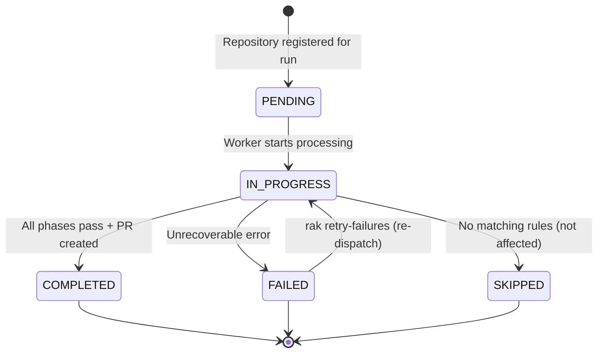

### 4.3 Condition DSL Evaluation

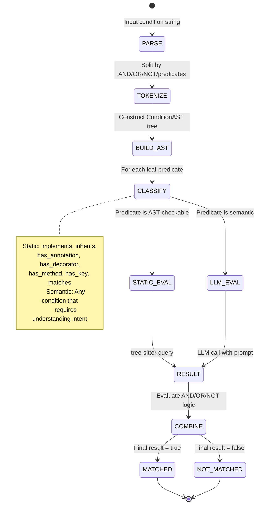

### 4.4 Audit Entry Lifecycle

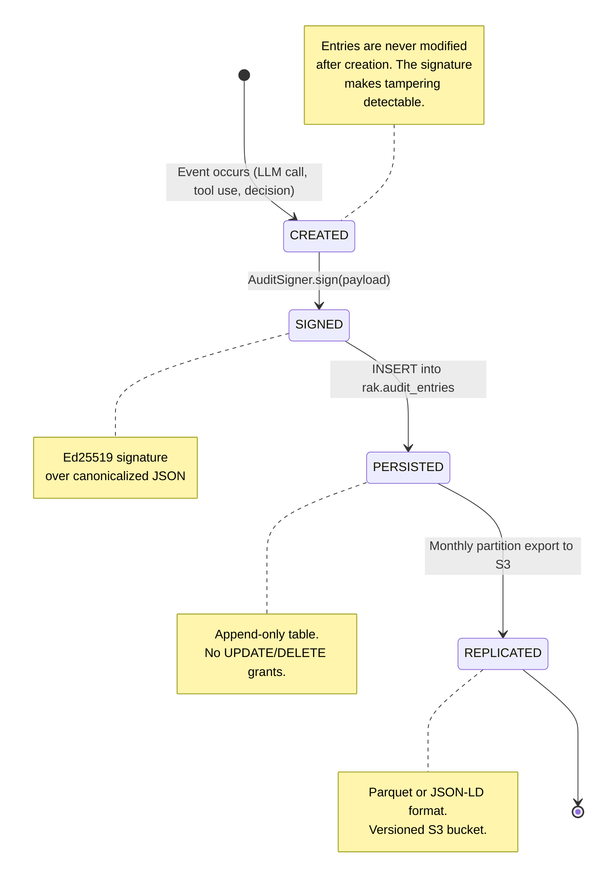

---

## 5. Database Schema Details

> **Cross-reference:** The canonical data dictionary, indexing strategy, JSONB payload schemas, Elasticsearch mappings, partitioning/retention policies, and migration plan are in [`data-model.md`](data-model.md). The DDL below focuses on constraints, indexes, roles, and security grants relevant to code-level implementation.

### 5.1 Complete DDL with Constraints, Indexes, and Security

```sql
-- ============================================================
-- Schema: rak
-- Managed by: Alembic migrations
-- Owner: rak_admin role
-- Application access: rak_app role
-- ============================================================

CREATE SCHEMA IF NOT EXISTS rak;

-- Roles
CREATE ROLE rak_admin;
CREATE ROLE rak_app;

-- --------------------------------------------------------
-- Table: pipeline_runs
-- --------------------------------------------------------
CREATE TABLE rak.pipeline_runs (
    run_id          UUID        PRIMARY KEY DEFAULT gen_random_uuid(),
    regulation_id   TEXT        NOT NULL,
    status          TEXT        NOT NULL DEFAULT 'pending'
                                CHECK (status IN ('pending','running','cost_rejected',
                                    'completed','failed','rejected','cancelled')),
    created_at      TIMESTAMPTZ NOT NULL DEFAULT now(),
    completed_at    TIMESTAMPTZ,
    total_repos     INTEGER     NOT NULL CHECK (total_repos > 0),
    estimated_cost  NUMERIC(10,4),
    actual_cost     NUMERIC(10,4) DEFAULT 0,
    config_snapshot JSONB       NOT NULL,

    -- Temporal workflow ID for cross-referencing
    temporal_workflow_id TEXT   UNIQUE,

    CONSTRAINT valid_completion CHECK (
        (status IN ('completed','failed','rejected','cancelled') AND completed_at IS NOT NULL)
        OR (status NOT IN ('completed','failed','rejected','cancelled') AND completed_at IS NULL)
    )
);

CREATE INDEX idx_runs_status      ON rak.pipeline_runs (status);
CREATE INDEX idx_runs_regulation  ON rak.pipeline_runs (regulation_id);
CREATE INDEX idx_runs_created     ON rak.pipeline_runs (created_at DESC);

-- --------------------------------------------------------
-- Table: repository_progress
-- --------------------------------------------------------
CREATE TABLE rak.repository_progress (
    id          UUID        PRIMARY KEY DEFAULT gen_random_uuid(),
    run_id      UUID        NOT NULL REFERENCES rak.pipeline_runs(run_id)
                            ON DELETE CASCADE,
    repo_url    TEXT        NOT NULL,
    status      TEXT        NOT NULL DEFAULT 'pending'
                            CHECK (status IN ('pending','in_progress','completed',
                                'failed','skipped')),
    branch_name TEXT,
    commit_sha  CHAR(40),   -- SHA-1 hash, always 40 chars
    pr_url      TEXT,
    error       TEXT,
    updated_at  TIMESTAMPTZ NOT NULL DEFAULT now(),

    UNIQUE (run_id, repo_url),

    -- If status is 'completed' or 'in_progress', branch_name must be set.
    CONSTRAINT branch_when_active CHECK (
        status NOT IN ('completed','in_progress')
        OR branch_name IS NOT NULL
    )
);

CREATE INDEX idx_progress_run    ON rak.repository_progress (run_id);
CREATE INDEX idx_progress_status ON rak.repository_progress (status);

-- Trigger: auto-update updated_at
CREATE OR REPLACE FUNCTION rak.update_timestamp()
RETURNS TRIGGER AS $$
BEGIN
    NEW.updated_at = now();
    RETURN NEW;
END;
$$ LANGUAGE plpgsql;

CREATE TRIGGER trg_progress_updated
    BEFORE UPDATE ON rak.repository_progress
    FOR EACH ROW EXECUTE FUNCTION rak.update_timestamp();

-- --------------------------------------------------------
-- Table: audit_entries (partitioned, append-only)
-- --------------------------------------------------------
CREATE TABLE rak.audit_entries (
    entry_id    UUID        NOT NULL DEFAULT gen_random_uuid(),
    -- NOTE: run_id is NOT a foreign key to pipeline_runs.
    -- PostgreSQL does not support FK constraints on partitioned tables
    -- referencing non-partitioned tables. Application code validates
    -- run_id existence before insert. See data-model.md for details.
    run_id      UUID        NOT NULL,
    event_type  TEXT        NOT NULL
                CHECK (event_type IN ('llm_call','tool_invocation',
                    'state_transition','human_decision','conflict_detected',
                    'cost_estimation','test_execution','merge_request',
                    'error')),
    timestamp   TIMESTAMPTZ NOT NULL DEFAULT now(),
    payload     JSONB       NOT NULL,
    signature   TEXT        NOT NULL,  -- Ed25519 base64-encoded signature

    PRIMARY KEY (timestamp, entry_id)
) PARTITION BY RANGE (timestamp);

-- Pre-create partitions for current and next months
-- (automated via pg_partman in production)
CREATE TABLE rak.audit_entries_2026_03 PARTITION OF rak.audit_entries
    FOR VALUES FROM ('2026-03-01') TO ('2026-04-01');
CREATE TABLE rak.audit_entries_2026_04 PARTITION OF rak.audit_entries
    FOR VALUES FROM ('2026-04-01') TO ('2026-05-01');

CREATE INDEX idx_audit_run     ON rak.audit_entries (run_id);
CREATE INDEX idx_audit_type    ON rak.audit_entries (event_type);
CREATE INDEX idx_audit_payload ON rak.audit_entries USING GIN (payload);

-- Expression index for common JSON queries
CREATE INDEX idx_audit_model ON rak.audit_entries ((payload->>'model'))
    WHERE event_type = 'llm_call';

-- --------------------------------------------------------
-- Table: checkpoint_decisions
-- --------------------------------------------------------
CREATE TABLE rak.checkpoint_decisions (
    id              UUID        PRIMARY KEY DEFAULT gen_random_uuid(),
    run_id          UUID        NOT NULL REFERENCES rak.pipeline_runs(run_id)
                                ON DELETE CASCADE,
    checkpoint_type TEXT        NOT NULL
                    CHECK (checkpoint_type IN ('impact_review','merge_review')),
    actor           TEXT        NOT NULL,
    decision        TEXT        NOT NULL
                    CHECK (decision IN ('approved','rejected','modifications_requested')),
    rationale       TEXT,
    signature       TEXT        NOT NULL,
    decided_at      TIMESTAMPTZ NOT NULL DEFAULT now(),

    -- Multiple decisions per checkpoint type are allowed (re-reviews).
    -- Each re-review creates a new row with a different decided_at.
    -- The application queries the latest decision per checkpoint type:
    --   SELECT DISTINCT ON (checkpoint_type) * FROM checkpoint_decisions
    --   WHERE run_id = $1 ORDER BY checkpoint_type, decided_at DESC;
    -- This preserves the full audit trail of all approval/rejection decisions.
    UNIQUE (run_id, checkpoint_type, decided_at)
);

CREATE INDEX idx_checkpoint_run ON rak.checkpoint_decisions (run_id);

-- --------------------------------------------------------
-- Table: conflict_log
-- --------------------------------------------------------
CREATE TABLE rak.conflict_log (
    id                UUID        PRIMARY KEY DEFAULT gen_random_uuid(),
    run_id            UUID        NOT NULL REFERENCES rak.pipeline_runs(run_id)
                                  ON DELETE CASCADE,
    conflicting_rules JSONB       NOT NULL,  -- [{regulation_id, rule_id}, ...]
    affected_regions  JSONB       NOT NULL,  -- [{file, start_line, end_line}, ...]
    resolution        TEXT,
    human_decision_id UUID        REFERENCES rak.checkpoint_decisions(id),
    detected_at       TIMESTAMPTZ NOT NULL DEFAULT now(),

    CONSTRAINT resolution_needs_decision CHECK (
        (resolution IS NOT NULL AND human_decision_id IS NOT NULL)
        OR resolution IS NULL
    )
);

CREATE INDEX idx_conflict_run ON rak.conflict_log (run_id);

-- --------------------------------------------------------
-- Table: file_analysis_cache
-- --------------------------------------------------------
CREATE TABLE rak.file_analysis_cache (
    cache_key   CHAR(64)    PRIMARY KEY,  -- SHA256(content + plugin_version + agent_version)
    repo_url    TEXT        NOT NULL,
    file_path   TEXT        NOT NULL,
    result      JSONB       NOT NULL,     -- Cached ImpactMap for this file
    created_at  TIMESTAMPTZ NOT NULL DEFAULT now(),
    expires_at  TIMESTAMPTZ NOT NULL DEFAULT now() + INTERVAL '7 days'
);

CREATE INDEX idx_cache_expires ON rak.file_analysis_cache (expires_at);

-- --------------------------------------------------------
-- Access Control
-- --------------------------------------------------------
GRANT USAGE ON SCHEMA rak TO rak_app;

-- Full access to most tables
GRANT SELECT, INSERT, UPDATE ON rak.pipeline_runs TO rak_app;
GRANT SELECT, INSERT, UPDATE ON rak.repository_progress TO rak_app;
GRANT SELECT, INSERT ON rak.checkpoint_decisions TO rak_app;
GRANT SELECT, INSERT, UPDATE ON rak.conflict_log TO rak_app;
GRANT SELECT, INSERT, DELETE ON rak.file_analysis_cache TO rak_app;

-- AUDIT TABLE: INSERT + SELECT ONLY (append-only enforcement)
GRANT SELECT, INSERT ON rak.audit_entries TO rak_app;
-- NO UPDATE, NO DELETE on audit_entries for rak_app

-- Admin has full access (for partition management, exports)
GRANT ALL ON ALL TABLES IN SCHEMA rak TO rak_admin;
```

### 5.2 Audit Entry Payload Schemas (JSON-LD)

Each `event_type` has a specific `payload` structure:

```json
// event_type: "llm_call"
{
  "@context": "https://schema.org",
  "@type": "LLMCall",
  "model": "anthropic/claude-sonnet-4-6",
  "model_version": "claude-sonnet-4-6-20260327",
  "prompt_hash": "sha256:abc...",
  "prompt_tokens": 4200,
  "completion_tokens": 1800,
  "total_tokens": 6000,
  "latency_ms": 3400,
  "cost_usd": 0.042,
  "temperature": 0.0,
  "agent": "analyzer",
  "purpose": "evaluate_condition",
  "rule_id": "DORA-ICT-001",
  "file_path": "src/main/java/com/example/UserService.java",
  "confidence": 0.92
}

// event_type: "human_decision"
{
  "@context": "https://schema.org",
  "@type": "HumanDecision",
  "checkpoint_type": "impact_review",
  "actor": "jane@corp.com",
  "decision": "approved",
  "rationale": "Impact assessment looks correct. Proceed with remediation.",
  "repos_affected": 42,
  "rules_matched": ["DORA-ICT-001", "DORA-ICT-002"]
}

// event_type: "state_transition"
{
  "@context": "https://schema.org",
  "@type": "StateTransition",
  "from_state": "ANALYZING",
  "to_state": "AWAITING_IMPACT_REVIEW",
  "trigger": "analysis_complete",
  "repos_analyzed": 42,
  "files_impacted": 156,
  "conflicts_detected": 2
}
```

---

## 6. Algorithms and Business Logic

### 6.1 Condition DSL Parser

The Condition DSL parses predicate expressions into an AST for evaluation against tree-sitter parse trees.

**Grammar (EBNF):**

```
expression  = or_expr
or_expr     = and_expr ( "OR" and_expr )*
and_expr    = not_expr ( "AND" not_expr )*
not_expr    = "NOT" not_expr | primary
primary     = predicate | "(" expression ")"
predicate   = class_pred | annotation_pred | method_pred | key_pred | match_pred
class_pred  = "class" ("implements" | "inherits") IDENTIFIER
annotation_pred = ("has_annotation" | "has_decorator") "(" "@" IDENTIFIER ")"
method_pred = "has_method" "(" IDENTIFIER ")"
key_pred    = "has_key" "(" DOTTED_PATH ")"
match_pred  = "class_name" "matches" QUOTED_STRING
```

**Parsing algorithm (recursive descent):**

```python
def parse(expression: str) -> ConditionAST:
    tokens = tokenize(expression)
    pos = 0

    def parse_or() -> ConditionAST:
        left = parse_and()
        while current_token() == "OR":
            consume("OR")
            right = parse_and()
            left = ConditionAST(node_type="OR", children=[left, right])
        return left

    def parse_and() -> ConditionAST:
        left = parse_not()
        while current_token() == "AND":
            consume("AND")
            right = parse_not()
            left = ConditionAST(node_type="AND", children=[left, right])
        return left

    def parse_not() -> ConditionAST:
        if current_token() == "NOT":
            consume("NOT")
            child = parse_not()
            return ConditionAST(node_type="NOT", children=[child])
        return parse_primary()

    def parse_primary() -> ConditionAST:
        if current_token() == "(":
            consume("(")
            expr = parse_or()
            consume(")")
            return expr
        return parse_predicate()

    def parse_predicate() -> ConditionAST:
        # Dispatch to specific predicate parsers
        # Returns ConditionAST(node_type="PREDICATE", predicate=Predicate(...))
        ...

    return parse_or()
```

**Operator Precedence (highest to lowest):**

| Precedence | Operator | Associativity | Example |
|---|---|---|---|
| 1 (highest) | `NOT` | Right | `NOT has_annotation(@Foo)` |
| 2 | `AND` | Left | `A AND B AND C` → `(A AND B) AND C` |
| 3 (lowest) | `OR` | Left | `A OR B OR C` → `(A OR B) OR C` |

Parentheses override precedence: `A OR (B AND NOT C)`.

**Static vs. LLM Evaluation:**

Each leaf predicate is classified as statically evaluable or requiring LLM delegation:

| Predicate | Evaluation | Method | Confidence |
|---|---|---|---|
| `class implements X` | **Static** | tree-sitter query for class inheritance | 1.0 |
| `class inherits X` | **Static** | tree-sitter query for class hierarchy | 1.0 |
| `has_annotation(@X)` | **Static** | tree-sitter query for decorator/annotation nodes | 1.0 |
| `has_decorator(@X)` | **Static** | tree-sitter query for decorator nodes (Python) | 1.0 |
| `has_method(X)` | **Static** | tree-sitter query for method definitions | 1.0 |
| `has_key(X.Y.Z)` | **Static** | YAML/JSON key path lookup | 1.0 |
| `class_name matches "regex"` | **Static** | Regex match on class name node text | 1.0 |
| Semantic conditions | **LLM** | `to_llm_prompt()` generates a constrained prompt | 0.6–0.9 (model-dependent) |

**LLM Delegation for Semantic Conditions:**

When `can_evaluate_statically()` returns `False` for a predicate (e.g., a condition requiring understanding of business intent), the `to_llm_prompt()` method converts the condition AST into a constrained LLM prompt:

```python
def to_llm_prompt(self, ast: ConditionAST) -> str:
    """Convert a non-static condition into an LLM evaluation prompt."""
    # 1. Serialize the condition as natural language
    # 2. Include the file content as context
    # 3. Constrain the output to a Pydantic schema:
    #    class ConditionResult(BaseModel):
    #        matches: bool
    #        confidence: float  # 0.0–1.0
    #        reasoning: str     # explanation for audit trail
    # 4. The PydanticAI agent enforces structured output
    ...
```

The LLM evaluation result includes a confidence score. If `confidence < rule.remediation.confidence_threshold`, the match is flagged for additional human review at the next checkpoint.

**Boolean Combination:**

After all leaf predicates are evaluated (statically or via LLM), the boolean operators combine results bottom-up through the AST. Confidence for combined expressions uses minimum propagation: `AND` takes the minimum confidence of its children, `OR` takes the maximum, and `NOT` preserves the child's confidence.

### 6.2 Cross-Regulation Conflict Detection

```python
def detect_conflicts(
    plugins: list[RegulationPlugin],
    impact_maps: dict[str, ImpactMap],   # keyed by plugin.id
) -> list[ConflictRecord]:
    """
    Detects when two regulation plugins produce conflicting remediations
    for overlapping code regions.

    Algorithm:
    1. Build a spatial index of all affected AST regions per file
    2. For each file, find all pairs of (plugin_A.rule, plugin_B.rule)
       where the affected AST regions overlap
    3. For each overlapping pair, check the cross_reference relationship
    4. If relationship is "takes_precedence", suppress the lower-priority rule
    5. If relationship is "does_not_override" and remediation strategies conflict,
       create a ConflictRecord and escalate to human

    Complexity: O(P^2 * F * R) where P=plugins, F=files, R=rules per file
    In practice: P < 5, F < 100 affected files, R < 10 rules per file
    """
    conflicts = []

    # Step 1: Index affected regions by file
    file_index: dict[str, list[tuple[str, str, ASTRegion]]] = {}
    # file_path -> [(plugin_id, rule_id, region), ...]

    for plugin_id, impact_map in impact_maps.items():
        for file_impact in impact_map.files:
            for rule_match in file_impact.matched_rules:
                for region in file_impact.affected_regions:
                    file_index.setdefault(file_impact.file_path, []).append(
                        (plugin_id, rule_match.rule_id, region)
                    )

    # Step 2: Find overlapping regions
    for file_path, entries in file_index.items():
        for i, (pid_a, rid_a, reg_a) in enumerate(entries):
            for j, (pid_b, rid_b, reg_b) in enumerate(entries):
                if j <= i or pid_a == pid_b:
                    continue  # Skip same-plugin and duplicate pairs

                if regions_overlap(reg_a, reg_b):
                    # Step 3: Check cross-reference relationship
                    relationship = get_relationship(plugins, pid_a, pid_b)

                    if relationship == "takes_precedence":
                        # Step 4: Suppress lower-priority rule
                        # (already handled by precedence filtering)
                        pass
                    elif relationship in ("does_not_override", "complementary", None):
                        # Step 5: Check if remediation strategies conflict
                        rule_a = get_rule(plugins, pid_a, rid_a)
                        rule_b = get_rule(plugins, pid_b, rid_b)

                        if strategies_conflict(rule_a.remediation, rule_b.remediation):
                            conflicts.append(ConflictRecord(
                                conflicting_rule_ids=[
                                    f"{pid_a}/{rid_a}",
                                    f"{pid_b}/{rid_b}",
                                ],
                                affected_regions=[reg_a, reg_b],
                                description=f"Rules {rid_a} and {rid_b} produce "
                                    f"conflicting changes to {file_path} "
                                    f"lines {reg_a.start_line}-{reg_a.end_line}",
                            ))

    return conflicts


def regions_overlap(a: ASTRegion, b: ASTRegion) -> bool:
    """Two AST regions overlap if their line ranges intersect."""
    return a.start_line <= b.end_line and b.start_line <= a.end_line


def strategies_conflict(a: Remediation, b: Remediation) -> bool:
    """Two remediation strategies conflict if they modify the same code region
    with different transformations. Same strategy with same template is not a conflict."""
    if a.strategy == b.strategy and a.template == b.template:
        return False  # Same fix from two regulations — deduplicate, don't conflict
    return True  # Different strategies on same region — conflict
```

### 6.3 File-Level Analysis Caching

```python
def compute_cache_key(
    file_content: bytes,
    plugin_version: str,
    agent_version: str,
) -> str:
    """
    Cache key for file-level analysis results.
    If the file content, plugin version, and agent version haven't changed,
    the analysis result is deterministic (given model version pinning).

    Returns SHA-256 hex digest (64 chars).
    """
    hasher = hashlib.sha256()
    hasher.update(file_content)
    hasher.update(plugin_version.encode())
    hasher.update(agent_version.encode())
    return hasher.hexdigest()


async def analyze_with_cache(
    file_path: Path,
    file_content: bytes,
    plugin: RegulationPlugin,
    agent_version: str,
    cache_repo: FileCacheRepository,
) -> Optional[FileImpact]:
    """
    Check cache before running analysis. Cache hit avoids LLM calls.

    Cache invalidation:
    - File content changed -> different SHA256 -> cache miss
    - Plugin version changed -> different SHA256 -> cache miss
    - Agent version changed -> different SHA256 -> cache miss
    - Model version changed -> agent_version includes model version -> cache miss
    - Cache expired (7 days TTL) -> cache miss
    """
    key = compute_cache_key(file_content, plugin.version, agent_version)

    cached = await cache_repo.get(key)
    if cached and cached.expires_at > datetime.now(UTC):
        return FileImpact.model_validate(cached.result)

    # Cache miss: run full analysis
    result = await run_analysis(file_path, file_content, plugin)

    # Store in cache
    await cache_repo.set(key, result.model_dump(), ttl_days=7)

    return result
```

### 6.4 Audit Entry Signing

```python
from cryptography.hazmat.primitives.asymmetric.ed25519 import (
    Ed25519PrivateKey, Ed25519PublicKey,
)
import json
import base64


class AuditSigner:
    """
    Signs audit entry payloads with Ed25519 for tamper detection.

    The signature covers the canonicalized JSON payload.
    Canonicalization ensures deterministic byte representation
    regardless of dict key ordering or whitespace.
    """

    def __init__(self, private_key: Ed25519PrivateKey):
        self._private_key = private_key
        self._public_key = private_key.public_key()

    def sign(self, payload: dict) -> str:
        """Sign a payload dict. Returns base64-encoded signature."""
        canonical = self._canonicalize(payload)
        signature = self._private_key.sign(canonical)
        return base64.b64encode(signature).decode("ascii")

    def verify(self, payload: dict, signature: str) -> bool:
        """Verify a payload against its signature. Returns True if valid."""
        canonical = self._canonicalize(payload)
        sig_bytes = base64.b64decode(signature)
        try:
            self._public_key.verify(sig_bytes, canonical)
            return True
        except Exception:
            return False

    @staticmethod
    def _canonicalize(payload: dict) -> bytes:
        """
        Produce deterministic JSON bytes:
        - Sort keys alphabetically
        - No whitespace
        - UTF-8 encoding
        - Ensure consistent float representation
        """
        return json.dumps(
            payload,
            sort_keys=True,
            separators=(",", ":"),
            ensure_ascii=False,
            default=str,  # Handle UUID, datetime, etc.
        ).encode("utf-8")
```

### 6.5 Cost Estimation

```python
# Model pricing (USD per 1M tokens, approximate)
MODEL_PRICING = {
    "anthropic/claude-sonnet-4-6": {"input": 3.00, "output": 15.00},
    "anthropic/claude-haiku-4-5":  {"input": 0.80, "output": 4.00},
    "openai/gpt-4o":               {"input": 2.50, "output": 10.00},
    "openai/gpt-4o-mini":          {"input": 0.15, "output": 0.60},
}

# Average tokens per agent phase (empirically measured)
PHASE_TOKEN_ESTIMATES = {
    "analyze": {"input": 8000, "output": 2000, "calls": 4},
    "refactor": {"input": 4000, "output": 4000, "calls": 3},
    "test_generate": {"input": 3000, "output": 3000, "calls": 2},
    "report": {"input": 2000, "output": 2000, "calls": 1},
}


def estimate_pipeline_cost(
    repo_count: int,
    model_config: dict[str, str],  # {phase: model_name}
    plugin: RegulationPlugin,
) -> CostEstimate:
    """
    Pre-run cost estimation.
    Multiplies per-repo token estimates by model pricing.
    Applies a rule-count multiplier (more rules = more LLM calls).

    Accuracy: within 2x of actual cost (empirically validated).
    Purpose: prevent accidental expensive runs, not precise billing.
    """
    rule_multiplier = max(1.0, len(plugin.rules) / 5.0)  # Baseline: 5 rules
    total_cost = 0.0
    total_tokens = 0
    per_repo = {}

    for phase, estimates in PHASE_TOKEN_ESTIMATES.items():
        model = model_config.get(phase, "anthropic/claude-sonnet-4-6")
        pricing = MODEL_PRICING[model]

        input_tokens = int(estimates["input"] * estimates["calls"] * rule_multiplier)
        output_tokens = int(estimates["output"] * estimates["calls"] * rule_multiplier)

        phase_cost = (
            (input_tokens / 1_000_000) * pricing["input"]
            + (output_tokens / 1_000_000) * pricing["output"]
        )

        total_cost += phase_cost * repo_count
        total_tokens += (input_tokens + output_tokens) * repo_count

    per_repo_cost = total_cost / repo_count if repo_count > 0 else 0

    return CostEstimate(
        estimated_total_cost=round(total_cost, 4),
        per_repo_cost={f"avg": round(per_repo_cost, 4)},
        estimated_total_tokens=total_tokens,
        model_used=model_config.get("analyze", "anthropic/claude-sonnet-4-6"),
        exceeds_threshold=total_cost > pipeline_config.cost_threshold,
    )
```

### 6.6 Deterministic Branch Naming

```python
def generate_branch_name(regulation_id: str, rule_id: str) -> str:
    """
    Deterministic branch naming for idempotent operations.

    Format: rak/{regulation_id}/{rule_id}
    Example: rak/dora-ict-risk-2025/DORA-ICT-001

    Properties:
    - Deterministic: same inputs always produce the same branch name
    - Idempotent: re-running the pipeline reuses existing branches
    - Scoped: each rule gets its own branch (reviewable independently)
    - Identifiable: the rak/ prefix identifies framework-created branches
    """
    safe_regulation = regulation_id.replace("/", "-").replace(" ", "-").lower()
    safe_rule = rule_id.replace("/", "-").replace(" ", "-")
    return f"rak/{safe_regulation}/{safe_rule}"


def generate_workflow_id(regulation_id: str, repo_url: str, phase: str) -> str:
    """
    Deterministic Temporal workflow ID for repository-level locking.

    Temporal enforces workflow ID uniqueness — starting a workflow with an
    existing ID is rejected, preventing concurrent processing of the same repo.

    Format: rak/{phase}/{regulation_id}/{repo_hash}
    """
    repo_hash = hashlib.sha256(repo_url.encode()).hexdigest()[:12]
    return f"rak/{phase}/{regulation_id}/{repo_hash}"
```

---

## 7. Error Handling and Retry Logic

### 7.1 Error Classification

```python
class RAKError(Exception):
    """Base exception for all framework errors."""
    pass

class PluginError(RAKError):
    """Plugin loading, validation, or template errors."""
    pass

class AnalysisError(RAKError):
    """Errors during code analysis (AST parse failure, search failure)."""
    retryable: bool = True

class RefactorError(RAKError):
    """Errors during code transformation."""
    retryable: bool = True

class TestExecutionError(RAKError):
    """Errors during sandboxed test execution."""
    retryable: bool = False  # Flaky tests should not be auto-retried

class LLMError(RAKError):
    """LLM provider errors (rate limit, timeout, content filter)."""
    retryable: bool = True

class GitError(RAKError):
    """Git operations errors (clone, push, PR creation)."""
    retryable: bool = True

class AuditError(RAKError):
    """Audit trail errors. NEVER suppressed."""
    retryable: bool = True  # Audit writes are retried aggressively
```

### 7.2 Temporal Retry Policies

```python
# Activity-level retry policies

ANALYZE_RETRY = RetryPolicy(
    initial_interval=timedelta(seconds=5),
    backoff_coefficient=2.0,
    maximum_interval=timedelta(minutes=5),
    maximum_attempts=3,
    non_retryable_error_types=["PluginError"],  # Bad plugin = don't retry
)

REFACTOR_RETRY = RetryPolicy(
    initial_interval=timedelta(seconds=10),
    backoff_coefficient=2.0,
    maximum_interval=timedelta(minutes=10),
    maximum_attempts=3,
    non_retryable_error_types=["PluginError"],
)

TEST_RETRY = RetryPolicy(
    initial_interval=timedelta(seconds=5),
    maximum_attempts=1,  # Tests are not retried (non-deterministic)
)

REPORT_RETRY = RetryPolicy(
    initial_interval=timedelta(seconds=5),
    backoff_coefficient=2.0,
    maximum_interval=timedelta(minutes=5),
    maximum_attempts=5,  # Reporting is critical — retry aggressively
    non_retryable_error_types=[],
)

# Activity timeout configuration
ACTIVITY_TIMEOUTS = {
    "estimate_cost": {
        "start_to_close_timeout": timedelta(minutes=5),
        "heartbeat_timeout": timedelta(minutes=1),
    },
    "analyze_repository": {
        "start_to_close_timeout": timedelta(minutes=30),
        "heartbeat_timeout": timedelta(minutes=5),
    },
    "refactor_repository": {
        "start_to_close_timeout": timedelta(minutes=30),
        "heartbeat_timeout": timedelta(minutes=5),
    },
    "test_repository": {
        "start_to_close_timeout": timedelta(minutes=15),
        "heartbeat_timeout": timedelta(minutes=3),
    },
    "report_results": {
        "start_to_close_timeout": timedelta(minutes=30),
        "heartbeat_timeout": timedelta(minutes=5),
    },
}
```

### 7.3 Error Flow — Activity Failure and Recovery

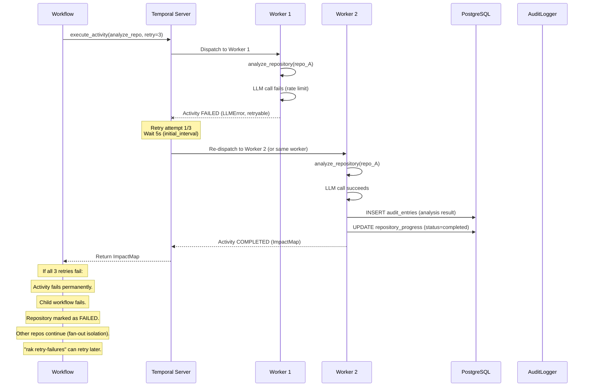

---

## See Also

| Document | What You'll Find |
|---|---|
| [`software-architecture.md`](software-architecture.md) | C4 model, component design, code-level abstractions |
| [`system-design.md`](system-design.md) | Deployment topology, hardware sizing, network policies |
| [`framework-spec.md`](framework-spec.md) | Abstract framework specification, plugin schema, agent contracts |
| [`data-model.md`](data-model.md) | Full database schema, indexes, JSONB payload schemas, partitioning |
| [`operations/runbook.md`](operations/runbook.md) | Failure recovery procedures, maintenance, troubleshooting |

*This document describes the code-level design. For system-level architecture, see [`software-architecture.md`](software-architecture.md). For deployment and infrastructure, see [`system-design.md`](system-design.md). For the abstract framework specification, see [`framework-spec.md`](framework-spec.md).*
