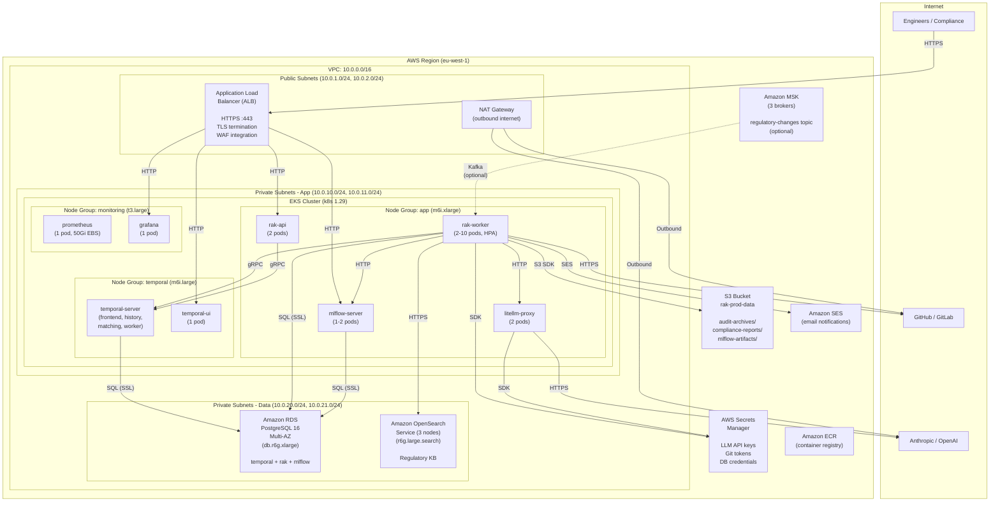
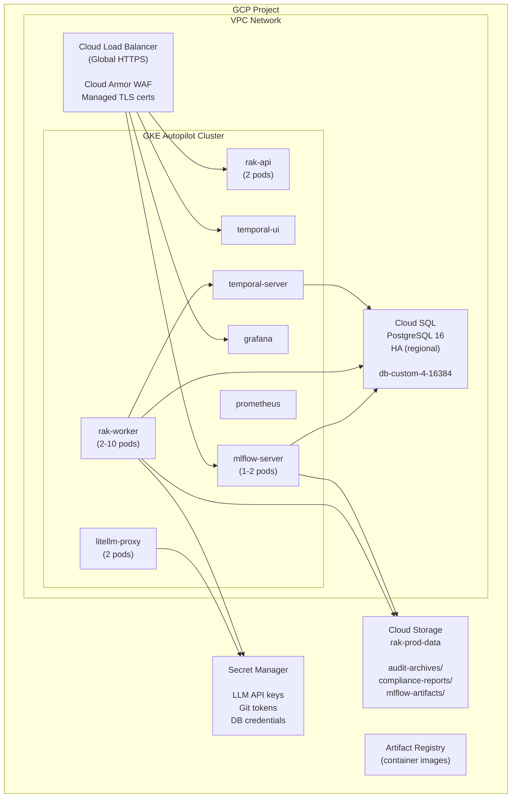
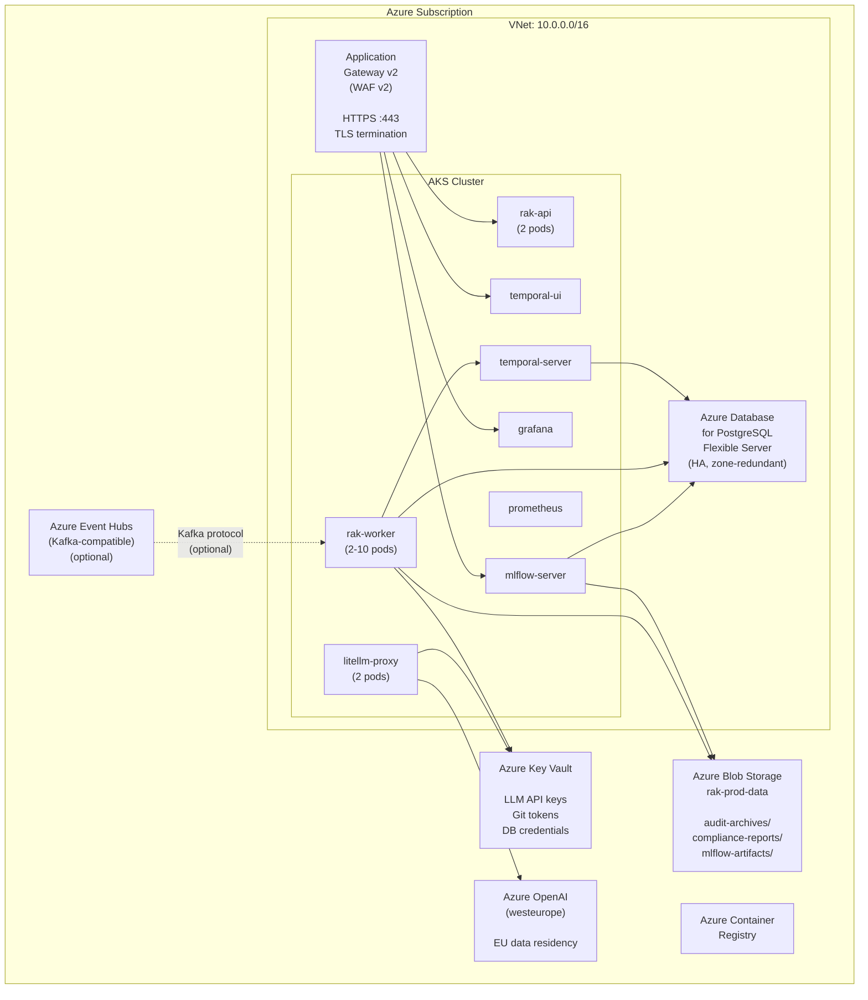
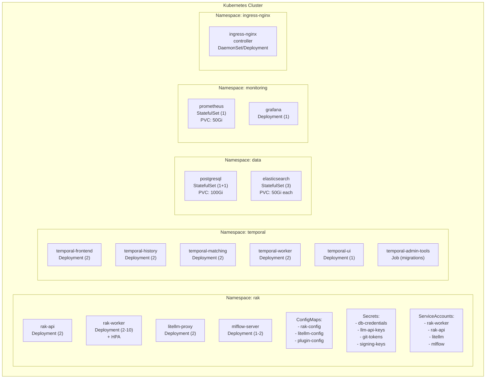
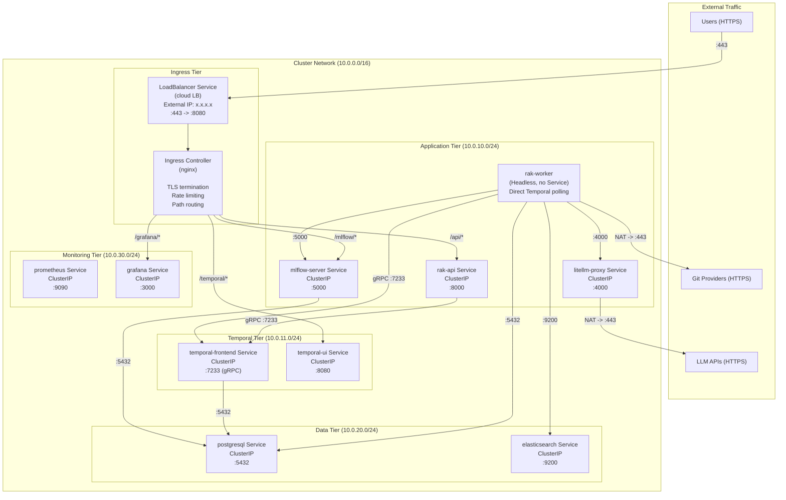
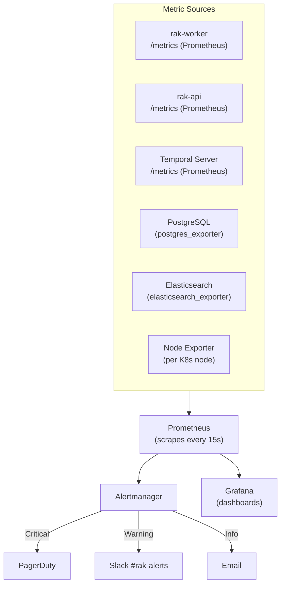

# regulatory-agent-kit — Infrastructure and Deployment Diagrams

> **Version:** 1.0
> **Date:** 2026-03-27
> **Status:** Active Development
> **Audience:** Platform engineers, DevOps, SRE, and infrastructure teams.
> **Related:** For integration protocols, authentication, rate limits, and retry strategies per external system, see [`system-design.md` Section 6.2 — Integration Specification Table](system-design.md#62-integration-specification-table).

---

## Table of Contents

1. [Overview](#1-overview)
2. [Cloud Topology — AWS](#2-cloud-topology--aws)
3. [Cloud Topology — GCP](#3-cloud-topology--gcp)
4. [Cloud Topology — Azure](#4-cloud-topology--azure)
5. [Kubernetes Cluster Architecture](#5-kubernetes-cluster-architecture)
6. [Network Configuration](#6-network-configuration)
7. [Load Balancing Strategy](#7-load-balancing-strategy)
8. [Container Orchestration](#8-container-orchestration)
9. [CI/CD Pipeline](#9-cicd-pipeline)
10. [Infrastructure as Code](#10-infrastructure-as-code)
11. [Monitoring and Alerting](#11-monitoring-and-alerting)

---

## 1. Overview

### 1.1 Deployment Models

> **New to regulatory-agent-kit?** Start with [`getting-started.md`](getting-started.md) for a 5-minute walkthrough using Lite Mode.

| Model | Infrastructure | Best For | Documented In |
|---|---|---|---|
| **Lite Mode** | Developer machine (Python only) | Evaluation (< 5 min setup) | Section 1.3 + Section 8.5 |
| **Docker Compose** | Single machine with Docker | Development, POC | [`system-design.md` SS2.3](system-design.md) |
| **Kubernetes (self-managed)** | EKS / GKE / AKS / on-prem | Production | This document |
| **AWS Native** | EKS + RDS + MSK + S3 | AWS-native orgs | Section 2 |
| **GCP Native** | GKE + Cloud SQL + S3-compat + GCS | GCP-native orgs | Section 3 |
| **Azure Native** | AKS + Azure DB + Event Hubs + Blob | Azure-native orgs | Section 4 |

### 1.2 Deployment Decision Matrix

Use this matrix to choose the right deployment model for your stage:

| | Lite Mode | Docker Compose | Kubernetes |
|---|---|---|---|
| **Setup time** | 5 minutes | 15-30 minutes | 2-4 hours |
| **Infra cost** | $0 (local machine) | $0 (local) or ~$50/mo (VM) | $500-2000/mo (cloud) |
| **Ops burden** | None | Low (single `docker compose up`) | Medium-High (K8s expertise required) |
| **Crash recovery** | None (restart loses state) | Temporal auto-recovery | Temporal auto-recovery + pod rescheduling |
| **Concurrent repos** | Sequential only | Parallel (limited by single machine) | Horizontally scalable (N workers) |
| **Audit durability** | SQLite / local files | PostgreSQL + S3 | PostgreSQL + S3 + HA |
| **Best for** | Evaluation, plugin dev | Development, POC, small teams | Production, enterprise |

**Graduation path:** Start with Lite Mode to evaluate. Move to Docker Compose for development. Deploy Kubernetes for production. Each tier is a superset of the previous.

### 1.3 Quick Evaluation (Lite Mode)

Lite Mode requires **no infrastructure** — only Python 3.12+, git, and an LLM API key:

```bash
pip install regulatory-agent-kit
export ANTHROPIC_API_KEY=sk-...

rak run --lite \
  --regulation regulations/example-regulation/example-regulation.yaml \
  --repos ./my-local-repo \
  --checkpoint-mode terminal
```

Lite Mode replaces Temporal with sequential execution, PostgreSQL with SQLite, and Elasticsearch with LLM-only context. Human checkpoints are interactive terminal prompts. For the full feature parity comparison, see [Section 8.5](#85-lite-mode-no-orchestration).

### 1.4 Service Inventory

All deployment models run the same application containers. Only the backing services differ.

| Service | Container Image | Stateful? | Managed Alternative |
|---|---|---|---|
| `rak-worker` | `rak:worker` (Python 3.12) | No | — |
| `rak-api` | `rak:api` (Python 3.12) | No | — |
| `litellm-proxy` | `ghcr.io/berriai/litellm:v1.40.0` | No | — |
| `mlflow-server` | `rak:mlflow` (Python 3.12) | No | — |
| `temporal-server` | `temporalio/server` | Yes (PG-backed) | Temporal Cloud |
| `temporal-ui` | `temporalio/ui` | No | Temporal Cloud |
| `postgresql` | `postgres:16-alpine` | **Yes** | RDS / Cloud SQL / Azure DB |
| `elasticsearch` | `elasticsearch:8.13.0` | **Yes** | OpenSearch Service / Elastic Cloud |
| `prometheus` | `prom/prometheus` | Yes | Managed Prometheus (AMP, Google Cloud Monitoring) |
| `grafana` | `grafana/grafana` | No (config-as-code) | Grafana Cloud |

---

## 2. Cloud Topology — AWS

### 2.1 Architecture Diagram



### 2.2 AWS Resource Inventory

| Resource | Service | Size | Multi-AZ | Monthly Cost (est.) |
|---|---|---|---|---|
| EKS Cluster | EKS | 1 cluster | Yes (3 AZs) | $73 |
| App Node Group | EC2 (m6i.xlarge) | 3 nodes | Yes | $420 |
| Temporal Node Group | EC2 (m6i.large) | 2 nodes | Yes | $140 |
| Monitoring Node Group | EC2 (t3.large) | 2 nodes | Yes | $120 |
| PostgreSQL | RDS (db.r6g.xlarge) | Multi-AZ, 100 Gi gp3 | Yes | $520 |
| OpenSearch | OpenSearch (r6g.large.search) | 3 nodes, 50 Gi gp3 each | Yes | $480 |
| Load Balancer | ALB | 1 | Yes | $25 + traffic |
| NAT Gateway | NAT | 2 (one per AZ) | Yes | $65 |
| Object Storage | S3 | Pay per use | N/A | ~$5-50 |
| Event Streaming | MSK (kafka.m5.large) | 3 brokers (optional) | Yes | $450 (optional) |
| Secrets | Secrets Manager | ~10 secrets | N/A | $5 |
| Email | SES | Pay per use | N/A | ~$1 |
| Container Registry | ECR | ~5 images | N/A | ~$5 |
| **Total (without MSK)** | | | | **~$1,860/mo** |
| **Total (with MSK)** | | | | **~$2,310/mo** |

### 2.3 AWS IAM Roles

| Role | Attached To | Permissions |
|---|---|---|
| `rak-worker-role` | EKS ServiceAccount `rak-worker` (IRSA) | S3 (read/write `rak-prod-data`), Secrets Manager (read), SES (send), SQS (receive, if used) |
| `rak-api-role` | EKS ServiceAccount `rak-api` (IRSA) | Secrets Manager (read) |
| `litellm-role` | EKS ServiceAccount `litellm` (IRSA) | Secrets Manager (read), Bedrock (InvokeModel) |
| `mlflow-role` | EKS ServiceAccount `mlflow` (IRSA) | S3 (read/write `rak-prod-data/mlflow-artifacts/`) |
| `temporal-role` | EKS ServiceAccount `temporal` (IRSA) | None (connects to RDS via credentials, not IAM auth) |

---

## 3. Cloud Topology — GCP

### 3.1 Architecture Diagram



### 3.2 GCP Resource Mapping

| AWS Equivalent | GCP Service | Notes |
|---|---|---|
| EKS | **GKE Autopilot** | Serverless node management, no node groups to configure |
| RDS PostgreSQL | **Cloud SQL for PostgreSQL** | Regional HA, automated backups, IAM auth |
| OpenSearch | **Elastic Cloud on GCP** or self-hosted in GKE | GCP does not have a native OpenSearch equivalent |
| ALB | **Cloud Load Balancer** (Global HTTPS) | With Cloud Armor WAF |
| S3 | **Cloud Storage** | S3-compatible API available via interop |
| Secrets Manager | **Secret Manager** | Mounted via CSI driver or Workload Identity |
| MSK | **Confluent Cloud on GCP** or self-hosted | GCP Pub/Sub is an alternative (requires adapter) |
| SES | **SendGrid** or SMTP relay | No native GCP email service |
| ECR | **Artifact Registry** | Multi-region replication |
| IAM (IRSA) | **Workload Identity** | Maps K8s ServiceAccounts to GCP Service Accounts |

---

## 4. Cloud Topology — Azure

### 4.1 Architecture Diagram



### 4.2 Azure Resource Mapping

| AWS Equivalent | Azure Service | Notes |
|---|---|---|
| EKS | **AKS** | System and user node pools |
| RDS PostgreSQL | **Azure Database for PostgreSQL Flexible Server** | Zone-redundant HA |
| OpenSearch | **Elastic Cloud on Azure** or self-hosted | No native Azure equivalent |
| ALB | **Application Gateway v2** | With WAF v2 policy |
| S3 | **Azure Blob Storage** | S3-compatible via MinIO gateway or native SDK |
| Secrets Manager | **Azure Key Vault** | CSI driver for pod mounting |
| MSK | **Azure Event Hubs** (Kafka-compatible surface) | Protocol-compatible with Apache Kafka clients |
| SES | **Azure Communication Services** or SendGrid | SendGrid is an Azure marketplace offering |
| ECR | **Azure Container Registry** | Geo-replication available |
| IAM (IRSA) | **Azure Workload Identity** | Maps K8s ServiceAccounts to Azure Managed Identities |
| LLM Data Residency | **Azure OpenAI (westeurope)** | EU deployment for GDPR compliance |

---

## 5. Kubernetes Cluster Architecture

### 5.1 Namespace Layout



### 5.2 Horizontal Pod Autoscaler (HPA)

The `rak-worker` deployment is the primary scaling lever:

```yaml
apiVersion: autoscaling/v2
kind: HorizontalPodAutoscaler
metadata:
  name: rak-worker-hpa
  namespace: rak
spec:
  scaleTargetRef:
    apiVersion: apps/v1
    kind: Deployment
    name: rak-worker
  minReplicas: 2
  maxReplicas: 10
  metrics:
    # Scale on CPU utilization (workers are CPU-bound during AST parsing)
    - type: Resource
      resource:
        name: cpu
        target:
          type: Utilization
          averageUtilization: 70
    # Scale on Temporal task queue depth (custom metric via Prometheus adapter)
    - type: External
      external:
        metric:
          name: temporal_task_queue_depth
          selector:
            matchLabels:
              task_queue: "rak-pipeline"
        target:
          type: AverageValue
          averageValue: "5"
  behavior:
    scaleUp:
      stabilizationWindowSeconds: 60
      policies:
        - type: Pods
          value: 2
          periodSeconds: 60
    scaleDown:
      stabilizationWindowSeconds: 300
      policies:
        - type: Pods
          value: 1
          periodSeconds: 120
```

### 5.3 Pod Disruption Budgets

```yaml
# Ensure at least 1 worker is always running during node maintenance
apiVersion: policy/v1
kind: PodDisruptionBudget
metadata:
  name: rak-worker-pdb
  namespace: rak
spec:
  minAvailable: 1
  selector:
    matchLabels:
      app: rak-worker

---
# Temporal frontend must have at least 1 replica
apiVersion: policy/v1
kind: PodDisruptionBudget
metadata:
  name: temporal-frontend-pdb
  namespace: temporal
spec:
  minAvailable: 1
  selector:
    matchLabels:
      app: temporal-frontend

---
# API must have at least 1 replica
apiVersion: policy/v1
kind: PodDisruptionBudget
metadata:
  name: rak-api-pdb
  namespace: rak
spec:
  minAvailable: 1
  selector:
    matchLabels:
      app: rak-api
```

### 5.4 Resource Quotas

```yaml
apiVersion: v1
kind: ResourceQuota
metadata:
  name: rak-quota
  namespace: rak
spec:
  hard:
    requests.cpu: "20"
    requests.memory: "40Gi"
    limits.cpu: "40"
    limits.memory: "80Gi"
    pods: "30"
    services: "10"
    persistentvolumeclaims: "5"
```

---

## 6. Network Configuration

### 6.1 Network Topology



### 6.2 Ingress Configuration

```yaml
apiVersion: networking.k8s.io/v1
kind: Ingress
metadata:
  name: rak-ingress
  namespace: rak
  annotations:
    nginx.ingress.kubernetes.io/ssl-redirect: "true"
    nginx.ingress.kubernetes.io/rate-limit: "100"
    nginx.ingress.kubernetes.io/rate-limit-window: "1m"
    nginx.ingress.kubernetes.io/proxy-body-size: "10m"
    cert-manager.io/cluster-issuer: "letsencrypt-prod"
spec:
  ingressClassName: nginx
  tls:
    - hosts:
        - rak.example.com
      secretName: rak-tls
  rules:
    - host: rak.example.com
      http:
        paths:
          - path: /api
            pathType: Prefix
            backend:
              service:
                name: rak-api
                port:
                  number: 8000
          - path: /temporal
            pathType: Prefix
            backend:
              service:
                name: temporal-ui
                port:
                  number: 8080
          - path: /mlflow
            pathType: Prefix
            backend:
              service:
                name: mlflow-server
                port:
                  number: 5000
          - path: /grafana
            pathType: Prefix
            backend:
              service:
                name: grafana
                port:
                  number: 3000
```

### 6.3 Network Policies

```yaml
# Workers: allow egress to temporal, data stores, LLM, Git. Deny all ingress.
apiVersion: networking.k8s.io/v1
kind: NetworkPolicy
metadata:
  name: rak-worker-netpol
  namespace: rak
spec:
  podSelector:
    matchLabels:
      app: rak-worker
  policyTypes: [Ingress, Egress]
  ingress: []  # Workers receive no inbound connections (Temporal polls)
  egress:
    # Temporal frontend (gRPC)
    - to:
        - namespaceSelector:
            matchLabels:
              name: temporal
          podSelector:
            matchLabels:
              app: temporal-frontend
      ports:
        - port: 7233
          protocol: TCP
    # PostgreSQL
    - to:
        - namespaceSelector:
            matchLabels:
              name: data
          podSelector:
            matchLabels:
              app: postgresql
      ports:
        - port: 5432
          protocol: TCP
    # Elasticsearch
    - to:
        - namespaceSelector:
            matchLabels:
              name: data
          podSelector:
            matchLabels:
              app: elasticsearch
      ports:
        - port: 9200
          protocol: TCP
    # LiteLLM proxy (same namespace)
    - to:
        - podSelector:
            matchLabels:
              app: litellm-proxy
      ports:
        - port: 4000
          protocol: TCP
    # MLflow (same namespace)
    - to:
        - podSelector:
            matchLabels:
              app: mlflow-server
      ports:
        - port: 5000
          protocol: TCP
    # Prometheus (OTLP push)
    - to:
        - namespaceSelector:
            matchLabels:
              name: monitoring
      ports:
        - port: 4318
          protocol: TCP
    # External: Git providers, S3, Secrets Manager (via NAT)
    - to:
        - ipBlock:
            cidr: 0.0.0.0/0
            except:
              - 10.0.0.0/8     # Block cross-pod direct access
              - 172.16.0.0/12
              - 192.168.0.0/16
      ports:
        - port: 443
          protocol: TCP

---
# PostgreSQL: allow ingress from temporal, rak, mlflow namespaces only
apiVersion: networking.k8s.io/v1
kind: NetworkPolicy
metadata:
  name: postgresql-netpol
  namespace: data
spec:
  podSelector:
    matchLabels:
      app: postgresql
  policyTypes: [Ingress]
  ingress:
    - from:
        - namespaceSelector:
            matchLabels:
              name: temporal
        - namespaceSelector:
            matchLabels:
              name: rak
      ports:
        - port: 5432
          protocol: TCP

---
# Sandbox containers: NO network at all (enforced at Docker level too)
# Test execution containers are created with --network=none by the TestRunner.
# This NetworkPolicy is defense-in-depth for any pod labeled app=test-sandbox.
apiVersion: networking.k8s.io/v1
kind: NetworkPolicy
metadata:
  name: sandbox-deny-all
  namespace: rak
spec:
  podSelector:
    matchLabels:
      app: test-sandbox
  policyTypes: [Ingress, Egress]
  ingress: []
  egress: []
```

---

## 7. Load Balancing Strategy

### 7.1 External Load Balancing

```
Internet
    |
    v
+-----------------------------------+
| Cloud Load Balancer               |
| (ALB / Cloud LB / App Gateway)   |
|                                   |
| - HTTPS termination (TLS 1.3)    |
| - WAF rules (OWASP Core Ruleset) |
| - DDoS protection (Shield/Armor) |
| - Rate limiting (100 req/min)     |
| - Health check: GET /healthz      |
+-----------------------------------+
    |
    v
+-----------------------------------+
| Ingress Controller (nginx)        |
|                                   |
| - Path-based routing              |
| - /api/* -> rak-api:8000          |
| - /temporal/* -> temporal-ui:8080 |
| - /mlflow/* -> mlflow:5000        |
| - /grafana/* -> grafana:3000      |
| - Connection limiting per IP      |
| - Request size limit: 10MB        |
+-----------------------------------+
    |
    v
+-----------------------------------+
| Kubernetes Service (ClusterIP)    |
|                                   |
| - Round-robin pod selection       |
| - Session affinity: None          |
|   (all pods are stateless)        |
+-----------------------------------+
```

### 7.2 Internal Load Balancing

| Service | Type | Balancing Strategy | Notes |
|---|---|---|---|
| `rak-api` | ClusterIP | kube-proxy round-robin | Stateless; any pod can serve any request |
| `litellm-proxy` | ClusterIP | kube-proxy round-robin | Stateless proxy; rate limiting is internal to LiteLLM |
| `mlflow-server` | ClusterIP | kube-proxy round-robin | Stateless; backed by PostgreSQL + S3 |
| `temporal-frontend` | ClusterIP | gRPC load balancing (headless + client-side) | Temporal SDK uses gRPC client-side balancing |
| `postgresql` | ClusterIP | Single primary (Patroni manages failover) | Not load-balanced; single-writer architecture |
| `elasticsearch` | ClusterIP | ES client round-robin across nodes | ES cluster handles internal shard routing |

### 7.3 Temporal-Specific Load Balancing

Temporal workers do not receive traffic — they **poll** the Temporal server for tasks. Load distribution is handled by the Temporal server's matching service:

```
Temporal Server (matching service)
    |
    +-- Task Queue: "rak-pipeline"
    |       |
    |       +-- Worker Pod 1 (polls) -> gets Activity A
    |       +-- Worker Pod 2 (polls) -> gets Activity B
    |       +-- Worker Pod 3 (polls) -> gets Activity C
    |       ...
    |
    +-- Task Queue: "rak-pipeline" (workflow tasks)
            |
            +-- Worker Pod 1 (polls) -> gets Workflow Task
            ...

Distribution: Temporal distributes activities across all polling workers.
Scaling: Add worker replicas -> Temporal automatically includes them.
Failover: Worker crash -> Temporal re-dispatches activity to another worker.
```

---

## 8. Container Orchestration

### 8.1 Container Image Build

```dockerfile
# Dockerfile (multi-stage)

# ===== Stage 1: Builder =====
FROM python:3.12-slim AS builder

RUN pip install uv

WORKDIR /app
COPY pyproject.toml uv.lock ./
RUN uv sync --frozen --no-dev --no-editable

COPY src/ src/
COPY regulations/ regulations/
COPY migrations/ migrations/

# ===== Stage 2: Runtime =====
FROM python:3.12-slim AS runtime

# Install git (required by GitClient)
RUN apt-get update && apt-get install -y --no-install-recommends \
    git=1:2.* \
    && rm -rf /var/lib/apt/lists/*

# Non-root user
RUN useradd --create-home --uid 1000 rak
USER rak
WORKDIR /home/rak

# Copy installed packages
COPY --from=builder /app/.venv /home/rak/.venv
COPY --from=builder /app/src /home/rak/src
COPY --from=builder /app/regulations /home/rak/regulations
COPY --from=builder /app/migrations /home/rak/migrations

ENV PATH="/home/rak/.venv/bin:$PATH"
ENV PYTHONPATH="/home/rak/src"

# Health check
HEALTHCHECK --interval=30s --timeout=5s --retries=3 \
    CMD python -c "import regulatory_agent_kit; print('ok')" || exit 1

# Default: worker mode (overridden by K8s command)
ENTRYPOINT ["python", "-m"]
CMD ["regulatory_agent_kit.worker"]
```

### 8.2 Image Variants

```yaml
# Kubernetes commands override the default CMD:

# Worker deployment
containers:
  - name: rak-worker
    image: rak:1.0.0
    command: ["python", "-m", "regulatory_agent_kit.worker"]

# API deployment
containers:
  - name: rak-api
    image: rak:1.0.0
    command: ["uvicorn", "regulatory_agent_kit.api.app:app",
              "--host", "0.0.0.0", "--port", "8000",
              "--loop", "uvloop", "--workers", "2"]

# Migration init container
initContainers:
  - name: migrate
    image: rak:1.0.0
    command: ["alembic", "upgrade", "head"]
```

### 8.3 Container Security

```yaml
# Pod security context (applied to all rak pods)
securityContext:
  runAsNonRoot: true
  runAsUser: 1000
  runAsGroup: 1000
  fsGroup: 1000
  seccompProfile:
    type: RuntimeDefault

# Container security context
containers:
  - name: rak-worker
    securityContext:
      allowPrivilegeEscalation: false
      readOnlyRootFilesystem: true
      capabilities:
        drop: ["ALL"]
    volumeMounts:
      - name: tmp
        mountPath: /tmp     # Writable tmp for git clones
      - name: cache
        mountPath: /home/rak/.cache

volumes:
  - name: tmp
    emptyDir:
      sizeLimit: 10Gi      # Limit tmp usage (git clones)
  - name: cache
    emptyDir:
      sizeLimit: 1Gi
```

### 8.4 Health Checks

```yaml
# rak-api
livenessProbe:
  httpGet:
    path: /healthz
    port: 8000
  initialDelaySeconds: 10
  periodSeconds: 15
  failureThreshold: 3

readinessProbe:
  httpGet:
    path: /readyz
    port: 8000
  initialDelaySeconds: 5
  periodSeconds: 5
  failureThreshold: 2

# rak-worker (no HTTP endpoint — use exec probe)
livenessProbe:
  exec:
    command: ["python", "-c",
      "from temporalio.client import Client; print('alive')"]
  initialDelaySeconds: 15
  periodSeconds: 30
  failureThreshold: 3

# litellm-proxy
livenessProbe:
  httpGet:
    path: /health
    port: 4000
  periodSeconds: 15

# mlflow-server
livenessProbe:
  httpGet:
    path: /health
    port: 5000
  periodSeconds: 15
```

### 8.5 Lite Mode (No Orchestration)

For evaluation and development without Kubernetes:

```bash
# Requires only: Python 3.12+, git, LLM API key
pip install regulatory-agent-kit
export ANTHROPIC_API_KEY=sk-...

# Runs with:
# - FileEventSource (watches ./events/ directory)
# - SQLite (in-memory or file-based)
# - No Temporal (direct function calls)
# - No Elasticsearch (optional)
# - No MLflow (optional, stdout tracing)
# - Terminal-based human checkpoints (interactive prompts)

rak run --lite \
  --regulation regulations/example-regulation/example-regulation.yaml \
  --repos ./my-local-repo \
  --checkpoint-mode terminal
```

#### 8.5.1 Lite Mode Feature Parity

Lite Mode replaces production infrastructure components with lightweight alternatives. The following table documents feature availability and behavioral differences:

| Feature | Full Mode | Lite Mode | Notes |
|---|---|---|---|
| **Workflow orchestration** | Temporal (event-sourced, durable) | Direct Python function calls (in-process) | No crash recovery — a process restart loses pipeline state |
| **State persistence** | PostgreSQL (temporal + rak + mlflow schemas) | SQLite (in-memory or file-based) | SQLite does not support concurrent writers; single-pipeline only |
| **Human checkpoints** | Temporal Signals (Slack, email, API) | Interactive terminal prompts (`input()`) | Blocks the process; only `--checkpoint-mode terminal` is supported |
| **Event sources** | Kafka, Webhook, SQS, File | File only (`FileEventSource`) | Drop JSON files into `./events/` directory to trigger |
| **Regulatory knowledge base** | Elasticsearch 8.x (semantic search) | **Not available** | Analyzer Agent skips `es_search` tool; relies on LLM with plugin YAML context only |
| **LLM observability** | MLflow (full tracing, dashboards) | Optional (stdout logging if MLflow not configured) | Set `MLFLOW_TRACKING_URI` to enable; otherwise traces go to stdout |
| **Cross-regulation conflicts** | Full conflict detection + escalation | **Supported** (conflict engine is in-process) | Works identically — no infrastructure dependency |
| **Parallel repository processing** | Fan-out across N Temporal workers | Sequential (single-threaded, one repo at a time) | Significant performance difference for multi-repo runs |
| **Repository-level locking** | Temporal workflow ID uniqueness | Not needed (sequential processing) | No concurrent conflicts possible |
| **Dead letter queue / retry** | Temporal failed workflow queries + `rak retry-failures` | **Not available** | Failures logged to stdout; must re-run the entire pipeline |
| **Rollback manifests** | Generated and stored in PostgreSQL + S3 | Generated to local filesystem | `rak rollback` works but reads from local file |
| **Audit trail signing** | Ed25519 signatures, append-only PostgreSQL | Ed25519 signatures, SQLite (or stdout JSON) | Signatures are still generated; storage is less durable |
| **Cost estimation gate** | Pre-run estimate with approval workflow | Pre-run estimate with terminal prompt | Same estimation logic; different approval mechanism |
| **Sandboxed test execution** | Docker containers (`--network=none`) | Docker containers (same) | Requires Docker even in Lite Mode |

**When to use Lite Mode:**
- Evaluating the framework for the first time (< 5 minutes to first run)
- Developing and testing a new regulation plugin against a local repository
- CI/CD environments where only shift-left analysis is needed (no full pipeline)

**When NOT to use Lite Mode:**
- Processing more than 5 repositories (sequential execution is too slow)
- Production compliance pipelines (no crash recovery, no durable audit trail)
- Multi-user environments (no concurrent access support)

---

## 9. CI/CD Pipeline

### 9.1 Pipeline Overview

```mermaid
flowchart LR
    subgraph DEVELOP["Development"]
        DEV["Developer"]
        LOCAL["Local Tests\n(just test)"]
    end

    subgraph CI["CI Pipeline (GitHub Actions)"]
        LINT["Lint + Type Check\n(ruff + mypy)"]
        UNIT["Unit Tests\n(pytest, no external deps)"]
        INTEG["Integration Tests\n(testcontainers:\nPostgreSQL, ES)"]
        SEC["Security Scan\n(pip-audit, trivy,\nsemgrep)"]
        BUILD["Build Container\nImage"]
        SIGN["Sign Image\n(cosign / sigstore)"]
        SBOM["Generate SBOM\n(syft / cyclonedx)"]
        PUSH["Push to Registry\n(ECR / GAR / ACR)"]
    end

    subgraph CD["CD Pipeline"]
        STAGE_DEPLOY["Deploy to Staging\n(Helm upgrade)"]
        STAGE_MIGRATE["Run Migrations\n(alembic upgrade head)"]
        STAGE_SMOKE["Smoke Tests\n(e2e with test plugin)"]
        STAGE_GATE["Manual Approval\n(required)"]
        PROD_DEPLOY["Deploy to Production\n(Helm upgrade)"]
        PROD_MIGRATE["Run Migrations"]
        PROD_SMOKE["Smoke Tests"]
        PROD_VERIFY["Verify Health\n(all pods ready,\nno error spikes)"]
    end

    DEV -->|"git push"| LINT
    DEV --> LOCAL

    LINT --> UNIT
    UNIT --> INTEG
    INTEG --> SEC
    SEC --> BUILD
    BUILD --> SIGN
    BUILD --> SBOM
    SIGN --> PUSH
    SBOM --> PUSH

    PUSH -->|"auto"| STAGE_DEPLOY
    STAGE_DEPLOY --> STAGE_MIGRATE
    STAGE_MIGRATE --> STAGE_SMOKE
    STAGE_SMOKE --> STAGE_GATE

    STAGE_GATE -->|"approved"| PROD_DEPLOY
    PROD_DEPLOY --> PROD_MIGRATE
    PROD_MIGRATE --> PROD_SMOKE
    PROD_SMOKE --> PROD_VERIFY
```



### 9.2 GitHub Actions Workflow

```yaml
# .github/workflows/ci.yml
name: CI

on:
  push:
    branches: [main]
  pull_request:
    branches: [main]

env:
  PYTHON_VERSION: "3.12"
  REGISTRY: ghcr.io
  IMAGE_NAME: ${{ github.repository }}

jobs:
  lint:
    runs-on: ubuntu-latest
    steps:
      - uses: actions/checkout@v4
      - uses: astral-sh/setup-uv@v4
      - run: uv sync --frozen --dev
      - run: uv run ruff check src/ tests/
      - run: uv run ruff format --check src/ tests/
      - run: uv run mypy src/ --strict

  test-unit:
    runs-on: ubuntu-latest
    needs: lint
    steps:
      - uses: actions/checkout@v4
      - uses: astral-sh/setup-uv@v4
      - run: uv sync --frozen --dev
      - run: uv run pytest tests/unit/ -v --cov=src/ --cov-report=xml
      - uses: codecov/codecov-action@v4

  test-integration:
    runs-on: ubuntu-latest
    needs: lint
    steps:
      - uses: actions/checkout@v4
      - uses: astral-sh/setup-uv@v4
      - run: uv sync --frozen --dev
      - run: uv run pytest tests/integration/ -v --timeout=120
        # testcontainers auto-starts PostgreSQL + ES

  security:
    runs-on: ubuntu-latest
    needs: lint
    steps:
      - uses: actions/checkout@v4
      - uses: astral-sh/setup-uv@v4
      - run: uv sync --frozen --dev
      - run: uv run pip-audit
      - uses: aquasecurity/trivy-action@master
        with:
          scan-type: fs
          scan-ref: .
      - uses: returntocorp/semgrep-action@v1
        with:
          config: p/python p/owasp-top-ten

  build:
    runs-on: ubuntu-latest
    needs: [test-unit, test-integration, security]
    if: github.ref == 'refs/heads/main'
    permissions:
      contents: read
      packages: write
      id-token: write  # For cosign OIDC
    steps:
      - uses: actions/checkout@v4

      - uses: docker/setup-buildx-action@v3

      - uses: docker/login-action@v3
        with:
          registry: ${{ env.REGISTRY }}
          username: ${{ github.actor }}
          password: ${{ secrets.GITHUB_TOKEN }}

      - id: meta
        uses: docker/metadata-action@v5
        with:
          images: ${{ env.REGISTRY }}/${{ env.IMAGE_NAME }}
          tags: |
            type=sha
            type=ref,event=branch

      - uses: docker/build-push-action@v5
        id: build
        with:
          context: .
          push: true
          tags: ${{ steps.meta.outputs.tags }}
          cache-from: type=gha
          cache-to: type=gha,mode=max

      # Sign image with cosign (keyless, OIDC)
      - uses: sigstore/cosign-installer@v3
      - run: cosign sign --yes ${{ env.REGISTRY }}/${{ env.IMAGE_NAME }}@${{ steps.build.outputs.digest }}

      # Generate SBOM
      - uses: anchore/sbom-action@v0
        with:
          image: ${{ env.REGISTRY }}/${{ env.IMAGE_NAME }}@${{ steps.build.outputs.digest }}
          format: cyclonedx-json
          output-file: sbom.json

      - uses: actions/upload-artifact@v4
        with:
          name: sbom
          path: sbom.json

  deploy-staging:
    runs-on: ubuntu-latest
    needs: build
    environment: staging
    steps:
      - uses: actions/checkout@v4
      - uses: azure/setup-kubectl@v3
      - run: |
          helm upgrade --install rak ./helm \
            --namespace rak \
            --set image.tag=${{ github.sha }} \
            --set environment=staging \
            --values helm/values-staging.yaml \
            --wait --timeout 5m

  deploy-production:
    runs-on: ubuntu-latest
    needs: deploy-staging
    environment: production  # Requires manual approval in GitHub
    steps:
      - uses: actions/checkout@v4
      - uses: azure/setup-kubectl@v3
      - run: |
          helm upgrade --install rak ./helm \
            --namespace rak \
            --set image.tag=${{ github.sha }} \
            --set environment=production \
            --values helm/values-production.yaml \
            --wait --timeout 10m
```

### 9.3 Pipeline Stages Detail

| Stage | Duration | Failure Action | Tools |
|---|---|---|---|
| **Lint** | ~30s | Block PR | ruff (lint + format), mypy (strict) |
| **Unit Tests** | ~2 min | Block PR | pytest, pytest-cov |
| **Integration Tests** | ~5 min | Block PR | pytest, testcontainers (PostgreSQL, ES) |
| **Security Scan** | ~3 min | Block PR (critical/high findings) | pip-audit, trivy (filesystem), semgrep (OWASP) |
| **Build** | ~3 min | Block deploy | Docker buildx (multi-stage, cached) |
| **Sign** | ~30s | Block deploy | cosign (keyless OIDC via Sigstore) |
| **SBOM** | ~1 min | Non-blocking | syft or cyclonedx-bom |
| **Deploy Staging** | ~5 min | Alert, manual investigation | Helm upgrade, kubectl rollout status |
| **Smoke Tests** | ~5 min | Block production deploy | Lite-mode pipeline run with test plugin |
| **Manual Approval** | Variable | Required | GitHub Environments |
| **Deploy Production** | ~10 min | Auto-rollback on failed health check | Helm upgrade with `--atomic` |

### 9.4 Rollback Strategy

```bash
# Automatic rollback on failed deployment (Helm --atomic)
helm upgrade --install rak ./helm \
  --atomic \               # Rolls back if deployment fails
  --timeout 10m \          # Wait up to 10 min for pods to be ready
  --cleanup-on-fail        # Remove new resources on failure

# Manual rollback to previous release
helm rollback rak 1        # Roll back to revision 1

# Emergency: pin to known-good image
kubectl set image deployment/rak-worker \
  rak-worker=ghcr.io/org/rak:sha-abc123 \
  -n rak
```

---

## 10. Infrastructure as Code

### 10.1 Repository Structure

```
infrastructure/
+-- terraform/
|   +-- modules/
|   |   +-- eks/              # EKS cluster + node groups
|   |   +-- rds/              # RDS PostgreSQL
|   |   +-- opensearch/       # OpenSearch domain
|   |   +-- s3/               # S3 buckets + policies
|   |   +-- networking/       # VPC, subnets, NAT, security groups
|   |   +-- iam/              # IAM roles + policies (IRSA)
|   |   +-- secrets/          # Secrets Manager initial setup
|   |
|   +-- environments/
|       +-- staging/
|       |   +-- main.tf       # Staging environment config
|       |   +-- terraform.tfvars
|       +-- production/
|           +-- main.tf       # Production environment config
|           +-- terraform.tfvars
|
+-- helm/
|   +-- Chart.yaml
|   +-- values.yaml           # Default values
|   +-- values-staging.yaml   # Staging overrides
|   +-- values-production.yaml # Production overrides
|   +-- templates/
|       +-- deployment-worker.yaml
|       +-- deployment-api.yaml
|       +-- deployment-litellm.yaml
|       +-- deployment-mlflow.yaml
|       +-- service-api.yaml
|       +-- service-litellm.yaml
|       +-- service-mlflow.yaml
|       +-- ingress.yaml
|       +-- hpa-worker.yaml
|       +-- pdb.yaml
|       +-- networkpolicy.yaml
|       +-- configmap.yaml
|       +-- secret.yaml       # ExternalSecret references
|       +-- serviceaccount.yaml
|       +-- _helpers.tpl
|
+-- docker/
    +-- Dockerfile            # Multi-stage application image
    +-- docker-compose.yml    # Development stack
    +-- docker-compose.test.yml # CI integration test stack
```

### 10.2 Helm Values (Production)

```yaml
# helm/values-production.yaml
environment: production

image:
  repository: ghcr.io/org/regulatory-agent-kit
  tag: "latest"  # Overridden by CI with SHA
  pullPolicy: IfNotPresent

worker:
  replicas: 3
  resources:
    requests:
      cpu: "1"
      memory: "2Gi"
    limits:
      cpu: "4"
      memory: "8Gi"
  hpa:
    enabled: true
    minReplicas: 2
    maxReplicas: 10
    targetCPU: 70

api:
  replicas: 2
  resources:
    requests:
      cpu: "250m"
      memory: "256Mi"
    limits:
      cpu: "1"
      memory: "1Gi"

litellm:
  replicas: 2
  resources:
    requests:
      cpu: "500m"
      memory: "512Mi"
    limits:
      cpu: "2"
      memory: "2Gi"

mlflow:
  replicas: 1
  resources:
    requests:
      cpu: "250m"
      memory: "512Mi"

postgresql:
  # Using managed RDS — not deployed via Helm
  external: true
  host: "rak-prod.xxxxx.eu-west-1.rds.amazonaws.com"
  port: 5432
  database: "rak"
  existingSecret: "db-credentials"

elasticsearch:
  # Using managed OpenSearch — not deployed via Helm
  external: true
  host: "https://rak-prod.eu-west-1.es.amazonaws.com"
  existingSecret: "es-credentials"

objectStorage:
  bucket: "rak-prod-data"
  region: "eu-west-1"

ingress:
  enabled: true
  host: "rak.example.com"
  tls: true
  clusterIssuer: "letsencrypt-prod"

monitoring:
  prometheus:
    enabled: true
  grafana:
    enabled: true
```

---

## 11. Monitoring and Alerting

### 11.1 Monitoring Stack



### 11.2 Key Dashboards

| Dashboard | Metrics | Audience |
|---|---|---|
| **Pipeline Health** | Runs in progress, completion rate, average duration, failure rate, cost per run | Engineering managers |
| **Worker Performance** | Activities per minute, activity latency (p50/p95/p99), task queue depth, worker utilization | SRE |
| **LLM Usage** | Calls per model, tokens per minute, latency per provider, cost per hour, fallback rate | Engineering |
| **Database Health** | Active connections, transaction rate, replication lag, disk usage, slow queries | DBA / SRE |
| **Audit Trail** | Entries per minute, partition size, unsigned entries (should be 0), export status | Compliance |

### 11.3 Alert Rules

```yaml
# prometheus/rules/rak-alerts.yml
groups:
  - name: rak-critical
    rules:
      - alert: PipelineStuck
        expr: |
          rak_pipeline_runs{status="running"}
          and on(run_id) (time() - rak_pipeline_started_at > 7200)
        for: 5m
        labels:
          severity: critical
        annotations:
          summary: "Pipeline run {{ $labels.run_id }} stuck for >2 hours"

      - alert: WorkerDown
        expr: up{job="rak-worker"} == 0
        for: 2m
        labels:
          severity: critical
        annotations:
          summary: "No rak-worker pods are running"

      - alert: PostgreSQLDown
        expr: pg_up == 0
        for: 1m
        labels:
          severity: critical

      - alert: TemporalFrontendDown
        expr: up{job="temporal-frontend"} == 0
        for: 2m
        labels:
          severity: critical

  - name: rak-warning
    rules:
      - alert: HighActivityFailureRate
        expr: |
          rate(temporal_activity_execution_failed_total[5m])
          / rate(temporal_activity_execution_total[5m]) > 0.1
        for: 10m
        labels:
          severity: warning
        annotations:
          summary: "Activity failure rate >10% for 10 minutes"

      - alert: LLMLatencyHigh
        expr: |
          histogram_quantile(0.95,
            rate(litellm_request_duration_seconds_bucket[5m])
          ) > 30
        for: 5m
        labels:
          severity: warning
        annotations:
          summary: "LLM p95 latency >30s for 5 minutes"

      - alert: PostgreSQLConnectionsHigh
        expr: pg_stat_activity_count > 150
        for: 5m
        labels:
          severity: warning
        annotations:
          summary: "PostgreSQL connections >150 (max 200)"

      - alert: AuditPartitionNearFull
        expr: pg_table_size{table="audit_entries"} > 5e9  # 5GB
        for: 1h
        labels:
          severity: warning
        annotations:
          summary: "Current audit partition >5GB — verify partitioning is working"

      - alert: TaskQueueBacklog
        expr: temporal_task_queue_depth > 50
        for: 10m
        labels:
          severity: warning
        annotations:
          summary: "Temporal task queue depth >50 — consider scaling workers"

      - alert: LLMCostSpike
        expr: |
          increase(rak_llm_cost_total[1h]) > 100
        for: 5m
        labels:
          severity: warning
        annotations:
          summary: "LLM cost >$100 in the last hour"
```

---

*This document describes the infrastructure and deployment architecture. For software architecture, see [`software-architecture.md`](software-architecture.md). For database schema details, see [`data-model.md`](data-model.md). For the high-level system design, see [`system-design.md`](system-design.md).*
