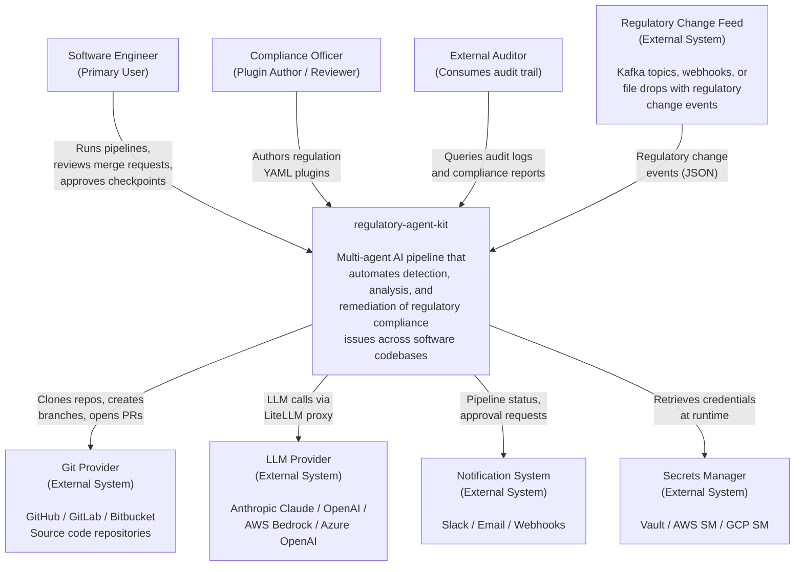
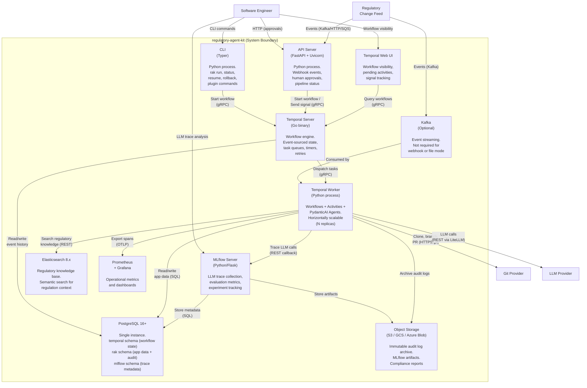
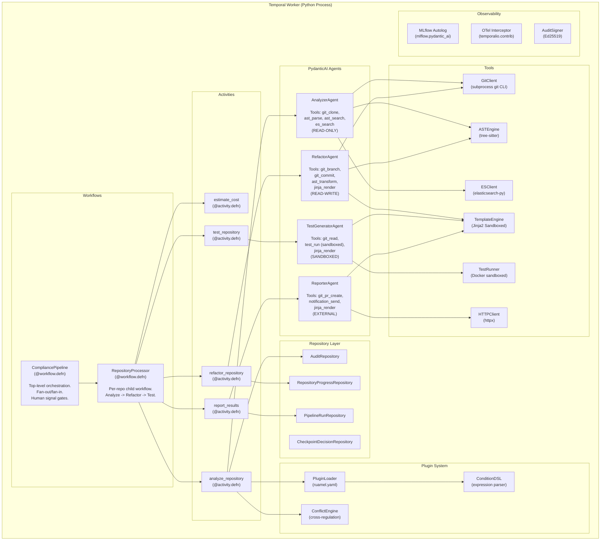
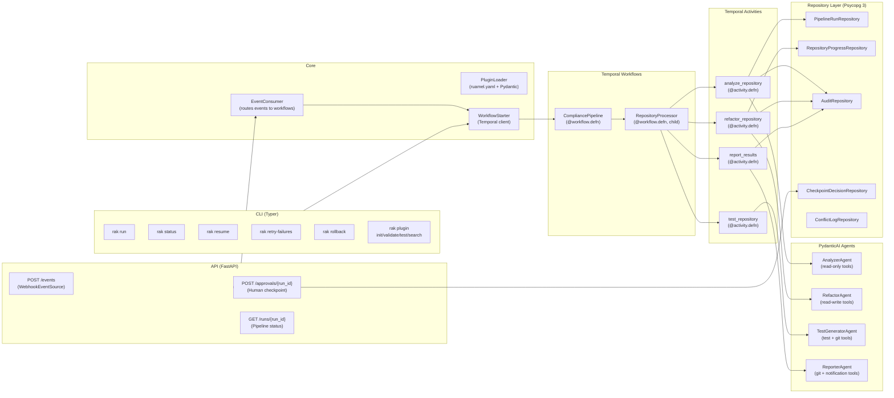
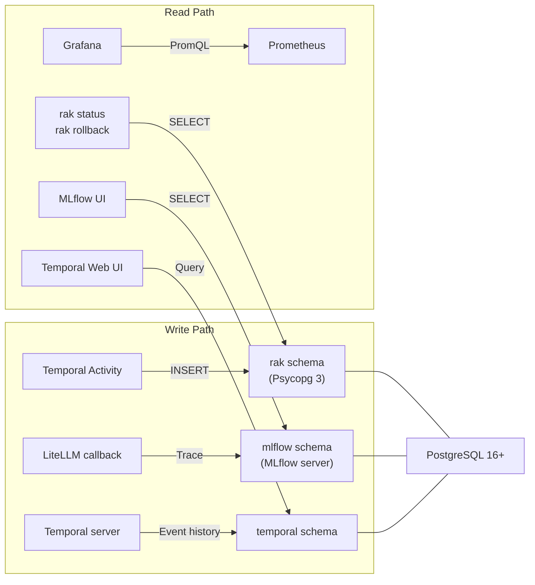

# regulatory-agent-kit — Software Architecture Document

### Production-Grade Multi-Agent Framework for Automated Regulatory Compliance

> **Version:** 1.0
> **Date:** 2026-03-27
> **Status:** Active Development
> **Scope:** This document describes the concrete technology architecture implementing the framework specification in [`framework-spec.md`](framework-spec.md). It reflects all accepted Architecture Decision Records (ADRs).

---

## Table of Contents

1. [Introduction](#1-introduction)
2. [Architectural Goals and Constraints](#2-architectural-goals-and-constraints)
3. [Architectural Decisions](#3-architectural-decisions)
4. [Key Technology Primer](#4-key-technology-primer)
5. [C4 Model](#5-c4-model)
6. [Technology Stack](#6-technology-stack)
7. [Component Architecture](#7-component-architecture)
8. [Data Architecture](#8-data-architecture)
9. [Orchestration Architecture](#9-orchestration-architecture)
10. [Agent Architecture](#10-agent-architecture)
11. [Event Architecture](#11-event-architecture)
12. [LLM Gateway](#12-llm-gateway)
13. [Observability Architecture](#13-observability-architecture)
14. [Security Architecture](#14-security-architecture)
15. [Deployment Architecture](#15-deployment-architecture)
16. [Project Structure](#16-project-structure)
17. [Technical Risks and Mitigations](#17-technical-risks-and-mitigations)

---

## 1. Introduction

### 1.1 Purpose

This Software Architecture Document (SAD) describes the concrete technology architecture of `regulatory-agent-kit` — an open-source Python framework for building production-grade, multi-agent AI pipelines that automate the detection, analysis, and remediation of regulatory compliance issues across large software codebases.

This document bridges the gap between the abstract framework specification ([`framework-spec.md`](framework-spec.md)) and the implementation. Where `framework-spec.md` describes what the system does in technology-agnostic terms, this SAD describes how it is built, with which technologies, and why.

### 1.2 System Scope

#### 1.2.1 Functional Scope

The system automates the compliance lifecycle from regulatory change detection to code remediation:

| Capability | In Scope | Out of Scope |
|---|---|---|
| **Regulatory change detection** | Consuming regulatory change events from upstream sources (Kafka, Webhook, SQS, file) | Monitoring regulator websites for new publications. The system reacts to events, not crawls for them. |
| **Impact analysis** | AST-based and semantic analysis of code repositories against regulation rules | Analyzing non-code artifacts (contracts, policies, procedures) that are not in version control |
| **Code remediation** | AST-aware code transformation using Jinja2 templates; creating branches and diffs | Deploying remediated code to production. The system creates merge requests; humans merge. |
| **Test generation** | Generating compliance and regression tests; executing in sandboxed containers | Performance testing, load testing, or end-to-end integration testing beyond unit/component scope |
| **Audit trail** | Cryptographically signed, immutable record of every decision and action | Regulatory reporting to authorities. The system generates audit artifacts; humans submit reports. |
| **Cross-regulation conflicts** | Detecting and flagging conflicting requirements from multiple regulations | Resolving conflicts. These are legal decisions escalated to human review. |
| **Plugin ecosystem** | Loading, validating, and executing regulation YAML plugins | Writing plugins. Plugins are authored by compliance engineers, not generated by the system. |

#### 1.2.2 Stakeholders

| Stakeholder | Role | Primary Concern |
|---|---|---|
| **Staff/Principal Software Engineer** | Primary user. Operates the pipeline, reviews merge requests. | Automation quality, false positive rate, integration with existing Git workflows |
| **Compliance Officer / Legal** | Reviews regulation plugins, validates audit trails | Accuracy of regulatory interpretation, auditability, tamper-evidence |
| **Platform Engineering Manager** | Deploys and operates the infrastructure | Operational complexity, scaling, monitoring, cost |
| **External Auditor** | Consumes audit logs and compliance reports | Completeness, immutability, and verifiability of the audit trail |
| **Plugin Contributor** | Authors and maintains regulation YAML plugins | Schema clarity, validation tooling, contribution process |

#### 1.2.3 Document Scope

This document covers:
- Concrete technology choices for every layer of the stack
- Component interactions and data flows with C4 model diagrams
- Database schema and data architecture
- Deployment topology and infrastructure
- Security boundaries and credential management

This document does **not** cover:
- Regulation-specific business rules (see [`regulations/`](../regulations/README.md))
- Market positioning or business strategy (see [`prd.md`](prd.md))
- Plugin authoring guides (see [`regulations/README.md`](../regulations/README.md))

### 1.3 Architectural Principles

The framework is built on four non-negotiable principles, defined in [`framework-spec.md` Section 1](framework-spec.md#1-architectural-principles):

1. **Regulation-as-Configuration.**
2. **Human-in-the-Loop by Design.**
3. **Audit-First Observability.**
4. **Infrastructure Agnosticism.**

These principles are elaborated with five cross-cutting design principles in [Section 2.3](#23-overarching-design-principles) of this document.

### 1.4 Document Relationships

| Document | Relationship |
|---|---|
| [`framework-spec.md`](framework-spec.md) | Abstract specification — this SAD implements it with concrete technologies |
| [`prd.md`](prd.md) | Product requirements — this SAD fulfills the technical requirements |
| [`adr/001-*.md`](adr/001-agent-orchestration-framework.md) | Superseded — initial framework selection |
| [`adr/002-*.md`](adr/002-langgraph-vs-temporal-pydanticai.md) | Accepted — Temporal + PydanticAI selection |
| [`adr/003-*.md`](adr/003-database-selection.md) | Accepted — PostgreSQL as single database |
| [`adr/004-*.md`](adr/004-python-stack.md) | Accepted — Full Python stack selection |
| [`adr/005-*.md`](adr/005-llm-observability-platform.md) | Accepted — MLflow for LLM observability |

---

## 2. Architectural Goals and Constraints

### 2.1 Architectural Goals

| ID | Goal | Quality Attribute | Measurable Target | Priority |
|---|---|---|---|---|
| AG-1 | **Crash resilience** — the pipeline must survive process crashes, server restarts, and infrastructure failures without data loss or duplicate work | Reliability | Zero data loss on crash. Automatic recovery without manual intervention. No duplicate merge requests on retry. | Critical |
| AG-2 | **Audit completeness** — every decision made by the system (human or AI) must be permanently recorded with tamper-evident integrity | Auditability | 100% of LLM calls, tool invocations, state transitions, and human approvals are captured. Audit entries are cryptographically signed. | Critical |
| AG-3 | **Human-in-the-loop non-bypassability** — no code change can reach a merge request without explicit human approval | Safety | Two mandatory checkpoints (post-analysis, pre-merge). No code path exists that skips them. | Critical |
| AG-4 | **Horizontal scalability** — the system must process hundreds of repositories concurrently | Scalability | Process 500+ repositories per pipeline run. Linear throughput scaling by adding worker replicas. | High |
| AG-5 | **Regulation extensibility** — adding support for a new regulation must require zero code changes | Extensibility | New regulation = new YAML plugin + Jinja2 templates. No framework code modified. | High |
| AG-6 | **Operational simplicity** — minimize the number of infrastructure services and operational expertise required | Maintainability | Single database (PostgreSQL). Python-only application runtime. No ClickHouse, no Redis, no JVM, no Node.js in the application stack. | High |
| AG-7 | **LLM provider independence** — switching LLM providers must require only configuration changes | Portability | All LLM calls routed through LiteLLM. No direct provider SDK imports in agent code. | High |
| AG-8 | **Supply chain security** — all dependencies must be pinned, hashed, and auditable | Security | `uv.lock` with hash verification. `pip-audit` in CI. SBOM generation. Signed container images. | High |
| AG-9 | **Sub-5-minute evaluation** — a new user must be able to evaluate the system with minimal setup | Usability | `rak run --lite` requires only Python 3.12 + LLM API key. No Kafka, no Elasticsearch, no Temporal for lite mode. | Medium |

### 2.2 Constraints

#### 2.2.1 Organizational Constraints

| ID | Constraint | Impact on Architecture |
|---|---|---|
| OC-1 | **Open source (Apache 2.0 license)** — the framework is publicly available; all dependencies must be compatible with Apache 2.0 | No AGPL, GPL, or SSPL dependencies in the core. All selected libraries are MIT or Apache 2.0. |
| OC-2 | **Small core team** — initial development by a small engineering team | Favors operational simplicity (AG-6). Single database, single runtime, minimal service count. |
| OC-3 | **Plugin contributors are non-engineers** — compliance officers and legal professionals author regulation plugins | Plugin format must be declarative YAML, not code. Schema must be readable by non-engineers. Validation tooling must provide clear error messages. |

#### 2.2.2 Technical Constraints

| ID | Constraint | Impact on Architecture |
|---|---|---|
| TC-1 | **Python runtime** — the framework is Python-only (the Temporal server is Go, but that is infrastructure, not application code) | All application code, agents, tools, and CLI are Python. No polyglot application layer. |
| TC-2 | **Temporal requires a relational database** — the Temporal server supports PostgreSQL, MySQL, or Cassandra | PostgreSQL is the mandated database (ADR-003). All application data co-locates in the same instance. |
| TC-3 | **LLM non-determinism** — LLM outputs are probabilistic and may vary across model versions | Model version pinning in production. Confidence scoring with configurable thresholds. Human review as the ultimate safety net. |
| TC-4 | **Network-isolated test execution** — generated tests must not access the network or host filesystem | Sandboxed containers with `--network=none --read-only`. Static AST analysis before execution. |

#### 2.2.3 Regulatory Constraints

| ID | Constraint | Impact on Architecture |
|---|---|---|
| RC-1 | **Data residency** — data subject to GDPR or equivalent must be processed by models in the appropriate geographic region | LiteLLM enforces region-based model routing. EU data routed to EU-region models (AWS Bedrock EU, Azure OpenAI EU). |
| RC-2 | **Audit trail permanence** — regulated entities must retain audit records for periods defined by their regulators (typically 5-10 years) | Append-only audit table with cryptographic signatures. Monthly partition export to immutable object storage. Configurable retention. |
| RC-3 | **No automated legal decisions** — the system must not resolve regulatory conflicts or make compliance determinations autonomously | Cross-regulation conflicts are always escalated to human review. All code changes are suggestions, never auto-merged. |

### 2.3 Overarching Design Principles

The four non-negotiable architectural principles (from SS1.3) are supported by five cross-cutting design principles that govern implementation decisions:

| Principle | Description | Manifests In |
|---|---|---|
| **Single Source of Truth** | Each data category has exactly one authoritative store. No data is duplicated across databases. | PostgreSQL as sole database (ADR-003). Pydantic models as the single schema definition across all layers (ADR-004). |
| **Explicit Over Implicit** | State transitions, tool permissions, and data flows are declared, not inferred. No hidden behavior. | Temporal workflows are imperative code with explicit `await` on signals. Tool sets are explicitly bound per agent. Database grants are explicitly restrictive. |
| **Fail Loud, Recover Automatically** | Failures are surfaced immediately and recovered without manual intervention where possible. Silent failures are never acceptable. | Temporal auto-recovers workflows on crash. Failed repositories are isolated (not silent). Dead letter queues are queryable. |
| **Minimize Operational Surface** | Every infrastructure service must justify its existence. Prefer fewer, well-understood services over many specialized ones. | Single database, Python-only application runtime, no ClickHouse, no Redis. MLflow chosen over Langfuse partly to eliminate ClickHouse (ADR-005). |
| **Defense in Depth** | Security is enforced at multiple layers. No single control is the sole defense. | LLM output validated by Pydantic AND reviewed by humans. Audit entries signed by application AND protected by database grants AND replicated to immutable storage. |

---

## 3. Architectural Decisions

| ADR | Decision | Rationale |
|---|---|---|
| [ADR-002](adr/002-langgraph-vs-temporal-pydanticai.md) | **Temporal + PydanticAI** for orchestration and agent framework | Event-sourced durability, distributed fan-out, built-in workflow ID locking, retry policies. Wins 8 of 12 requirements vs. LangGraph. |
| [ADR-003](adr/003-database-selection.md) | **PostgreSQL** as the single database | All data categories (workflow state, pipeline metadata, audit trail, checkpoint decisions) fit PostgreSQL. No NoSQL store justified. Minimizes operational complexity. |
| [ADR-004](adr/004-python-stack.md) | **Python 3.12+, uv, Pydantic v2, Psycopg 3, FastAPI, Ruff, mypy** | Coherent, minimal dependency set. Pydantic-centric data layer. Astral toolchain (uv + Ruff). No ORM. |
| [ADR-005](adr/005-llm-observability-platform.md) | **MLflow** (self-hosted) for LLM observability | No ClickHouse dependency (uses PostgreSQL + S3). Native PydanticAI autolog. Python server. Apache 2.0 / Linux Foundation governance. |
| [ADR-006](adr/006-elasticsearch-selection.md) | **Elasticsearch 8.x** as regulatory knowledge base | Mature kNN vector search + BM25 + structured filtering in one engine. Optional dependency — Lite Mode degrades gracefully. |

---

## 4. Key Technology Primer

> Unfamiliar with any of these? See the full [`glossary.md`](glossary.md) for all terms.

This system is built on four key technologies. Understanding their roles is essential before reading subsequent sections:

**Temporal** is a distributed workflow engine (Go binary) that provides durable execution for the pipeline. When a workflow step (called an *activity*) fails or the process crashes, Temporal automatically replays the workflow from its event history — no data is lost, no manual restart is needed. Human approvals are delivered via *signals*, durable messages that persist until the workflow processes them. See [ADR-002](adr/002-langgraph-vs-temporal-pydanticai.md) for why Temporal was chosen over LangGraph.

**PydanticAI** is a Python agent framework that gives each AI agent (Analyzer, Refactor, TestGenerator, Reporter) strongly-typed inputs and outputs via Pydantic models. This means LLM responses are validated against a schema before the pipeline acts on them — malformed output is caught immediately, not downstream. Each agent has an explicitly declared set of tools (e.g., Analyzer gets read-only tools; Refactor gets read-write tools).

**LiteLLM** is a proxy server that provides a unified API across LLM providers (Anthropic Claude, OpenAI GPT, AWS Bedrock, Azure OpenAI, self-hosted models). Switching providers is a config change, not a code change. LiteLLM also handles rate limiting, fallback routing, and cost tracking.

**tree-sitter** is an incremental parser generator used to build Abstract Syntax Trees (ASTs) from source code. The framework uses tree-sitter to identify code patterns structurally — for example, finding all classes that implement a given interface — rather than relying on fragile text matching.

---

## 5. C4 Model

The system architecture is described using the [C4 model](https://c4model.com/) at four levels of abstraction: Context, Containers, Components, and Code.

### 4.1 Level 1 — System Context

Shows `regulatory-agent-kit` and its relationships with external actors and systems.



**Key relationships:**
- The system **reacts** to regulatory change events — it does not poll or scrape regulator websites.
- The system **creates merge requests** — it does not merge or deploy code. Humans make the final merge decision.
- The system **calls LLM providers** through LiteLLM — it is not tied to any single provider.
- The system **sends notifications** — it does not own the notification channels.

### 4.2 Level 2 — Container Diagram

Shows the runtime containers (deployable units) and how they interact.



**Container responsibilities:**

| Container | Technology | Scalability | Statefulness |
|---|---|---|---|
| **CLI** | Python (Typer) | N/A (operator's machine) | Stateless |
| **API Server** | Python (FastAPI + Uvicorn) | Horizontal (2+ replicas behind load balancer) | Stateless |
| **Temporal Server** | Go binary | Horizontal (multi-node cluster) | Stateful (PostgreSQL-backed) |
| **Temporal Web UI** | TypeScript | Single replica | Stateless |
| **Worker** | Python (temporalio + PydanticAI) | **Horizontal (N replicas)** — primary scaling lever | Stateless (all state in Temporal + PostgreSQL) |
| **MLflow Server** | Python (Flask) | Horizontal (1-2 replicas) | Stateful (PostgreSQL + S3 backed) |
| **PostgreSQL** | PostgreSQL 16+ | Vertical + HA (Patroni / managed) | Stateful |
| **Elasticsearch** | Elasticsearch 8.x | Horizontal (cluster) | Stateful |
| **Object Storage** | S3 / GCS / Azure Blob | Managed service | Stateful |
| **Prometheus + Grafana** | Prometheus + Grafana | Standard deployment | Stateful (Prometheus) |
| **Kafka** | Apache Kafka (optional) | Horizontal (cluster) | Stateful |

### 4.3 Level 3 — Component Diagram (Worker Container)

The Worker container is the primary application unit. It hosts Temporal workflows, activities, and PydanticAI agents.



### 4.4 Level 4 — Code (Key Abstractions)

The code level shows the key classes, interfaces, and their relationships within the most important components.

```python
# --- Workflow Layer ---
@workflow.defn
class CompliancePipeline:
    """Top-level Temporal workflow. Orchestrates the full pipeline."""
    impact_review_decision: Optional[CheckpointDecision]
    merge_review_decision: Optional[CheckpointDecision]

    @workflow.signal
    async def approve_impact_review(self, decision: CheckpointDecision): ...
    @workflow.signal
    async def approve_merge_review(self, decision: CheckpointDecision): ...
    @workflow.run
    async def run(self, input: PipelineInput) -> PipelineResult: ...

@workflow.defn
class RepositoryProcessor:
    """Child workflow. One per repository."""
    @workflow.run
    async def run(self, input: RepoInput) -> RepoResult: ...

# --- Agent Layer ---
analyzer_agent = Agent(
    model=LiteLLMModel("..."),
    result_type=ImpactMap,       # Pydantic structured output
    tools=[git_clone, ast_parse, ast_search, es_search],
)

# --- Data Layer ---
class AuditRepository:
    """Append-only. INSERT + SELECT only. No UPDATE/DELETE."""
    def __init__(self, pool: AsyncConnectionPool): ...
    async def insert(self, entry: AuditEntry) -> None: ...
    async def get_by_run(self, run_id: UUID) -> list[AuditEntry]: ...

# --- Plugin Layer ---
class RegulationPlugin(BaseModel):
    """Pydantic model validated from YAML. Schema in framework-spec.md SS12."""
    id: str
    name: str
    version: str
    rules: list[Rule]
    cross_references: list[CrossReference]
    disclaimer: str

# --- Event Layer ---
class EventSource(Protocol):
    """Pluggable interface. Kafka, Webhook, SQS, File implementations."""
    async def start(self) -> None: ...
    async def stop(self) -> None: ...

# --- Tool Layer ---
class GitClient:
    """Thin async wrapper around subprocess git CLI."""
    async def clone(self, url: str, path: Path, depth: int = 1) -> None: ...
    async def create_branch(self, repo: Path, name: str) -> None: ...
    async def diff(self, repo: Path) -> str: ...
```

### 4.5 Layer Responsibilities (Cross-Cutting View)

| Layer | Responsibility | Key Technology | Regulation-Aware? |
|---|---|---|---|
| **Input** | Receives events, loads plugins, connects to repositories | Kafka, FastAPI, Elasticsearch, ruamel.yaml | No |
| **Orchestration** | Manages workflow state, transitions, checkpoints | Temporal server + temporalio SDK | No |
| **Agents** | Executes analysis, refactoring, testing, reporting | PydanticAI + LiteLLM | No |
| **Tools** | Provides AST parsing, Git operations, test execution, LLM access | tree-sitter, subprocess git, LiteLLM | No |
| **Observability** | Traces all operations, produces audit artifacts | MLflow, OpenTelemetry, Prometheus | No |
| **Data** | Persists workflow state, application data, audit trail, traces | PostgreSQL 16+, S3/GCS | No |
| **Output** | Delivers merge requests, audit logs, reports, notifications | httpx, Jinja2, cryptography | No |

**All regulation-specific behavior is injected at runtime through YAML plugins.**

---

## 6. Technology Stack

```
+-------------------------------------------------------+
|                    regulatory-agent-kit                 |
+-------------------------------------------------------+
|  Runtime            | Python 3.12+                     |
|  Package Manager    | uv (lockfile + hash verification)|
|  Task Runner        | just                             |
+-------------------------------------------------------+
|  ORCHESTRATION                                         |
|  Workflow engine     | Temporal (self-hosted, Go)       |
|  Workflow SDK        | temporalio >= 1.24.0             |
|  Agent framework     | pydantic-ai >= 1.0.0             |
|  LLM gateway         | litellm >= 1.40.0                |
|  Data validation     | pydantic >= 2.7.0                |
|  Settings            | pydantic-settings >= 2.3.0       |
+-------------------------------------------------------+
|  DATA                                                  |
|  Database            | PostgreSQL 16+                   |
|  DB driver           | psycopg[binary,pool] >= 3.2.0    |
|  Migrations          | alembic >= 1.14.0                |
|  Search index        | elasticsearch[async] >= 8.13.0   |
+-------------------------------------------------------+
|  INFRASTRUCTURE                                        |
|  HTTP framework      | fastapi >= 0.115.0               |
|  ASGI server         | uvicorn[standard] >= 0.30.0      |
|  Async runtime       | asyncio + uvloop >= 0.20.0       |
|  Kafka client        | confluent-kafka >= 2.5.0         |
|  HTTP client         | httpx >= 0.27.0                  |
|  Async abstraction   | anyio >= 4.4.0                   |
+-------------------------------------------------------+
|  DOMAIN                                                |
|  AST parsing         | tree-sitter >= 0.22.0            |
|  Templates           | jinja2 >= 3.1.0 (sandboxed)      |
|  YAML parsing        | ruamel.yaml >= 0.18.0            |
|  Crypto signing      | cryptography >= 43.0.0           |
+-------------------------------------------------------+
|  CLI                                                   |
|  CLI framework       | typer >= 0.12.0                  |
|  Terminal output      | rich >= 13.7.0                   |
+-------------------------------------------------------+
|  OBSERVABILITY                                         |
|  LLM tracing         | mlflow >= 2.18.0                 |
|  OTel SDK            | opentelemetry-sdk >= 1.25.0      |
|  OTel exporter       | opentelemetry-exporter-otlp      |
|  Metrics             | prometheus-client                |
+-------------------------------------------------------+
|  QUALITY                                               |
|  Testing             | pytest + pytest-asyncio          |
|  Integration tests   | testcontainers-python            |
|  Linting / format    | ruff >= 0.6.0                    |
|  Type checking       | mypy >= 1.11.0 (strict mode)     |
+-------------------------------------------------------+
```

### 5.1 Key Design Choices

| Choice | Rationale | ADR |
|---|---|---|
| **No ORM** | ~10 distinct queries. Psycopg 3 + thin repository pattern. SQL is visible, not hidden. | ADR-004 |
| **No LangChain** | Temporal replaces LangGraph. PydanticAI replaces LangChain agents. LiteLLM replaces LangChain LLM wrappers. Zero LangChain dependency. | ADR-002 |
| **No ClickHouse** | MLflow uses PostgreSQL + S3 instead of ClickHouse. Single database principle. | ADR-005 |
| **subprocess git, not GitPython** | GitPython has memory leak issues at scale. The git CLI is guaranteed present. | ADR-004 |
| **ruamel.yaml, not PyYAML** | YAML 1.2 compliance, round-trip preservation for plugin authoring. | ADR-004 |
| **Ed25519 default signing** | Fast, small signatures, safe by design. RSA/ECDSA available for enterprise PKI. | ADR-004 |

---

## 7. Component Architecture

### 6.1 Component Diagram



### 6.2 Component Contracts

| Component | Input | Output | Side Effects |
|---|---|---|---|
| **PluginLoader** | YAML file path | `RegulationPlugin` (Pydantic model) | None (pure) |
| **EventConsumer** | Raw event (JSON) | `RegulatoryEvent` (Pydantic model) | Starts Temporal workflow |
| **CompliancePipeline** | `PipelineInput` (regulation_id, repo_urls, config) | `PipelineResult` (status, artifacts) | Orchestrates child workflows |
| **RepositoryProcessor** | `RepoInput` (repo_url, plugin, rules) | `RepoResult` (status, branch, pr_url) | Creates branches, PRs |
| **AnalyzerAgent** | Repository + plugin rules | `ImpactMap` (files, rules, approach, conflicts) | Clones repo, reads files |
| **RefactorAgent** | ImpactMap + Jinja2 templates | `ChangeSet` (diffs, confidence scores) | Creates branch, commits changes |
| **TestGeneratorAgent** | ChangeSet + test templates | `TestResult` (pass/fail, coverage) | Generates and runs tests |
| **ReporterAgent** | All previous outputs + metadata | `ReportBundle` (PR URLs, audit log, report) | Creates PRs, sends notifications |

---

## 8. Data Architecture

### 7.1 PostgreSQL Schema Layout

PostgreSQL hosts three logical schemas in a single instance:

```
PostgreSQL 16+
+-----------------------------------------------+
| temporal schema (managed by Temporal server)  |
|   - executions, history, visibility, tasks    |
|   - DO NOT TOUCH from application code        |
+-----------------------------------------------+
| rak schema (managed by Alembic migrations)    |
|   - pipeline_runs                             |
|   - repository_progress                       |
|   - audit_entries (partitioned by month)      |
|   - checkpoint_decisions                      |
|   - conflict_log                              |
+-----------------------------------------------+
| mlflow schema (managed by MLflow server)      |
|   - experiments, runs, metrics, params, tags  |
|   - DO NOT TOUCH from application code        |
+-----------------------------------------------+
```

### 7.2 Application Schema (rak)

> **Abbreviated schema** — the canonical DDL with all constraints, indexes, roles, and security grants is in [`data-model.md`](data-model.md). The listing below is a structural overview only.

```sql
CREATE SCHEMA rak;

-- Pipeline run metadata
CREATE TABLE rak.pipeline_runs (
    run_id               UUID PRIMARY KEY DEFAULT gen_random_uuid(),
    regulation_id        TEXT NOT NULL,
    status               TEXT NOT NULL CHECK (status IN
                             ('pending','running','cost_rejected',
                              'completed','failed','rejected','cancelled')),
    created_at           TIMESTAMPTZ NOT NULL DEFAULT now(),
    completed_at         TIMESTAMPTZ,
    total_repos          INTEGER NOT NULL CHECK (total_repos > 0),
    estimated_cost       NUMERIC(10,4),
    actual_cost          NUMERIC(10,4) DEFAULT 0,
    config_snapshot      JSONB NOT NULL,
    temporal_workflow_id TEXT UNIQUE
);

-- Per-repository progress tracking
CREATE TABLE rak.repository_progress (
    id          UUID PRIMARY KEY DEFAULT gen_random_uuid(),
    run_id      UUID NOT NULL REFERENCES rak.pipeline_runs(run_id),
    repo_url    TEXT NOT NULL,
    status      TEXT NOT NULL CHECK (status IN
                    ('pending','in_progress','completed','failed','skipped')),
    branch_name TEXT,
    commit_sha  CHAR(40),   -- SHA-1 hash, always 40 hex characters
    pr_url      TEXT,
    error       TEXT,
    updated_at  TIMESTAMPTZ NOT NULL DEFAULT now(),
    UNIQUE (run_id, repo_url)
);

-- Audit trail (partitioned, append-only, cryptographically signed)
CREATE TABLE rak.audit_entries (
    entry_id    UUID NOT NULL DEFAULT gen_random_uuid(),
    run_id      UUID NOT NULL,
    event_type  TEXT NOT NULL,
    timestamp   TIMESTAMPTZ NOT NULL DEFAULT now(),
    payload     JSONB NOT NULL,      -- JSON-LD, event-type-specific
    signature   TEXT NOT NULL,        -- Ed25519 signature of payload
    PRIMARY KEY (timestamp, entry_id)
) PARTITION BY RANGE (timestamp);

-- Human checkpoint decisions
CREATE TABLE rak.checkpoint_decisions (
    id              UUID PRIMARY KEY DEFAULT gen_random_uuid(),
    run_id          UUID NOT NULL REFERENCES rak.pipeline_runs(run_id),
    checkpoint_type TEXT NOT NULL CHECK (checkpoint_type IN
                        ('impact_review','merge_review')),
    actor           TEXT NOT NULL,
    decision        TEXT NOT NULL CHECK (decision IN
                        ('approved','rejected','modifications_requested')),
    rationale       TEXT,
    signature       TEXT NOT NULL,
    decided_at      TIMESTAMPTZ NOT NULL DEFAULT now()
);

-- Cross-regulation conflict log
CREATE TABLE rak.conflict_log (
    id                UUID PRIMARY KEY DEFAULT gen_random_uuid(),
    run_id            UUID NOT NULL REFERENCES rak.pipeline_runs(run_id),
    conflicting_rules JSONB NOT NULL,
    affected_regions  JSONB NOT NULL,
    resolution        TEXT,
    human_decision_id UUID REFERENCES rak.checkpoint_decisions(id),
    detected_at       TIMESTAMPTZ NOT NULL DEFAULT now()
);

-- File-level analysis cache (incremental analysis)
CREATE TABLE rak.file_analysis_cache (
    cache_key   CHAR(64) PRIMARY KEY,  -- SHA-256(content + plugin_version + agent_version)
    repo_url    TEXT NOT NULL,
    file_path   TEXT NOT NULL,
    result      JSONB NOT NULL,
    created_at  TIMESTAMPTZ NOT NULL DEFAULT now(),
    expires_at  TIMESTAMPTZ NOT NULL DEFAULT (now() + INTERVAL '7 days')
);
```

### 7.3 Audit Trail Immutability

The audit trail's append-only property is enforced at three levels:

1. **Database level:** The `rak_app` role has `INSERT` and `SELECT` grants only — no `UPDATE` or `DELETE`.
2. **Application level:** Every audit entry's `payload` is cryptographically signed (Ed25519) before insertion. Tampering is detectable by signature verification.
3. **Infrastructure level:** Monthly partitions are exported to object storage (S3/GCS) for long-term retention. Old partitions can be dropped from PostgreSQL without losing the permanent record.

### 7.4 Data Flow



---

## 9. Orchestration Architecture

### 8.1 Temporal Workflow Design

The pipeline is implemented as a Temporal workflow with child workflows for per-repository processing. Temporal's event-sourced execution provides durable state, automatic crash recovery, and distributed fan-out.

The canonical state machine diagram is defined in [`framework-spec.md` Section 4.1 — Workflow Engine](framework-spec.md#41-workflow-engine). The conceptual states (IDLE, COMPLETE, ERROR) used in the architecture-level diagram map to implementation-level states documented in [`implementation-design.md` Section 4.1 — Pipeline Run Lifecycle](implementation-design.md#41-pipeline-run-lifecycle), which also provides the mapping between Temporal workflow phases and PostgreSQL `pipeline_runs.status` values.

### 8.2 Workflow Structure

```python
# Simplified — illustrates Temporal workflow structure

@workflow.defn
class CompliancePipeline:
    """Top-level workflow. One per pipeline run."""

    def __init__(self):
        self.impact_review_decision: Optional[CheckpointDecision] = None
        self.merge_review_decision: Optional[CheckpointDecision] = None

    @workflow.signal
    async def approve_impact_review(self, decision: CheckpointDecision):
        self.impact_review_decision = decision

    @workflow.signal
    async def approve_merge_review(self, decision: CheckpointDecision):
        self.merge_review_decision = decision

    @workflow.run
    async def run(self, input: PipelineInput) -> PipelineResult:
        # Cost estimation
        cost = await workflow.execute_activity(
            estimate_cost, input,
            start_to_close_timeout=timedelta(minutes=5),
        )
        if not input.auto_approve_cost and cost.exceeds_threshold:
            return PipelineResult(status="cost_rejected")

        # Fan-out analysis across repositories
        analyses = await asyncio.gather(*[
            workflow.execute_child_workflow(
                RepositoryProcessor.run,
                RepoInput(repo_url=repo, plugin=input.plugin, phase="analyze"),
                id=f"analyze/{input.regulation_id}/{repo_id(repo)}",
            )
            for repo in input.repo_urls
        ])

        impact_map = aggregate_analyses(analyses)

        # Human checkpoint #1 — wait for Temporal Signal
        await workflow.wait_condition(
            lambda: self.impact_review_decision is not None
        )
        if self.impact_review_decision.decision == "rejected":
            return PipelineResult(status="rejected")

        # Fan-out refactoring + testing across repositories
        results = await asyncio.gather(*[
            workflow.execute_child_workflow(
                RepositoryProcessor.run,
                RepoInput(repo_url=repo, plugin=input.plugin, phase="refactor_and_test"),
                id=f"refactor/{input.regulation_id}/{repo_id(repo)}",
                retry_policy=RetryPolicy(maximum_attempts=3),
            )
            for repo in affected_repos(impact_map)
        ])

        # Human checkpoint #2
        await workflow.wait_condition(
            lambda: self.merge_review_decision is not None
        )
        if self.merge_review_decision.decision == "modifications_requested":
            # Re-enter refactoring with feedback
            ...

        # Reporting
        report = await workflow.execute_activity(
            generate_report, results,
            start_to_close_timeout=timedelta(minutes=30),
        )

        return PipelineResult(status="completed", report=report)
```

### 8.3 Key Orchestration Features

| Feature | Implementation |
|---|---|
| **Durable state** | Temporal event-sourced history in PostgreSQL. Automatic replay on crash. |
| **Human checkpoints** | `workflow.wait_condition()` blocks until a Temporal Signal is received. Non-bypassable: the `await` cannot be skipped. |
| **Fan-out/fan-in** | `asyncio.gather()` on child workflow futures. Each child runs on potentially different workers. |
| **Repository locking** | Deterministic child workflow IDs (`analyze/{regulation_id}/{repo_id}`). Temporal enforces workflow ID uniqueness — prevents concurrent processing of the same repository. |
| **Retry policies** | Per-activity `RetryPolicy` with configurable attempts, backoff, and non-retryable error types. |
| **Dead letter** | Failed child workflows are queryable via Temporal API (`ExecutionStatus = 'Failed'`). `rak retry-failures` re-signals them. |
| **Rollback** | Reporter activity generates a rollback manifest. `rak rollback --run-id` uses it to close PRs, delete branches, create reverts. |
| **Cost estimation** | Pre-run activity estimates LLM token usage and cost. Displayed before pipeline proceeds. |
| **Idempotency** | Deterministic branch naming (`rak/{regulation_id}/{rule_id}`). Deterministic workflow IDs. Temporal deduplicates activity retries. |

---

## 10. Agent Architecture

### 9.1 PydanticAI Agent Design

Each agent is a PydanticAI `Agent` with typed input/output (Pydantic models), a specific tool set, and a system prompt that receives regulation context from the plugin YAML at runtime.

```python
# Simplified — illustrates PydanticAI agent structure

analyzer_agent = Agent(
    model=LiteLLMModel("anthropic/claude-sonnet-4-6"),
    result_type=ImpactMap,              # Pydantic model — structured output
    system_prompt="You are a regulatory compliance analyzer...",
    tools=[git_clone, ast_parse, ast_search, es_search],  # Read-only tools
)

refactor_agent = Agent(
    model=LiteLLMModel("anthropic/claude-sonnet-4-6"),
    result_type=ChangeSet,
    system_prompt="You are a code refactoring agent...",
    tools=[git_branch, git_commit, ast_transform, jinja_render],  # Read-write tools
)
```

### 9.2 Agent Contracts

Four PydanticAI agents (Analyzer, Refactor, TestGenerator, Reporter) with typed Pydantic input/output models and disjoint tool sets enforcing minimum privilege per agent. For the canonical contract table and tool isolation matrix, see [`framework-spec.md` Section 4.3 — Agent Contracts](framework-spec.md#43-agent-contracts). For implementation-level class definitions, see [`implementation-design.md` Section 2.3](implementation-design.md#23-workflow-and-activity-layer-workflows-activities).

---

## 11. Event Architecture

The framework treats regulatory changes as domain events from pluggable sources (Kafka, Webhook, SQS, File), all implementing a common `EventSource` interface and producing a normalized `RegulatoryEvent`. It also supports shift-left integration via CI/CD pipeline gates, PR review bots, and pre-commit hooks.

For the canonical event schema, source table, and shift-left integration details, see [`framework-spec.md` Section 5 — Event Architecture](framework-spec.md#5-event-architecture). For implementation-level class definitions (KafkaEventSource, WebhookEventSource, etc.), see [`implementation-design.md` Section 2.6 — Event System](implementation-design.md#26-event-system-events).

---

## 12. LLM Gateway

All LLM calls are routed through **LiteLLM**, deployed as a proxy behind a load balancer.

```
PydanticAI Agent
    |
    v
LiteLLM (proxy, 2+ replicas)
    |
    +---> Anthropic Claude (primary, complex reasoning)
    +---> OpenAI GPT-4o (fallback, cost optimization)
    +---> AWS Bedrock (data residency: EU)
    +---> Azure OpenAI (data residency: enterprise)
    +---> Self-hosted vLLM/Ollama (air-gapped)
    |
    +---> MLflow callback (automatic trace on every call)
```

| Capability | Implementation |
|---|---|
| **Model-agnostic agents** | PydanticAI agents use `LiteLLMModel(model_name)`. Switching providers is a config change. |
| **Data residency routing** | LiteLLM routes calls to region-specific models based on data classification. Mandatory for GDPR-scoped data. |
| **Cost optimization** | Claude Opus/Sonnet for analysis; Haiku/GPT-4o-mini for templated tasks. |
| **Model version pinning** | Exact model versions in production config. Version recorded in every audit trace. |
| **Rate limit management** | LiteLLM token bucket rate limiter for 500+ repository processing. |
| **Fallback routing** | Automatic failover to secondary models on provider outage. |
| **Tracing** | `success_callback=["mlflow"]` — every call automatically traced. |

---

## 13. Observability Architecture

### 12.1 Two-Layer Model

Observability is split into two complementary layers:

```
+--------------------------------------------------+
|  LAYER 1: LLM / AI Observability (MLflow)        |
|                                                    |
|  - Prompts, completions, token counts, cost       |
|  - Agent steps, tool calls, structured outputs    |
|  - PydanticAI autolog (mlflow.pydantic_ai)        |
|  - LiteLLM callback (success_callback=["mlflow"]) |
|  - Evaluation metrics (mlflow.genai.evaluate)     |
|                                                    |
|  Storage: PostgreSQL (mlflow schema) + S3         |
|  UI: MLflow Tracking Server (Flask)               |
+--------------------------------------------------+

+--------------------------------------------------+
|  LAYER 2: Operational Observability (OTel)        |
|                                                    |
|  - Workflow start/complete, activity execution    |
|  - Signal received, timer fired                   |
|  - HTTP request latency, error rates              |
|  - Database connection pool stats                 |
|  - Temporal interceptor (temporalio.contrib.otel) |
|                                                    |
|  Storage: Prometheus (time-series)                |
|  UI: Grafana dashboards                           |
+--------------------------------------------------+
```

### 12.2 What is Captured

| Event | Captured Data | Destination | Retention |
|---|---|---|---|
| LLM call | Model + version, prompt, completion, tokens, cost, latency | MLflow + audit_entries | Configurable (default: 90 days) |
| Agent step | Agent name, tool calls, structured output, confidence | MLflow (PydanticAI autolog) | Configurable |
| Workflow transition | From state, to state, trigger, timestamp | Temporal event history + audit_entries | Permanent |
| Human decision | Actor, decision, rationale, signature | checkpoint_decisions table | Permanent |
| Test execution | Pass/fail, stack traces, sandbox metadata | audit_entries | 30 days |
| Merge request | Repository, branch, PR URL, rule IDs | audit_entries | Permanent |
| Cost tracking | Per-call cost, cumulative pipeline cost | MLflow + pipeline_runs | Permanent |

### 12.3 Durability Guarantees

- **MLflow** traces are stored in PostgreSQL (metadata) and S3 (artifacts).
- **Audit-critical events** are also written to `rak.audit_entries` (application's own audit trail) — the audit trail does not depend on MLflow availability.
- **A local write-ahead log (WAL)** buffers audit entries, preventing data loss during PostgreSQL outages.
- **OpenTelemetry** exports operational metrics to Prometheus. Grafana dashboards provide pipeline health visibility.

---

## 14. Security Architecture

### 13.1 Security Boundaries

The framework enforces eight security boundaries. For the canonical listing, see [`framework-spec.md` Section 9 — Security Architecture](framework-spec.md#9-security-architecture).

### 13.2 Threat Mitigations

For the canonical threat mitigation table and credential management requirements, see [`framework-spec.md` Section 9 — Security Architecture](framework-spec.md#9-security-architecture). Key highlights:

- **LLM prompt injection** — input sanitization, Pydantic structured output, tool-level isolation, human checkpoints
- **Test execution as RCE** — sandboxed containers (`--network=none --read-only`), static AST analysis, resource limits
- **Audit log tampering** — Ed25519 signatures, append-only PostgreSQL (no UPDATE/DELETE), immutable object storage export
- **Plugin template injection** — Jinja2 `SandboxedEnvironment` in all rendering paths

**Environment variables are acceptable for development only.** Production deployments must use a secrets manager.

---

## 15. Deployment Architecture

### 14.1 Deployment Options

Multiple deployment models are supported — from Lite Mode (zero-infrastructure evaluation) through Docker Compose and Kubernetes (Helm) to cloud-native configurations (AWS, GCP, Azure). For the canonical deployment options with hardware sizing, cloud-specific configurations, and Helm chart values, see [`infrastructure.md`](infrastructure.md). For the architecture-level summary, see [`framework-spec.md` Section 11 — Deployment Options](framework-spec.md#11-deployment-options).

### 14.2 Docker Compose Topology

```yaml
# docker-compose.yml — service overview
services:
  # --- Data Layer ---
  postgres:           # PostgreSQL 16 — Temporal + rak + MLflow schemas
  elasticsearch:      # Elasticsearch 8.x — regulatory knowledge base

  # --- Orchestration Layer ---
  temporal-server:    # Temporal server (Go) — workflow engine
  temporal-ui:        # Temporal Web UI — workflow visibility
  temporal-worker:    # Python worker — workflows + activities + agents

  # --- API Layer ---
  api:                # FastAPI + Uvicorn — webhook events, approvals, status

  # --- Observability Layer ---
  mlflow:             # MLflow tracking server (Flask) — LLM traces
  prometheus:         # Prometheus — operational metrics
  grafana:            # Grafana — dashboards

  # --- Event Layer (optional) ---
  kafka:              # Apache Kafka — event streaming (optional, not needed for webhook/file mode)
  zookeeper:          # ZooKeeper — Kafka dependency (or KRaft mode)
```

**Service count:** 8 core services (PostgreSQL, Elasticsearch, Temporal server, Temporal UI, worker, API, MLflow, Prometheus) + 1 optional (Kafka). Grafana is optional for development.

### 14.3 Kubernetes Deployment

```
+-----------------------------------------------------------------+
|  Kubernetes Cluster                                             |
|                                                                  |
|  Namespace: temporal                                            |
|    - temporal-server (Deployment, 2+ replicas)                  |
|    - temporal-ui (Deployment, 1 replica)                        |
|    - temporal-admin-tools (Job, for schema migrations)          |
|                                                                  |
|  Namespace: rak                                                 |
|    - rak-worker (Deployment, N replicas — horizontal scale)     |
|    - rak-api (Deployment, 2+ replicas, behind Ingress)          |
|    - mlflow-server (Deployment, 1-2 replicas)                   |
|                                                                  |
|  Namespace: monitoring                                          |
|    - prometheus (StatefulSet)                                   |
|    - grafana (Deployment)                                       |
|                                                                  |
|  Namespace: data                                                |
|    - postgresql (StatefulSet, HA via Patroni or managed PG)     |
|    - elasticsearch (StatefulSet or managed ES)                  |
|                                                                  |
|  External:                                                      |
|    - S3/GCS (object storage for audit logs + MLflow artifacts)  |
|    - Secrets Manager (Vault / AWS SM / GCP SM)                  |
+-----------------------------------------------------------------+
```

**Scaling model:** Add `rak-worker` replicas to increase throughput. Temporal distributes activities across workers automatically. Each worker can process multiple repositories concurrently.

### 14.4 Integration Reference

For the detailed integration specification table including protocols, authentication, rate limits, retry strategies, and timeouts, see [`system-design.md` Section 6.2 — Integration Specification Table](system-design.md#62-integration-specification-table). For a summary-level integration reference, see [`framework-spec.md` Section 11 — Deployment Options](framework-spec.md#11-deployment-options).

---

## 16. Project Structure

The project follows a standard Python `src/` layout. Key top-level directories:

| Directory | Purpose |
|---|---|
| `src/regulatory_agent_kit/` | Application code — CLI, API, workflows, activities, agents, tools, plugins, events, repositories, models, observability |
| `migrations/` | Alembic migrations for the `rak` schema |
| `regulations/` | Regulation YAML plugins (e.g., `dora/`) |
| `tests/` | Unit (no external deps), integration (testcontainers), e2e (Docker Compose) |
| `docs/` | Architecture documentation and ADRs |
| `helm/` | Kubernetes Helm chart |

For the full directory tree with per-file descriptions, see [`implementation-design.md` Section 2 — Class Diagrams](implementation-design.md#2-class-diagrams), which maps each source file to its class hierarchy and responsibilities.

---

## 17. Technical Risks and Mitigations

For the canonical risk table, see [`framework-spec.md` Section 10 — Technical Risks & Mitigations](framework-spec.md#10-technical-risks--mitigations). The following risks are **specific to the SAD's implementation choices** and supplement the architecture-level risks:

| Risk | Severity | Likelihood | Mitigation |
|---|---|---|---|
| Temporal server operational complexity | HIGH | MEDIUM | Docker Compose for dev; Temporal Helm chart for production; documented runbooks; Temporal Cloud as managed fallback option. |
| PostgreSQL as single point of failure | HIGH | LOW | Streaming replication with automatic failover (Patroni or managed PostgreSQL with HA). Separate connection pools for Temporal and application. |
| MLflow LLM tracing maturity | MEDIUM | MEDIUM | Audit trail lives in `rak.audit_entries` (application-owned), not in MLflow. MLflow is the visualization layer, not the system of record. |

---

## See Also

| Document | What You'll Find |
|---|---|
| [`framework-spec.md`](framework-spec.md) | Abstract framework specification, agent contracts, plugin schema |
| [`implementation-design.md`](implementation-design.md) | Class diagrams, detailed sequence diagrams, algorithms, error handling |
| [`system-design.md`](system-design.md) | Deployment topology, hardware sizing, Kubernetes configuration |
| [`data-model.md`](data-model.md) | Full database schema, indexing strategy, JSONB payload schemas |
| [`operations/runbook.md`](operations/runbook.md) | Failure scenarios, recovery procedures, maintenance tasks |

### How to Read This Document

This document uses the [C4 model](https://c4model.com/) at four levels of abstraction:

- **Level 1 — System Context:** Shows the system and its relationships with external actors (engineers, Git providers, LLM providers).
- **Level 2 — Containers:** Shows the deployable units (CLI, API server, Temporal, workers, databases).
- **Level 3 — Components:** Shows the internal structure of the Worker container (workflows, activities, agents, tools).

Start at Level 1 to understand the big picture, then drill down to Level 3 for implementation details.

*This document describes the implementation architecture. For the abstract framework specification (regulation-agnostic), see [`framework-spec.md`](framework-spec.md). For the canonical database schema, see [`data-model.md`](data-model.md). For regulation-specific plugin documentation, see [`regulations/`](../regulations/README.md). For the full product requirements, see [`prd.md`](prd.md).*
